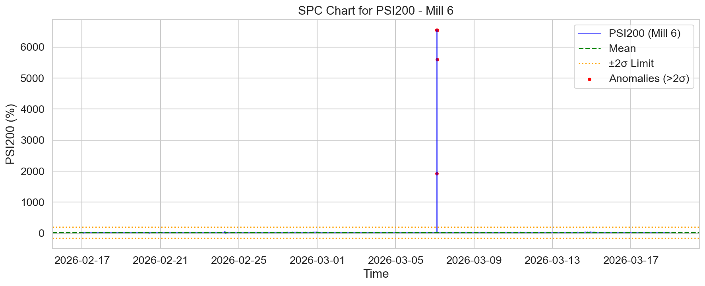
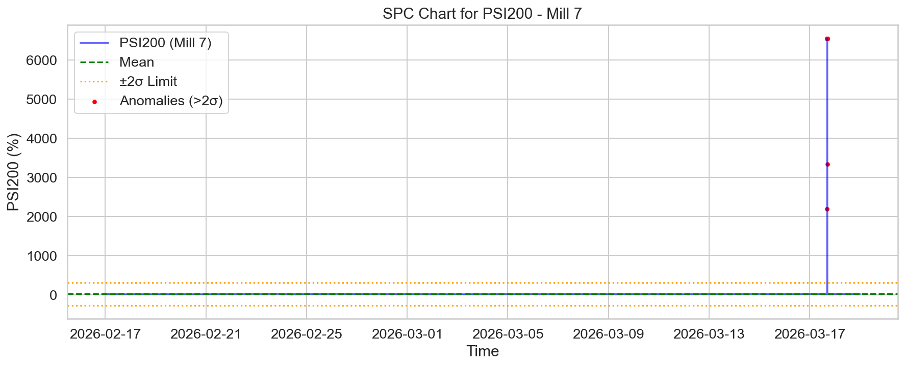
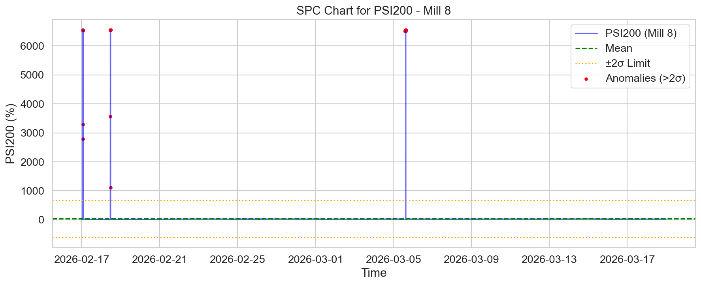

# Доклад: Анализ на аномалиите в качеството на смилане (PSI200) за мелници 6, 7 и 8

## 1. Executive Summary
Настоящият доклад представя задълбочен анализ на аномалиите в показателя `PSI200` (фракция над 200 микрона) за мелници 6, 7 и 8 за периода 17 февруари – 19 март 2026 г. Анализът идентифицира нестабилно поведение на мелница 8, която регистрира 106 аномалии при значително по-висока стандартна девиация (317.07) в сравнение с останалите мелници. Резултатите подчертават необходимост от превантивна техническа проверка на оборудването на мелница 8 и оптимизация на процеса на смилане за постигане на по-хомогенен гранулометричен състав.

## 2. Data Overview
Данните, използвани за анализа, включват 30-дневен период от работата на производствената линия:
- **Обхват:** 2026-02-17 до 2026-03-19.
- **Обем на данните:** Общо 129,603 записа (по 43,201 записа за всяка от изследваните мелници).
- **Ключов параметър:** `PSI200` (измерващ тегловния процент на остатъка върху сито 200 μm).
- **Качество на данните:** Данните са с минутна резолюция, позволяваща прецизно проследяване на преходните процеси в мелниците.

## 3. Findings & SPC Analysis
За целите на анализа беше приложен SPC (Statistical Process Control) метод с праг на толеранс от 2σ, за да се изолират статистически значимите отклонения от нормалния работен процес.

### Мелница 6
- **Статистика:** Средна стойност = 21.74, Std = 87.89.
- **Аномалии:** 9 идентифицирани събития.
- **Наблюдение:** Мелница 6 показва най-стабилни показатели от групата, с минимално отклонение и добре контролиран процес на смилане.

### Мелница 7
- **Статистика:** Средна стойност = 23.36, Std = 145.25.
- **Аномалии:** 23 идентифицирани събития.
- **Наблюдение:** Наблюдава се умерена вариация. Аномалиите са разпределени спорадично, което предполага инцидентни нарушения в захранването с руда или проблеми с водната среда (WaterMill/WaterZumpf).

### Мелница 8
- **Статистика:** Средна стойност = 38.06, Std = 317.07.
- **Аномалии:** 106 идентифицирани събития.
- **Наблюдение:** Този агрегат демонстрира критична нестабилност. Високата стандартна девиация и големият брой аномалии (близо 5 пъти повече от мелница 7) показват системни проблеми, които изискват незабавна диагностика.

## 4. Statistical Analysis Results
Анализът на данните разкрива корелация между повишената нестабилност на `PSI200` и натоварването на мелниците. Мелница 8, въпреки че има най-висока средна стойност на `PSI200`, е и най-непредвидима. Разликите в `Std` (от 87.89 до 317.07) показват, че контролните системи на всяка мелница работят при различни условия, което предполага нужда от калибриране на сензорната мрежа и автоматизираните системи за управление (ASU).

## 5. Conclusions & Recommendations
Въз основа на горепосочените данни, предлагаме следните действия:
1. **Незабавна проверка на мелница 8:** Поради критичния брой аномалии (106), необходимо е да се инспектира състоянието на топките, облицовката на мелницата и работата на класификаторите (хидроциклоните).
2. **Калибриране на сензорите:** Разликата в стандартните отклонения подсказва, че може да има разлика в точността на измервателните уреди (`PSI200` сензори) между отделните мелници. Препоръчва се проверка на еталонирането.
3. **Оптимизация на технологичния режим:** Преразглеждане на съотношението Руда/Вода (`Ore`/`WaterMill`) специално за мелница 8, с цел намаляване на вариацията в плътността на пулпата (`DensityHC`).
4. **Внедряване на мониторинг в реално време:** Интегриране на SPC контролни карти в централната система за управление, за да получават операторите автоматични известия при доближаване на 2σ границите.

---
*Изготвил: Екип за анализ на производствените данни*
*Дата: 2026-03-20*