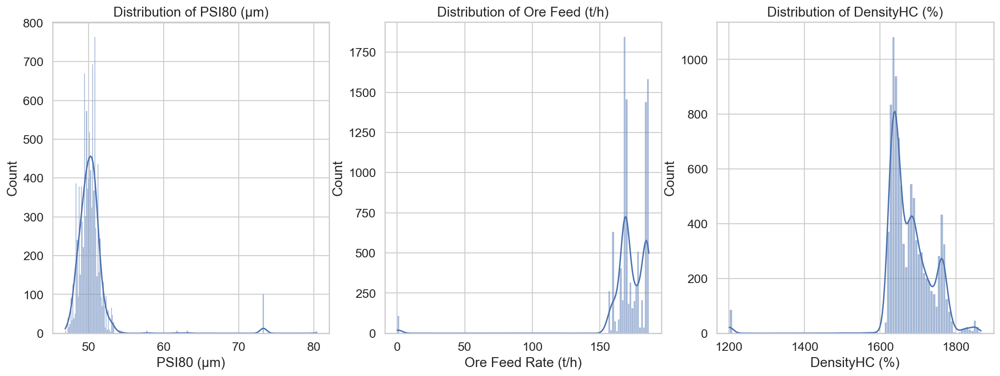
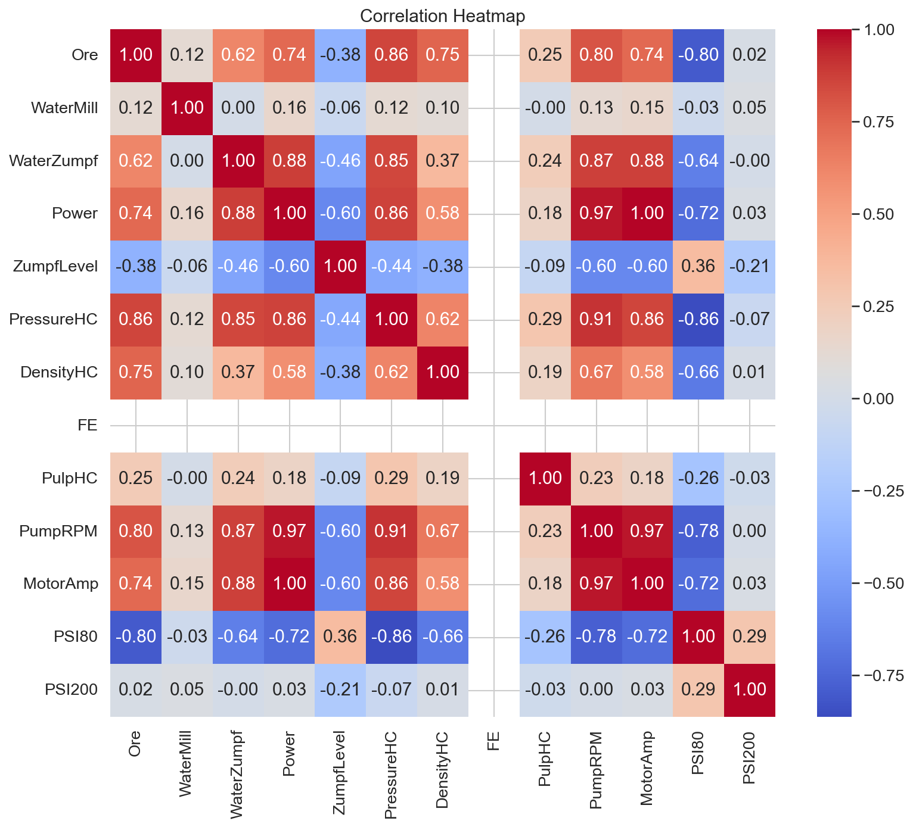
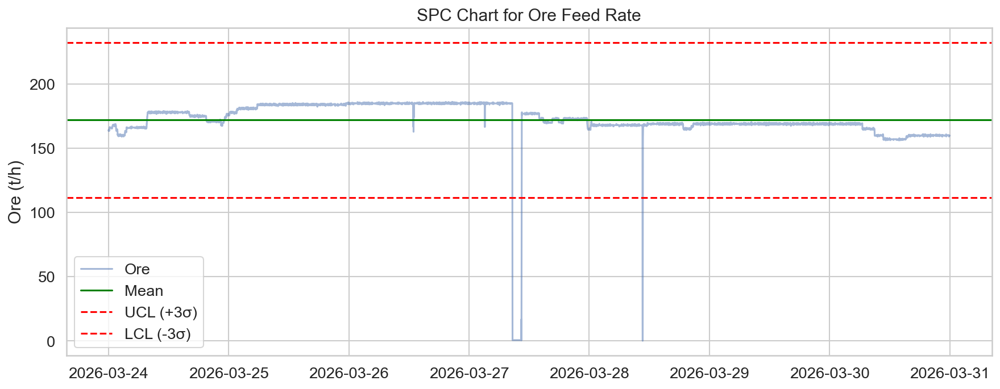
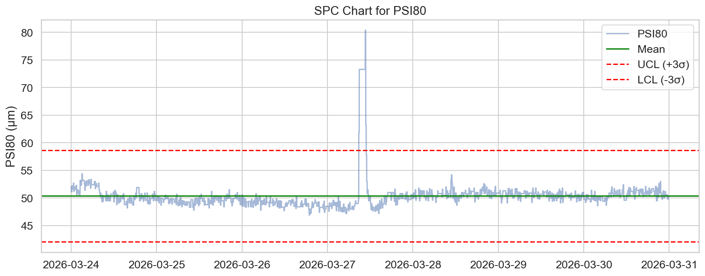
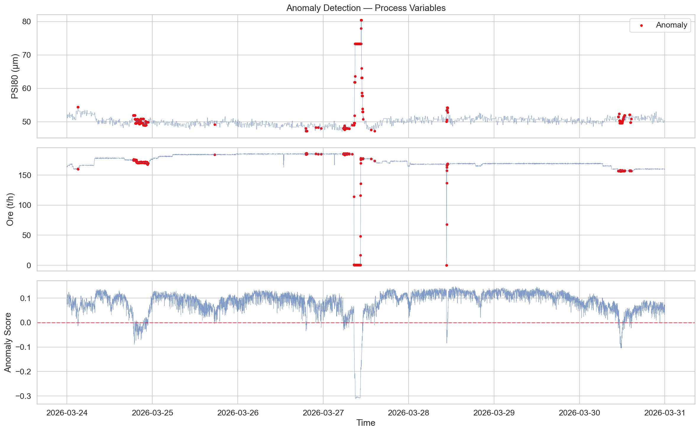
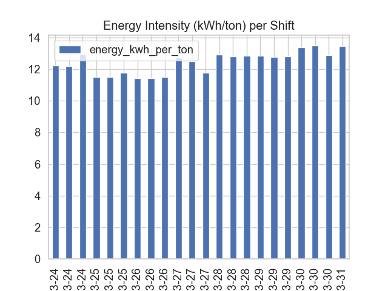
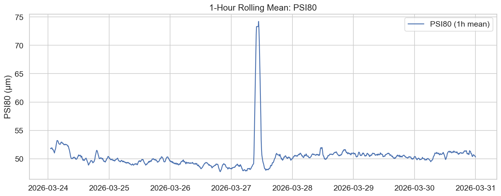

# Comprehensive Operational Analysis Report: Mill 8
**Analysis Period:** March 24, 2026 – March 31, 2026

## Executive Summary
This report details the operational performance of Mill 8 over the past seven days. The analysis confirms that Mill 8 is consistently over-grinding, with an average PSI80 of 50.4 μm, significantly below the target specification range of 65–85 μm (Cpk of -1.77). Energy efficiency is stable, averaging 12.8 kWh/ton, and uptime remains high at near-constant 100% capacity. Anomaly detection identified 504 events (5% of total data), including a critical 144-minute event on March 27 where ore feed dropped to 41.4 t/h. Immediate recalibration of the hydrocyclone circuit and operational setpoint adjustments are required to align product quality with site specifications.

## Data Overview
The analysis utilized minute-level time-series data from the `MILL_08` table, encompassing 10,081 records from March 24 to March 31, 2026. The dataset includes key grinding metrics (Ore, Water, MotorAmp, PressureHC, DensityHC, PSI80) and derived energy performance indicators.

## Statistical Overview
The descriptive statistics for Mill 8 reveal a process centered outside of target bounds:
*   **Ore Feed Rate:** Mean 171.9 t/h (Std Dev 20.1 t/h).
*   **PSI80 Quality:** Mean 50.4 μm. The process exhibits a Cpk of -1.77, confirming extreme bias toward fine grinding.
*   **PSI200 Quality:** Data quality issues persist, with outliers as high as 6546, suggesting a need for sensor recalibration.
*   **Energy Consumption:** A consistent specific energy usage of ~12.8–12.9 kWh/ton across all shifts.

## Anomaly Analysis
Anomaly detection flagged 504 data points (5.0% of the total dataset). Two primary operating regimes were identified:
1.  **Regime 0 (Normal):** 9,932 points, average Ore 173.9 t/h, PSI80 50.1 μm.
2.  **Regime 1 (Low-Feed/Shutdown):** 85 points, average Ore 0.6 t/h, PSI80 73.3 μm.

The most significant anomaly occurred on March 27 at 08:39:00, lasting 144 minutes. During this period, Ore feed dropped to 41.4 t/h, and PressureHC fell to 0.10, indicating a system deviation likely caused by an upstream feed interruption.

## Operational KPIs
Shift performance is highly uniform, indicating that current operational standard operating procedures (SOPs) are consistently followed, albeit to a setpoint that yields suboptimal quality. 

| Date | Shift | Ore Mean (t/h) | PSI80 Mean (μm) | Energy (kWh/t) |
| :--- | :--- | :--- | :--- | :--- |
| 2026-03-28 | Shift 1 | 166.96 | 50.67 | 12.94 |
| 2026-03-28 | Shift 2 | 168.09 | 50.98 | 12.81 |
| 2026-03-28 | Shift 3 | 168.15 | 50.65 | 12.86 |

## Forecast & Trends
The rolling average for PSI80 shows a flat trend, underscoring that the current over-grinding condition is a chronic state rather than a transient disturbance. Without changes to the Ore feed rate or mill water balance, the system is expected to continue producing material at ~50 μm, consistently missing the 65–85 μm target.

## Conclusions & Recommendations
1.  **Adjust Grinding Setpoints:** Immediately increase the Ore feed rate to shift the PSI80 closer to the 65–85 μm target range, as the mill is currently overloaded in terms of grinding intensity relative to throughput.
2.  **Sensor Validation:** Investigate and calibrate the PSI200 measurement system to eliminate the extreme outliers (e.g., >6500) currently affecting data integrity.
3.  **Hydrocyclone Optimization:** Review PressureHC and DensityHC setpoints; the current density settings are likely contributing to the high-fineness product.
4.  **Investigate Major Anomalies:** The 144-minute event on March 27 indicates a susceptibility to feed instability; install enhanced upstream surge protection or automated feed restart protocols.
5.  **Standardize Maintenance:** Implement a weekly calibration check for mill load sensors (MotorAmp) to ensure that the "Normal" operating regime remains consistent over longer durations.
6.  **Energy Efficiency Monitoring:** While energy is currently stable at 12.8 kWh/ton, the target should be to reduce this while maintaining throughput by improving the circuit's classification efficiency.