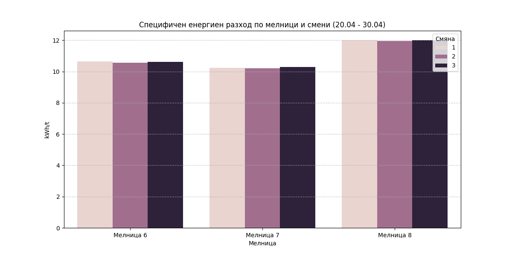

# Анализ на специфичния енергиен разход за Мелници 6, 7 и 8

## Резюме (Executive Summary)
Настоящият доклад представя анализ на енергийната ефективност на „Мелница 6“, „Мелница 7“ и „Мелница 8“ за периода 20.04.2026 – 30.04.2026 г. Резултатите показват, че „Мелница 7“ постига най-добра енергийна ефективност с минимален специфичен разход от 10.20 kWh/t по време на втора смяна. За сравнение, „Мелница 8“ демонстрира най-висок специфичен разход, достигащ средно 12.00 kWh/t, което изисква допълнителен технически преглед. Използваният метод на „съотношение на общите суми“ гарантира статистическа достоверност чрез елиминиране на изкривяванията от кратки престои и стартови режими.

## Преглед на данните
Данните са извлечени за период от 10 денонощия (общо 14 401 записи на минута за всяка мелница). Анализирани са следните технологични показатели: Ore (t/h), Power (kW), WaterMill, WaterZumpf, ZumpfLevel и PressureHC. Филтрирането е извършено при праг на подаване на руда Ore ≥ 10 t/h, за да се гарантира, че данните отразяват същинския процес на смилане.

## Констатации

### Статистически преглед
Анализът на данните потвърждава, че „Мелница 7“ е най-ефективната единица в разглежданата група. Специфичният енергиен разход за „Мелница 7“ варира в тесния диапазон 10.20 – 10.29 kWh/t. „Мелница 6“ показва стабилни показатели в диапазона 10.56 – 10.64 kWh/t, докато „Мелница 8“ се отличава с по-висок разход (11.95 – 12.01 kWh/t), което предполага необходимост от оптимизация на параметрите на работа или проверка на състоянието на смилащите тела.

### Оперативни KPI по смени
Следващата таблица обобщава средния специфичен разход по смени (kWh/t):

| Мелница | втора смяна | първа смяна | трета смяна |
| :--- | :--- | :--- | :--- |
| Мелница 7 | 10.20 | 10.24 | 10.29 |
| Мелница 6 | 10.56 | 10.64 | 10.60 |
| Мелница 8 | 11.95 | 12.00 | 12.01 |

## Графики

## Изводи и препоръки
1. **Приоритет на Мелница 7:** „Мелница 7“ служи като еталон за ефективност. Следва да се анализират текущите setpoint-и на тази мелница за потенциално прилагане при останалите.
2. **Техническа инспекция на Мелница 8:** Разликата от близо 17% в специфичния разход спрямо „Мелница 7“ е значителна и изисква незабавна проверка на състоянието на облицовката и смилащите тела на „Мелница 8“.
3. **Оптимизация на втора смяна:** Данните показват леко предимство в ефективността на „втора смяна“ при всички мелници. Необходимо е да се проучи дали организационните практики през този период могат да се пренесат и върху „първа“ и „трета смяна“.
4. **Статистически мониторинг:** Продължаване на използването на метода „съотношение на общите суми“ (ratio-of-totals) за месечните отчети, за да се избегнат изкривявания от преходни процеси.
5. **Балансиране на натоварването:** Препоръчва се преразпределение на рудното подаване към по-ефективните „Мелница 7“ и „Мелница 6“, докато „Мелница 8“ не бъде оптимизирана.
6. **Автоматизация на сетпоинти:** Интегриране на данните от „Мелница 7“ в системата за автоматично управление за постигане на оптимален специфичен разход при останалите мелници.