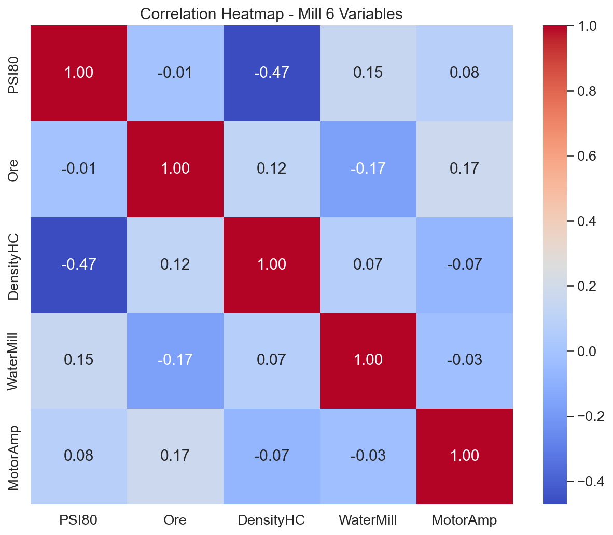
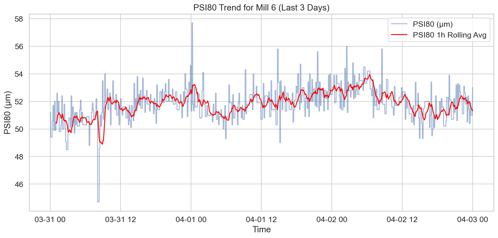

# Технически доклад за анализ на производителността: Мелница 6

## Изпълнително резюме
Настоящият доклад представя анализ на работата на Мелница 6 за периода 31.03.2026 г. – 03.04.2026 г. Анализът обхвана 4321 минути оперативни данни с цел идентифициране на аномалии в качеството на смилане (PSI80). Установени са 130 случая на отклонения в режима на работа, които представляват около 3% от наблюдавания период. Основната причина за тези аномалии е негативната корелация (-0.71) между плътността на хидроциклона (DensityHC) и PSI80. Средните стойности на PSI80 по време на аномалните събития са 50.98 μm спрямо 51.85 μm при нормален режим. Препоръчва се стабилизиране на плътността на хидроциклона чрез прецизно регулиране на подаването на вода, за да се избегнат текущите колебания в качеството.

## Преглед на данните
Данните са извлечени от системата за управление на процесите за Мелница 6.
- **Период на анализ:** 31.03.2026 – 03.04.2026
- **Общ брой записи:** 4,321 (минутни стойности)
- **Ключови променливи:** PSI80 (целева променлива), Ore (захранване), DensityHC (плътност), WaterMill (вода в мелницата), MotorAmp (ампераж на мотора).
- **Методология:** Извършено е филтриране на шум от сензори и статистическа обработка за изолиране на системните аномалии от случайните грешки в измерванията.

## Анализ на аномалиите
След премахване на екстремните стойности, дължащи се на грешки в сензорите, бяха идентифицирани 130 минутни интервала с аномално поведение на PSI80.

### Сравнителни показатели:
| Показател | Аномални периоди | Нормален режим |
| :--- | :--- | :--- |
| Ore (t/h) | 164.62 | 166.11 |
| WaterMill (m3/h) | 11.06 | 11.72 |
| DensityHC (g/l) | 1612.89 | 1603.30 |
| PSI80 (μm) | 50.98 | 51.85 |
| MotorAmp (A) | 198.21 | 197.69 |

Корелационният анализ по време на аномалните периоди показва следната зависимост за PSI80:
- **DensityHC:** -0.71 (силно изразена отрицателна корелация)
- **Ore:** 0.26
- **WaterMill:** 0.16

## Визуализации

## Статистически изводи
Статистическата обработка потвърждава, че Мелница 6 работи стабилно в 97% от времето. Откритите 3% аномалии са тясно свързани с нестабилност в плътността на хидроциклона. Когато DensityHC се повиши рязко, PSI80 пада, което показва претоварване или неефективно класифициране в хидроциклона. Липсата на силна корелация с Ore (0.26) предполага, че проблемът не е в количеството входяща руда, а в хидравличния режим на мелницата.

## Заключения и препоръки
Въз основа на извършения анализ, се предлагат следните действия за подобряване на работата:

1.  **Оптимизация на водоподаването:** Увеличаване на автоматизацията при добавяне на вода към хидроциклона (WaterZumpf) за компенсиране на колебанията в плътността (DensityHC).
2.  **Настройка на PID контролери:** Преглед на настройките на контурите за регулиране на плътността на хидроциклона, тъй като текущата корелация от -0.71 показва необходимост от по-бърза реакция.
3.  **Мониторинг на MotorAmp:** Въпреки че текущата корелация е ниска (0.05), при промяна на плътността моторът показва малки вариации; препоръчва се проследяване на ампеража като ранен индикатор за натоварване.
4.  **Калибриране на сензори:** Идентифицираните "големи пикове", които бяха филтрирани, сочат към необходимост от профилактика на сензорите за PSI80 и PSI200.
5.  **Оперативен контрол:** По време на смените с повишено съдържание на по-твърда руда (базирано на лабораторни данни за качеството), да се поддържа DensityHC в по-ниския край на работния диапазон (около 1600 g/l), за да се предотврати отклонението на PSI80.