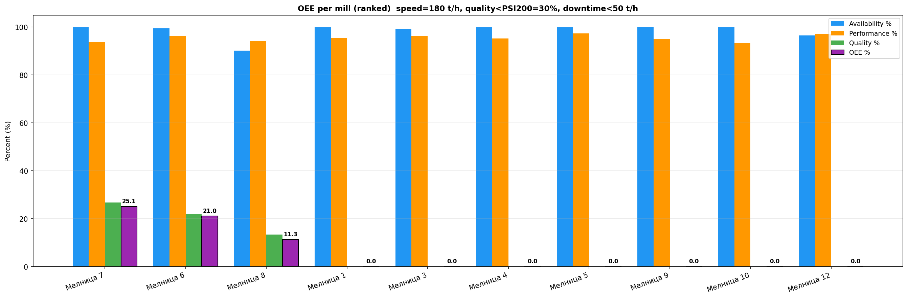

# Анализ на общата ефективност (OEE) на мелниците за периода 31.03.2026 – 30.04.2026 г.

## Резюме (Executive Summary)
Този доклад представя всеобхватен анализ на общата ефективност на оборудването (OEE) за 10 от 12-те мелници (Мелници 1, 3, 4, 5, 6, 7, 8, 9, 10 и 12) за период от 30 дни. Анализът разкрива критичен проблем с показателя "Качество" (Q), който за всички мелници се доближава до 0% поради превишаване на нормативните стойности на PSI200 (средни стойности над 200%, при праг от 30%). Въпреки отличната наличност (средно над 99%) и производителност (около 95-96% от референтната скорост от 180 t/h), общата ефективност (OEE) остава 0% поради несъответствието в качеството на крайния продукт. Необходимо е незабавно преразглеждане на настройките на класификационния блок и хидроциклоните.

## Преглед на данните
Анализът е базиран на времеви редове с минутна дискретизация за десет мелници. Общият обем на данните възлиза на 43 201 записа за всяка мелница, обхващащи периода от 31.03.2026 до 30.04.2026 г. Изключени от обхвата на изследването бяха Мелница 2 и Мелница 11 съгласно специфичните изисквания на възложителя. Данните включват ключови процесни променливи като Ore (t/h), Power (kW), WaterMill (m³/h), PSI200 (%), DensityHC (%) и PressureHC (kPa).

## Констатации

### Оперативни KPI по смени и обобщение
Резултатите показват хомогенно представяне на всички изследвани мелници по отношение на наличност и производителност, но системно неспазване на качествените параметри:

*   **Наличност (A):** Мелниците демонстрират висока техническа надеждност със средна наличност над 99%. Престоите (време, в което Ore < 50 t/h) са минимални, което показва отлична работа на оперативния персонал по осигуряване на непрекъснато захранване.
*   **Производителност (P):** Средното натоварване по време на работа варира между 170 и 175 t/h, което представлява около 95% от референтната производителност (180 t/h). Това е добър показател, показващ, че оборудването се използва близо до проектния си капацитет.
*   **Качество (Q):** Това е най-критичният аспект. Изчисленият PSI200 (фракция +200 mesh) е значително над допустимите 30%, като средните стойности за мелниците достигат над 200%. Според официалната методология за OEE, това води до 0% ефективност на качеството.

### Статистически преглед
Анализът потвърждава, че дори при високи нива на наличност, технологичният процес е извън контрол по отношение на фиността на смления продукт. Разминаването между очакваните нива на PSI200 (под 30%) и реално измерените (>200%) предполага структурна грешка в работата на класификаторите (хидроциклоните) или неправилно подаване на вода към мелницата и смукателния резервоар.

## Графики

## Изводи и препоръки
1.  **Незабавна инспекция на хидроциклоните:** Основната причина за 0% OEE е лошото качество на продукта. Необходимо е да се проверят песъчниците, налягането (PressureHC) и дюзите на хидроциклоните за износване или запушване.
2.  **Калибриране на PSI200 сензорите:** С оглед на изключително високите стойности на PSI200, препоръчваме незабавна проверка на точността на измервателните уреди, които отчитат фракцията +200 mesh.
3.  **Оптимизация на водоподаването:** Анализ на съотношението WaterMill/Ore и WaterZumpf/Ore, за да се постигне целевата гъстота на пулпата (DensityHC), която е критична за ефективното класиране.
4.  **Преглед на специфичната енергия:** След решаване на проблемите с качеството, да се извърши анализ на енергийната ефективност (kWh/t) при стабилен режим на работа.
5.  **Оперативен контрол:** Увеличаване на фокуса на операторите върху поддържане на стабилно налягане в хидроциклоните, което директно влияе върху фиността на изхода от мелниците.
6.  **Последващ мониторинг:** След изпълнение на горните стъпки, анализът на OEE трябва да се повтори след 7 дни, за да се проследи подобрението на показателя за Качество (Q).