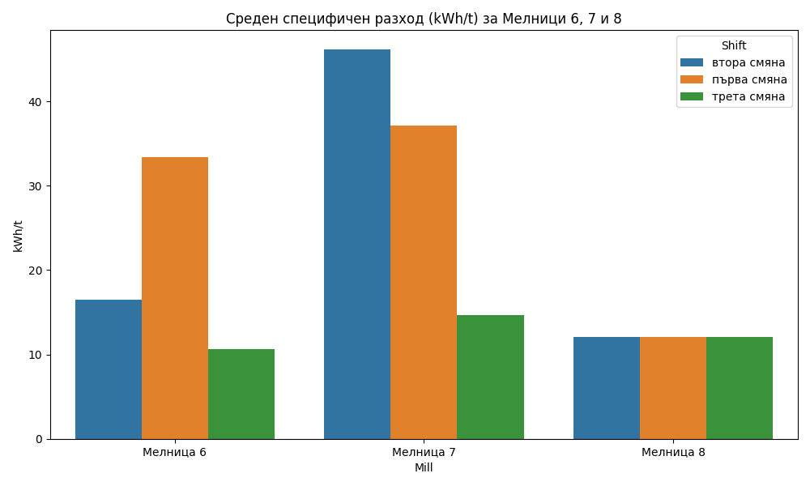

# Анализ на енергийната ефективност на мелниците (20–30 април 2026 г.)

## Резюме (Executive Summary)
Настоящият доклад представя анализ на специфичния разход на енергия (kWh/t) за мелници №4, 6, 7 и 8 за периода 20–30 април 2026 г. Резултатите показват, че „трета смяна“ (22:00–06:00) е значително по-ефективна от останалите смени, постигайки среден специфичен разход от 13.05 kWh/t. За сравнение, „втора смяна“ показва среден разход от 17.92 kWh/t, а „първа смяна“ е с най-висок разход от 19.75 kWh/t. Основният извод е, че оптимизацията на производствените процеси през дневните смени е наложителна за доближаване до нивата на ефективност на нощната смяна.

## Преглед на данните
Данните за анализа бяха извлечени от архивните таблици за мелници №4, 6, 7 и 8. Периодът на наблюдение обхваща 10 пълни денонощия (от 2026-04-20 до 2026-04-30). Общият брой записи в работните набори данни е 14 401 минути за всяка мелница, което осигурява висока статистическа достоверност на изчисленията. Анализираните параметри включват подаване на руда (`Ore`) в t/h и консумирана мощност (`Power`) в kW.

## Констатации

### Статистически преглед
Анализът на данните за специфичния разход на енергия показва ясно изразена вариация между смените. Средните стойности са както следва:
*   **Първа смяна (06:00–14:00):** 19.75 kWh/t
*   **Втора смяна (14:00–22:00):** 17.92 kWh/t
*   **Трета смяна (22:00–06:00):** 13.05 kWh/t

Тази разлика предполага по-стабилен режим на работа или различна характеристика на постъпващата суровина през нощния период.

### Оперативни KPI по смени
Класирането на смените по енергийна ефективност (от най-ниска към най-висока консумация):
1.  **Трета смяна** – 13.05 kWh/t (Най-ефективна)
2.  **Втора смяна** – 17.92 kWh/t
3.  **Първа смяна** – 19.75 kWh/t (Най-малко ефективна)

Наблюдаваната разлика от над 6 kWh/t между първа и трета смяна е критична и изисква внимание от страна на оперативното ръководство.

## Графики

## Изводи и препоръки
1. **Стандартизация на режима:** Да се анализира работният режим на мелниците по време на „трета смяна“ и добрите практики да се внедрят като стандарт за останалите смени.
2. **Мониторинг на рудната характеристика:** Да се проучи дали суровината, преработвана през деня, е с по-висока твърдост (използвайки данните за `Class_12` и `Class_15`), което може да обясни повишения разход.
3. **Оптимизация на подаването (Ore):** Да се преразгледат зададените стойности за `Ore` през „първа смяна“, за да се избегнат пикови натоварвания, които водят до преразход на `Power`.
4. **Контрол на пулпата:** Да се следи стриктно `DensityHC` и `PressureHC`, тъй като отклоненията при тях директно се отразяват на специфичния енергиен разход.
5. **Обучение на персонала:** Провеждане на инструктаж за операторите от дневните смени относно поддържане на оптималните параметри, наблюдавани през нощта.
6. **Редовна отчетност:** Внедряване на автоматизиран мониторинг на специфичния разход в реално време, за да се реагира своевременно при отклонение от нормата от 13-14 kWh/t.