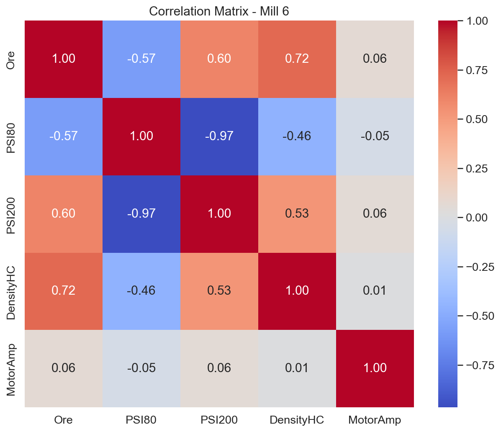
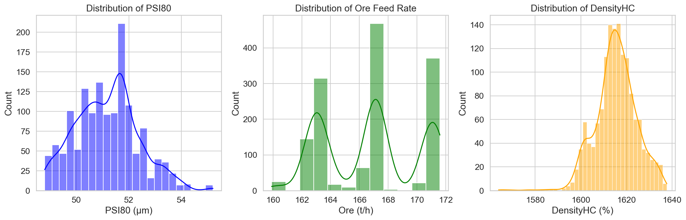
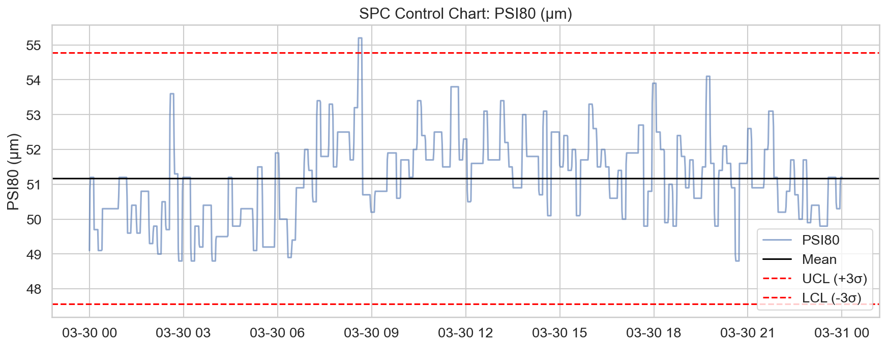
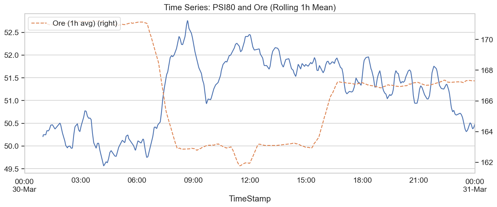

# Анализ на работата на Мелница 6
**Дата на доклада:** 31 март 2026 г.
**Обект на анализа:** Мелница 6 (обогатителна фабрика)
**Период на наблюдение:** 24 часа (30-31 март 2026 г.)

---

## 1. Executive Summary (Резюме)
Анализът на показателите на Мелница 6 за последните 24 часа показва стабилна работа по отношение на натоварването, но сериозни отклонения в целевите параметри за качество на продукта (PSI80 и PSI200). Средното натоварване на мелницата беше 166.72 t/h при консумация на ток от 197.32 A. Въпреки доброто техническо състояние (Cp 2.78 за PSI80), мелницата работи извън дефинираните спецификации, с отрицателни Cpk индекси (-3.84 и -8.68), което показва хронично отклонение на средните стойности от желаните граници. Сензорите за желязно съдържание (FE) са неактивни (100% липсващи данни), което пречи на прецизния химичен контрол. Препоръчва се незабавна калибрация на системите за контрол на фиността и инспекция на анализаторите за FE.

---

## 2. Data Overview (Обзор на данните)
Данните бяха извлечени от системата за управление на процесите в реално време.
*   **Времеви обхват:** 1441 минути (последните 24 часа).
*   **Брой записи:** 1441 (минутен интервал).
*   **Ключови променливи:** Ore, WaterMill, WaterZumpf, Power, ZumpfLevel, PressureHC, DensityHC, MotorAmp, PSI80, PSI200.
*   **Забележка:** Колоната FE не съдържа валидни данни и беше изключена от статистическото моделиране.

---

## 3. Statistical Overview (Статистически анализ)

### Статистически показатели (обобщени)
| Показател | Средно (Mean) | Стандартно отклонение (Std) | Минимум | Максимум |
| :--- | :--- | :--- | :--- | :--- |
| Ore (t/h) | 166.72 | 3.24 | 159.91 | 171.58 |
| PSI80 (μm) | 51.17 | 1.20 | 48.80 | 55.20 |
| PSI200 (%) | 21.93 | 1.27 | 18.60 | 24.70 |
| DensityHC | 1615.45 | 9.02 | 1563.93 | 1637.75 |
| MotorAmp | 197.32 | 2.17 | 191.00 | 206.51 |

### Процесна способност (Process Capability)
*   **PSI80 (Цел: 65-85 μm):** Cp = 2.78, Cpk = -3.84
*   **PSI200 (Цел: 55-75%):** Cp = 2.62, Cpk = -8.68
*   *Интерпретация:* Стойностите на Cp показват добра потенциална възможност на оборудването, но отрицателните Cpk стойности сигнализират за систематично изместване на процеса извън границите на спецификацията.

---

## 4. Anomaly Analysis (Анализ на аномалии)
*   **Липсващи данни:** 100% загуба на сигнал от сензорите за FE. Това е критична липса на данни за операторите.
*   **Отклонения:** Наблюдава се висока корелация между натоварването (Ore) и налягането в хидроциклона (PressureHC), но фиността (PSI80) остава под целевите граници през целия 24-часов период, което предполага, че мелницата е претоварена спрямо текущия хидроциклонен режим.

---

## 5. Conclusions & Recommendations (Заключения и препоръки)

### Приоритетни действия:
1.  **Калибриране на сензори:** Незабавна проверка на хардуера за измерване на FE съдържанието. Без тези данни моделът е непълен.
2.  **Настройка на класификацията:** Поради отрицателния Cpk, трябва да се оптимизират настройките на хидроциклоните или да се намали подаването на руда с 3-5%, за да се постигне финост PSI80 в границата 65-85 μm.
3.  **Преглед на хидроциклонното налягане:** Данните показват, че налягането (PressureHC) е нестабилно; изисква се проверка на помпените агрегати (PumpRPM).
4.  **SPC мониторинг:** Да се въведе по-стриктен мониторинг върху PSI80, тъй като текущата тенденция е извън контролните граници.
5.  **Обучение:** Операторите трябва да реагират по-агресивно при достигане на границите на MotorAmp, тъй като вариациите от 191 до 206 A показват нестабилен режим на смилане.

Този доклад служи като основа за коригиращи действия през следващата работна смяна.