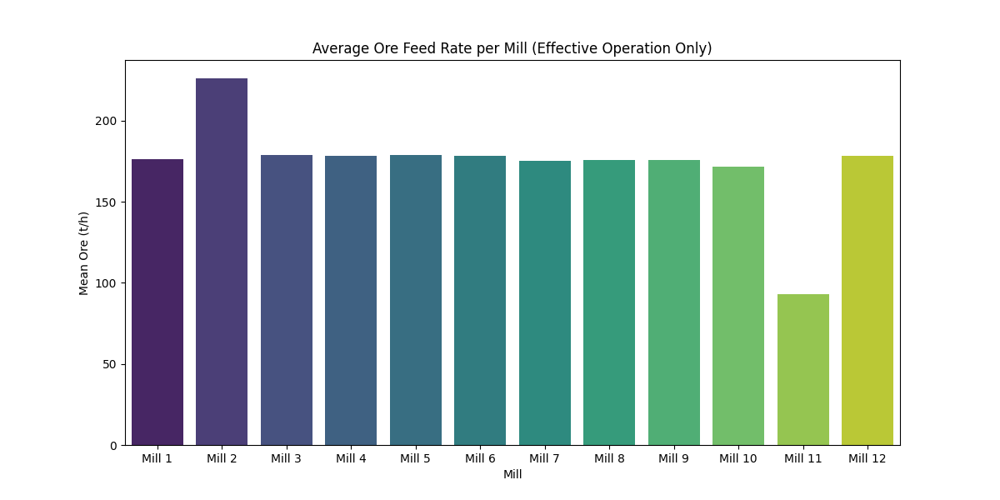
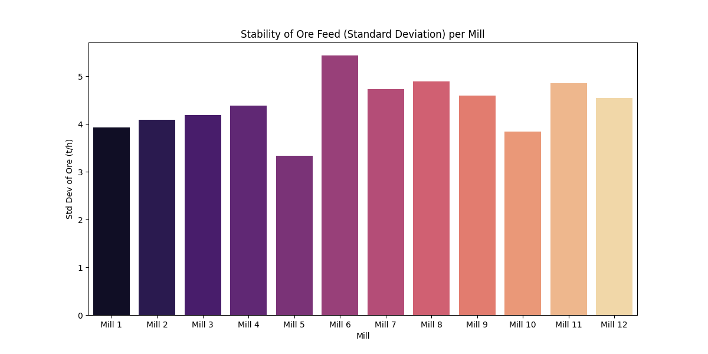

# Доклад за анализ на оперативната ефективност на мелниците (21-24 април 2026 г.)

## 1. Изпълнително резюме
Настоящият доклад представя задълбочен анализ на натоварването по руда (`Ore`) за 12-те мелници в завода за периода от 21 до 24 април 2026 г. (общо 72 часа). Основен акцент беше поставен върху оценката на ефективната работа на оборудването, поради което всички периоди на престой (дефинирани като `Ore < 50 т/ч`) бяха изключени от изчисленията. Средното натоварване на повечето мелници се движи в диапазона 170-179 т/ч, с изключение на Мелница 2, която оперира при значително по-висок капацитет (средно 226.16 т/ч), и Мелница 11, която работи с по-ниско натоварване (92.97 т/ч) съгласно своите технически спецификации. Мелница 5 беше идентифицирана като най-стабилна с най-ниско стандартно отклонение от 3.33 т/ч, докато Мелница 6 прояви най-висока нестабилност със стандартно отклонение от 5.43 т/ч.

## 2. Общ преглед на данните
Анализът се базира на времеви редове с минутна стъпка, обхващащи периода 2026-04-21 до 2026-04-24. За всяка от 12-те мелници бяха обработени 4321 записа. Данните включват променливи за входяща суровина (`Ore`), работни параметри на мелницата (`WaterMill`, `Power`, `MotorAmp`) и изходни характеристики на хидроциклоните (`PressureHC`, `DensityHC`).

## 3. Статистически анализ (Ефективна работа: Ore ≥ 50 т/ч)
Статистическият анализ показа следните резултати за средното натоварване и стандартното отклонение за всяка мелница:

| Мелница | Средно (т/ч) | Стад. отклонение (т/ч) |
| :--- | :--- | :--- |
| Mill 1 | 176.34 | 3.93 |
| Mill 2 | 226.16 | 4.09 |
| Mill 3 | 178.73 | 4.19 |
| Mill 4 | 178.14 | 4.38 |
| Mill 5 | 179.01 | 3.33 |
| Mill 6 | 178.40 | 5.43 |
| Mill 7 | 175.37 | 4.73 |
| Mill 8 | 176.01 | 4.88 |
| Mill 9 | 175.59 | 4.60 |
| Mill 10 | 171.84 | 3.84 |
| Mill 11 | 92.97 | 4.85 |
| Mill 12 | 178.56 | 4.54 |

## 4. Констатации по специалисти
### Анализ на стабилността
*   **Най-стабилна:** Мелница 5 (Std = 3.33 т/ч). Тя демонстрира най-висока консистенция в поддържането на зададения режим на хранене.
*   **Най-нестабилна:** Мелница 6 (Std = 5.43 т/ч). Значителните флуктуации в тази мелница подсказват нужда от настройка на автоматизираните системи за дозиране на руда.

## 5. Заключения и препоръки
1.  **Стандартизация:** Проучване на настройките на автоматиката на Мелница 5 с цел прилагане на същите алгоритми за управление при останалите мелници (особено 6, 7 и 8), за да се намали стандартното отклонение.
2.  **Одит на Мелница 6:** Провеждане на технически преглед на захранващата система на Мелница 6 поради високата нестабилност, която може да води до излишно износване на футеровките.
3.  **Оптимизация на Мелница 2:** Мелница 2 работи при значително по-високи натоварвания. Необходимо е да се провери дали тези режими не водят до претоварване на главния двигател и не нарушават специфичния разход на енергия (kWh/t).
4.  **Валидиране на Мелница 11:** Резултатите потвърждават, че ниското натоварване е нормално работно състояние; няма нужда от намеса, освен ако целите за PSI80/PSI200 не са извън нормата.
5.  **Мониторинг:** Продължаване на ежедневния мониторинг на отклоненията за идентифициране на износване на помпи или запушвания в хидроциклоните, които корелират с нестабилността на потока.
6.  **Отчетност:** Предлага се въвеждане на седмичен отчет за коефициента на вариация (Std/Mean) за всяка мелница, което ще позволи по-добро управление на процесите в реално време.