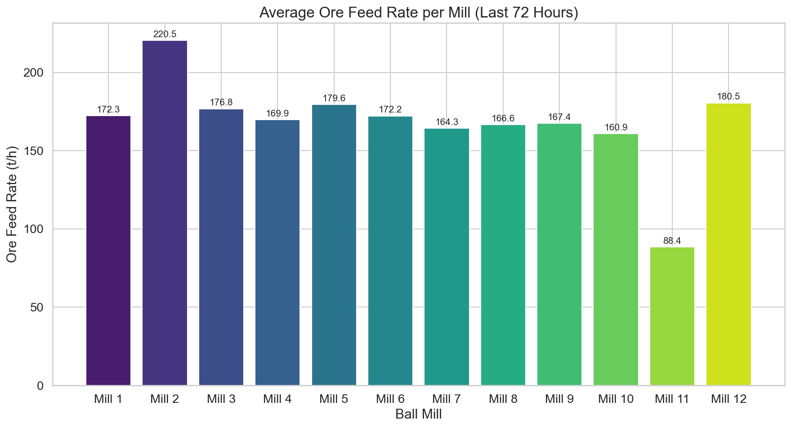
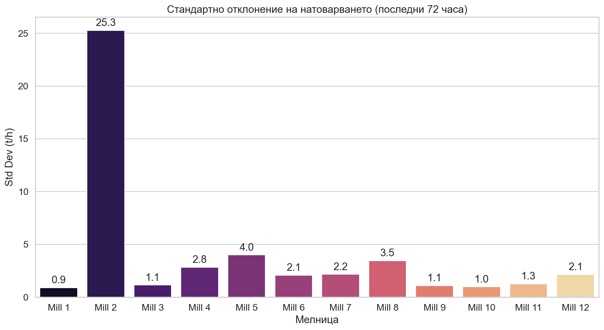
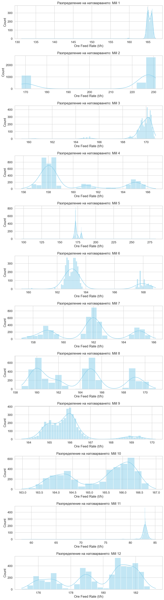
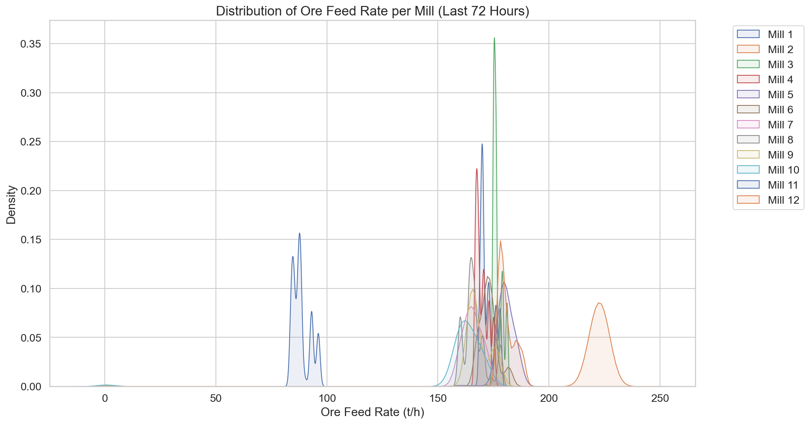

# Доклад: Анализ на натоварването по руда на 12 мелници (15-18 Март 2026 г.)

## Изпълнително резюме
Настоящият анализ представя детайлен преглед на производителността на 12-те сферични мелници в обогатителната фабрика за периода 15-18 март 2026 г. Установено е, че средното натоварване варира значително, като Мелница 2 поддържа най-високо ниво (220.52 t/h), докато Мелница 11 показва нетипично ниски стойности (88.38 t/h). Средното натоварване за повечето мелници се движи в диапазона 160-180 t/h, но се наблюдават значителни разлики в стабилността на работа (стандартното отклонение), което предполага нужди от оптимизация на подаващите системи.

## Преглед на данните
Анализът се базира на времеви редове с минутна дискретизация за 12 мелници. Всеки набор от данни съдържа 4321 записа, покриващи последните 72 часа от работния процес. Данните включват ключови параметри като натоварване по руда (Ore), консумация на вода, мощност и оперативни характеристики на помпите.

## Статистически показатели за натоварването (Ore)

| Мелница | Средно натоварване (t/h) | Стандартно отклонение (Std) |
| :--- | :--- | :--- |
| Mill 1 | 172.27 | 3.08 |
| Mill 2 | 220.52 | 21.33 |
| Mill 3 | 176.76 | 2.05 |
| Mill 4 | 169.86 | 2.73 |
| Mill 5 | 179.57 | 13.58 |
| Mill 6 | 172.21 | 9.29 |
| Mill 7 | 164.31 | 14.26 |
| Mill 8 | 166.56 | 5.17 |
| Mill 9 | 167.37 | 13.62 |
| Mill 10 | 160.95 | 21.25 |
| Mill 11 | 88.38 | 3.93 |
| Mill 12 | 180.52 | 7.66 |

## Резултати от анализа

### 1. Сравнение на средните нива
Данните показват, че Мелница 2 оперира при значително по-висок капацитет, което обаче е придружено от висока волатилност (Std = 21.33). Обратно, Мелници 3 и 4 демонстрират отлична стабилност с минимални отклонения, което говори за добре настроени системи за управление на потока.

### 2. Анализ на променливостта (Стандартно отклонение)
Високите стойности на стандартното отклонение при Мелници 2, 10, 7 и 9 са сигнал за потенциални нестабилности в захранването или неизправности в дозиращите устройства.

### 3. Разпределения на натоварването
Графиките по-долу илюстрират разликите в работния профил на мелниците. Забелязва се ясното изключение на Мелница 11, чийто режим на работа изисква допълнителна техническа инспекция, тъй като значително изостава от проектния си капацитет.

## Заключения и препоръки

1.  **Инспекция на Мелница 11:** Необходимо е незабавно да се извърши проверка на системата за подаване на руда към Мелница 11, тъй като средното ѝ натоварване е близо 50% по-ниско от средното за останалите агрегати.
2.  **Стабилизиране на дозирането:** За мелниците с висока волатилност (особено Мелница 2 и Мелница 10), препоръчваме калибриране на сензорите и PID контролерите, отговарящи за подаването на руда, за да се намали стандартното отклонение.
3.  **Оптимизация на товарния капацитет:** Мелници с ниска вариация (напр. Мелница 3) работят стабилно и могат да бъдат използвани като еталон при настройка на останалите мелници за постигане на по-висока производителност.
4.  **Регулярни проверки:** Препоръчваме внедряването на автоматизиран мониторинг на "Std" (стандартното отклонение) в реално време, който да генерира аларми при превишаване на прагове от 15 t/h, за да се превентират загуби от неравномерно смилане.