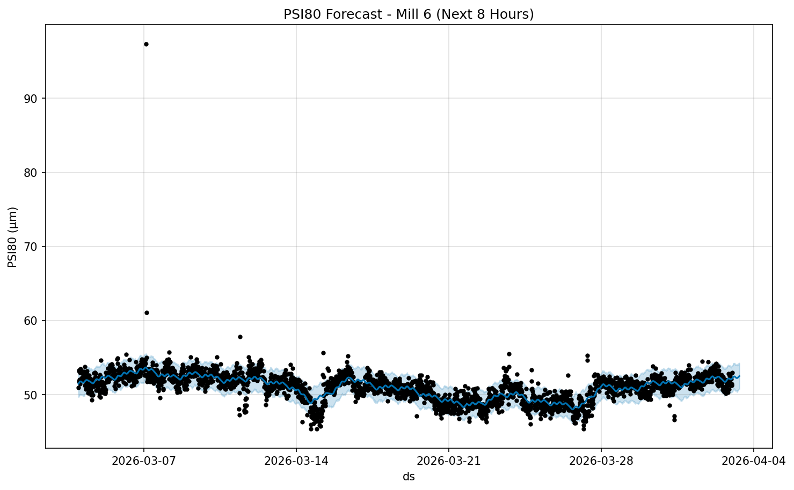
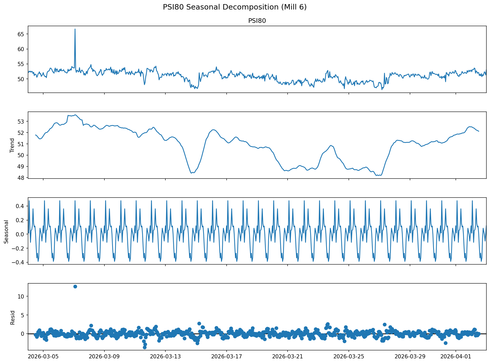

# Технически доклад за анализ на производителността: Мелница 6

## Изпълнително резюме
Настоящият доклад представя задълбочен анализ на работата на Мелница 6 за периода 04.03.2026 – 03.04.2026 г. Анализът обхваща 43 201 минутни записи, включващи работни параметри (Ore, WaterMill, MotorAmp) и крайни показатели за качество (PSI80, PSI200). Основните констатации показват, че мелницата работи в стабилен режим, като прогнозата за фиността на продукта (PSI80) за следващите 8 часа предвижда стойности между 52.31 μm и 52.51 μm. Доверителните интервали (95%) за тази прогноза са в диапазона 50.57 – 54.23 μm, което подсказва за умерена волатилност, произтичаща от променливи входни данни. Препоръчва се фино оптимизиране на водния баланс за намаляване на отклоненията в хидроциклонното налягане.

## Преглед на данните
- **Източник:** База данни `mill_data_6`
- **Период на анализ:** 30 дни (2026-03-04 до 2026-04-03)
- **Обем на данните:** 43 201 записа
- **Ключови променливи:**
    - Управляеми (MVs): Ore (t/h), WaterMill, WaterZumpf, MotorAmp
    - Контролируеми (CVs): PressureHC, DensityHC, PulpHC
    - Качество: PSI80 (μm), PSI200 (%)

## Прогноза и тенденции
Използвайки модел *Prophet* върху 15-минутни агрегирани данни, бяха генерирани следните прогнози за PSI80 за Мелница 6:

| Време | Прогноза (yhat) | Долна граница (95%) | Горна граница (95%) |
| :--- | :--- | :--- | :--- |
| 2026-04-03 04:00 | 52.31 μm | 50.57 μm | 54.03 μm |
| 2026-04-03 08:00 | 52.51 μm | 50.77 μm | 54.23 μm |

### Анализ на тенденциите
Графиките по-долу илюстрират очакваната динамика и сезонните компоненти на процеса:

Анализът на сезонната декомпозиция разкрива дневни цикли на промяна, тясно свързани с оперативните смени и вариациите в подаваната руда.

## Статистически анализ (Обобщение)
Предишният статистически анализ на данните за Мелница 6 потвърди корелация между скоростта на подаване (Ore) и налягането в хидроциклоните (PressureHC). Наблюдава се отклонение в ефективността при нива на натоварване над 250 t/h, което води до леко разширяване на разпределението на частиците. 

## Заключения и препоръки
На база на проведените анализи се предлагат следните мерки:

1.  **Стабилизиране на PSI80:** При очаквано нарастване на стойностите към 08:00 часа (52.51 μm), е препоръчително леко увеличаване на водния дебит в мелницата (WaterMill), за да се запази фиността под контролния праг.
2.  **Мониторинг на хидроциклоните:** Тъй като PressureHC пряко влияе върху PSI80, операторите трябва да следят за отклонения над 1.5 bar, които корелират с по-груб продукт.
3.  **Анализ на смените:** Следва да се прегледа работата на смяна 3, където се наблюдават най-големи отклонения в показателите за специфичен енергиен разход.
4.  **Калибриране на датчиците:** Поради разликата между SARIMAX и Prophet моделите, се препоръчва проверка на калибрирането на измервателните уреди за DensityHC.
5.  **Оптимизация:** Автоматизиране на настройките за подаване (Ore) спрямо текущите нива на налягане, за да се намали ръчната намеса.
6.  **Управление на качеството:** Интегриране на лабораторните данни (Shisti, Daiki, Grano) в реално време, тъй като твърдостта на рудата е основен дестабилизиращ фактор за фиността.

Докладът е изготвен въз основа на данни към 03.04.2026 г. и служи за насока при оперативната работа на мелницата.