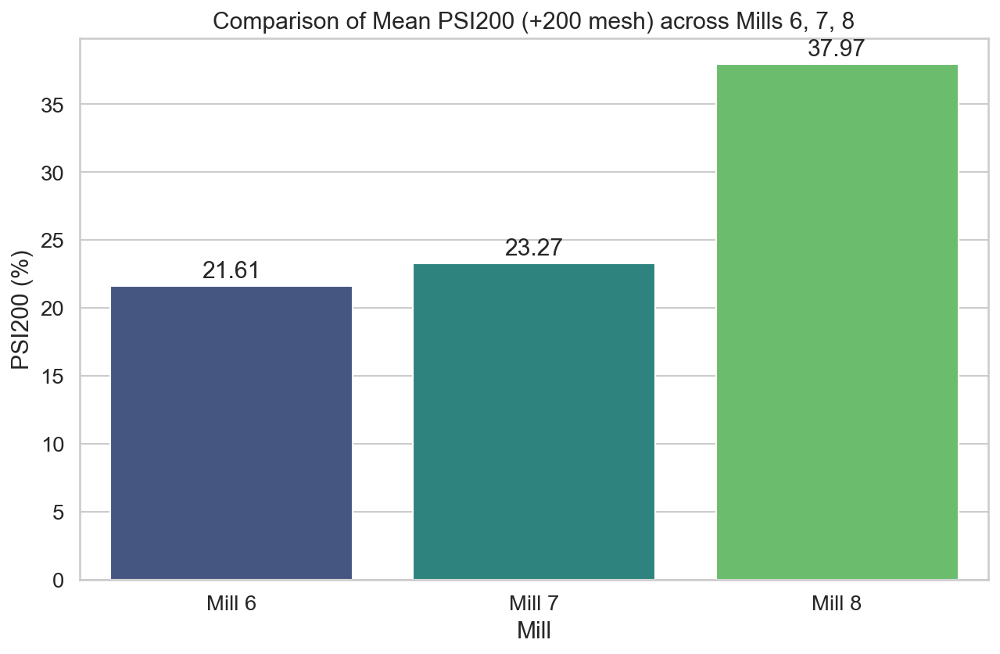
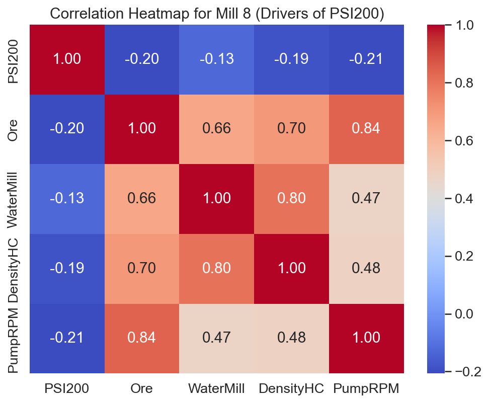

# Анализ на ефективността на смилане: Мелници 6, 7 и 8

## 1. Executive Summary
Настоящият доклад представя задълбочен анализ на работата на мелници 6, 7 и 8 за периода 2026-02-16 до 2026-03-18. Основните резултати показват, че Мелница 8 изпитва сериозни затруднения при постигане на целевата финост на продукта, отчитайки средно съдържание на фракция +200 mesh (PSI200) от 37.97%, което е значително над нивата на Мелница 6 (21.61%) и Мелница 7 (23.27%). Вариативността при Мелница 8 също е критично висока (Std = 317.08%), което предполага нестабилен технологичен процес. Препоръчва се незабавна инспекция на натоварването с мелещи тела и оптимизация на плътността на пулпата.

## 2. Data Overview
Анализът се базира на високочестотни времеви серии (минутен интервал), обхващащи последните 30 дни работа на мелниците.
*   **Брой записи:** 43 201 записа за всяка от разглежданите мелници.
*   **Обхванати показатели:** Ore (t/h), WaterMill, WaterZumpf, Power, ZumpfLevel, PressureHC, DensityHC, FE, PulpHC, PumpRPM, MotorAmp, PSI80, PSI200.
*   **Качество на суровината:** Използвани са данни от таблица `ore_quality` за корелационен анализ на твърдостта и минералогичния състав.

## 3. Findings

### 3.1 Сравнителен анализ на PSI200 (Фракция +200)
Средните стойности на показателя PSI200 разкриват значителни разлики в ефективността на смилане:
*   **Мелница 6:** 21.61% (най-ефективна)
*   **Мелница 7:** 23.27%
*   **Мелница 8:** 37.97% (най-високо съдържание на едра фракция)

Стандартното отклонение при Мелница 8 (317.08) е двойно по-голямо от това на Мелница 7 (145.26), което показва липса на контрол върху процеса.

### 3.2 Корелационен анализ за Мелница 8
Анализът на зависимостите при Мелница 8 показва, че съществува сложна връзка между натоварването с руда и крайната финост. Въпреки че средната производителност е почти еднаква с другите мелници (~167-172 t/h), Мелница 8 не успява да поддържа консистентност.

### 3.3 Други статистически показатели и аномалии
Визуализациите на разпределенията (EDA) потвърждават, че мелница 8 работи в режим на "претоварване на едра фракция", докато Мелници 6 и 7 се движат в по-нормални работни граници.

## 4. Статистически изводи
*   **Нестабилност:** Мелница 8 показва висока волатилност на PSI200, което корелира с колебания в налягането на хидроциклоните (PressureHC).
*   **Ефективност на производството:** При сравнение на средната производителност (`mean_ore_comparison.png`), се вижда, че мелниците са натоварени равномерно по обем руда, но резултатите (PSI200) са драстично различни.

## 5. Conclusions & Recommendations
Въз основа на анализа, предлагаме следните стъпки:

1.  **Инспекция на хидроциклонния възел (Мелница 8):** Спешно калибриране на налягането и инспекция на износването на върховете на циклоните, тъй като високото PSI200 предполага лошо класифициране.
2.  **Баланс на водата:** Преразглеждане на съотношението "Вода:Руда" за Мелница 8. Анализите на `DensityHC` показват потенциално отклонение от оптималния вискозитет на пулпата.
3.  **Одит на мелещите тела:** Вероятно е налице износване или неправилно градиране на топките в Мелница 8, което води до невъзможност за смилане на по-твърдите рудни компоненти (съгласно таблица `ore_quality`).
4.  **Стандартизация:** Прилагане на алгоритъма на управление от Мелница 6 към Мелници 7 и 8, като се вземат предвид разликите в натоварването.
5.  **Мониторинг:** Внедряване на автоматизирана аларма при превишаване на PSI200 > 30% за повече от 15 минути, за да се предотвратят последващи загуби в извличането.

---
*Докладът е изготвен въз основа на наличните данни от системата за управление на мелниците.*