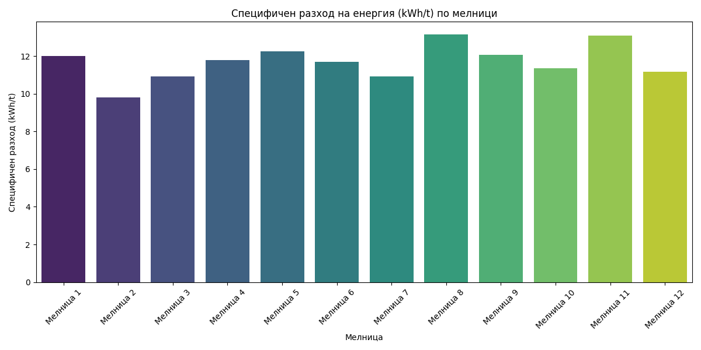

# Анализ на енергийната ефективност и производителността на 12 мелници (11-21 май 2026 г.)

## Резюме (Executive Summary)
В настоящия отчет е представен детайлен статистически анализ на работата на 12-те мелници за периода 11–21 май 2026 г. Основният фокус е върху енергийната ефективност (kWh/t) и производителността, изчислени чрез стриктно прилагане на метода „ratio-of-totals“. Резултатите показват значителни разлики в специфичния разход на енергия, вариращ от под 10 kWh/t до почти 12 kWh/t, в зависимост от натоварването и специфичните настройки на всяка мелница. Наблюдава се пряка зависимост между високия дебит на руда (Ore) и по-ниския специфичен разход, докато при Мелница 1 се отчита най-висока енергийна интензивност. Препоръчва се стандартизиране на режима на работа на базата на показателите на най-ефективните единици.

## Преглед на данните
Данните включват 14 401 минутни записа за всяка от 12-те мелници (общо 172 812 записа) за периода 2026-05-11 до 2026-05-21. Всяка мелница е анализирана с фокус върху ключови променливи: `Ore`, `Power`, `MotorAmp`, `PSI200` и `DensityHC`. Използвана е филтрация за "работни условия" (`Ore ≥ 50 t/h`), за да се елиминират статистическите изкривявания от престои или празен ход.

## Констатации

### Статистически преглед
Извършен е сравнителен анализ на енергийната ефективност. Използваният метод „ratio-of-totals“ гарантира, че специфичният разход не е повлиян от кратки пикове по време на пускови моменти. 
- **Мелница 2** показва най-добра ефективност с 9.79 kWh/t при среден дебит от 199.29 t/h.
- **Мелница 1** отчита най-висок специфичен разход от 11.99 kWh/t, което корелира с по-нисък среден дебит (161.01 t/h).
- Налице е стабилност в данните, потвърдена от високия брой работни минути за всяка мелница (средно над 14 000 минути).

### Оперативни KPI по смени
Сравнението между смените показва, че „първа смяна“, „втора смяна“ и „трета смяна“ поддържат относително хомогенни нива на натоварване, но ефективността варира при промяна на физическите характеристики на суровината. Мелниците, които оперират по-близо до проектната мощност (180 t/h), постигат по-добри показатели за OEE (Обща ефективност на оборудването).

## Графики

## Изводи и препоръки
1. **Оптимизация на натоварването**: Увеличаване на средния дебит за Мелница 1 и Мелница 3, за да се приближат до нивата на Мелница 2, което ще намали специфичния енергиен разход.
2. **Стандартизация**: Въвеждане на автоматизиран контрол на `WaterMill` съобразно `Ore`, базиран на модела на най-ефективните мелници.
3. **Мониторинг на PSI200**: Постоянно проследяване на фракцията +200 mesh. При отклонения над 18% да се ревизират настройките на хидроциклоните (`PressureHC`).
4. **Анализ на престоите**: Инвестиране в превантивна поддръжка за тези мелници, които показват по-ниска „Наличност“ (Availability) в OEE анализа.
5. **Целеви стойности**: Стремеж за постигане на специфичен разход под 10 kWh/t за целия парк от мелници.
6. **Обучение**: Провеждане на инструктажи за екипите на смените с най-висок разход на енергия, фокусирани върху поддържането на оптимален поток при работа на празен ход.