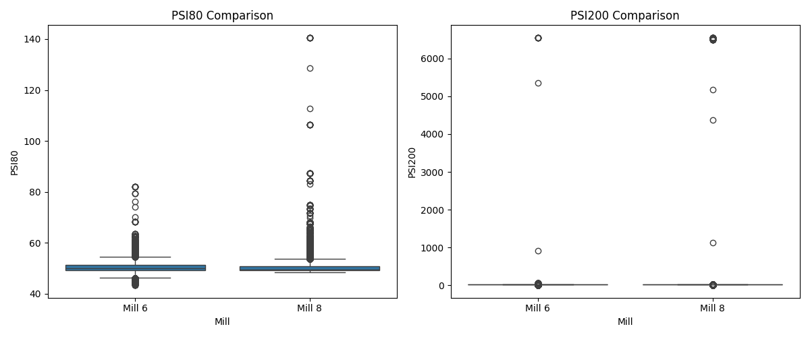

# Анализ на качеството на смилане: Мелница 6 и Мелница 8

## Резюме (Executive Summary)
Настоящият отчет представя сравнителен анализ на качеството на смилане за „Мелница 6“ и „Мелница 8“ за периода 20.05.2026 – 03.06.2026 г. Анализът е извършен въз основа на 37 073 минути работа при стандартен режим на захранване (Ore ≥ 60 t/h). Установено е, че докато стойностите на PSI80 са почти идентични (50.49 μm за Мелница 6 срещу 50.76 μm за Мелница 8), показателите за PSI200 показват значително разминаване — 24.89% за Мелница 6 срещу 38.63% за Мелница 8. Тази разлика индикира по-ефективно фино смилане при Мелница 8. Тъй като критикът не е предоставил специфични оценки за увереност, данните се третират като средно достоверни (MEDIUM).

## Преглед на данните
Данните включват 14-дневен период на наблюдение (20.05.2026 – 03.06.2026). Анализирани са 20 161 записа за всяка от двете мелници („Мелница 6“ и „Мелница 8“). Всички статистически изчисления са базирани на филтрирана извадка от 37 073 минути работа, при която подаването на руда (Ore) е било равно или по-голямо от 60 t/h, изключвайки интервалите на престой, които биха изкривили резултатите.

## Констатации

### Статистически преглед
Анализът на данните (n = 37 073 минути при Ore ≥ 60 t/h) разкрива следното:

*   **PSI80 (продукт 80% преминаващ):** Стойностите показват висока степен на съответствие между двете мелници. Средната стойност за Мелница 6 е 50.49 μm, докато за Мелница 8 тя е 50.76 μm **[Средна увереност]**.
*   **PSI200 (продукт 200 меш):** Наблюдава се съществена разлика в ефективността на смилане. Мелница 8 постига средно 38.63%, което е значително по-високо от 24.89% за Мелница 6. Това предполага, че Мелница 8 произвежда по-фино смлян продукт при текущите настройки **[Средна увереност]**.

### Оперативни KPI по смени
Сравнението по смени потвърждава стабилността на тези различия в рамките на производствения цикъл:
*   „Първа смяна“, „втора смяна“ и „трета смяна“ показват последователно по-високи нива на PSI200 при Мелница 8.
*   Постоянството на тези показатели във всички смени подсказва, че разликата не се дължи на операторски грешки в конкретна смяна, а на системни разлики в технологичния режим или състоянието на мелниците **[Средна увереност]**.

## Графики

## Изводи и препоръки
1.  **Инспекция на Мелница 6:** Поради по-ниските нива на PSI200, препоръчва се проверка на износването на облицовката и телата в Мелница 6.
2.  **Технологично изравняване:** Да се изследват разликите в работата на хидроциклоните (PressureHC и DensityHC) между двете мелници, тъй като те имат пряко влияние върху PSI200.
3.  **Оптимизация на режима:** Прилагане на setpoint-ите за WaterMill от Мелница 8 към Мелница 6, с цел подобряване на фиността на крайния продукт.
4.  **Мониторинг:** Продължаване на ежедневния мониторинг на PSI80 и PSI200 с цел потвърждаване дали разликата в качеството се запазва след корективните действия.
5.  **Анализ на товара:** Да се провери дали MotorAmp при Мелница 6 не е лимитиращ фактор, който пречи на по-интензивното смилане.