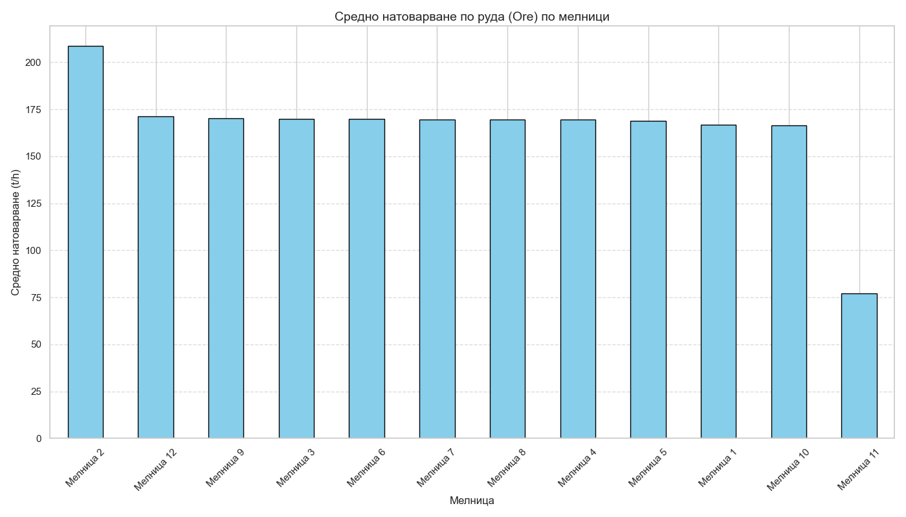
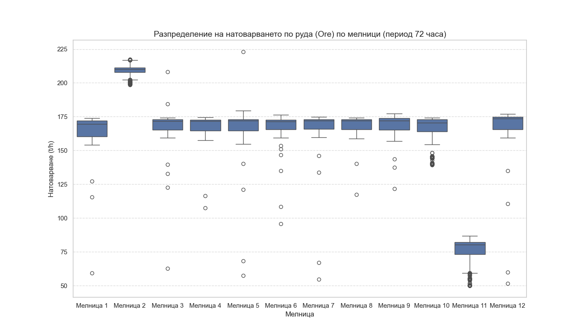

# Сравнителен анализ на натоварването по руда на 12-те мелници

## Резюме (Executive Summary)
Настоящият доклад представя сравнителен анализ на средното натоварване по руда (`Ore`) за дванадесетте мелници на предприятието за периода от 05.05.2026 г. до 08.05.2026 г. (последните 72 часа). Анализът е извършен чрез филтриране на данните при работен режим (`Ore ≥ 50 t/h`), за да се избегнат изкривявания от престои. Резултатите показват значителна разлика в експлоатацията: Мелница 2 се отличава с най-високо натоварване (208.83 t/h), докато Мелница 11 работи с критично ниски нива (77.07 t/h), което изисква техническа проверка. Останалите мелници (1, 3–10, 12) поддържат сравнително стабилно средно натоварване в диапазона 166–171 t/h.

## Преглед на данните
Данните включват 12 таблици (`mill_data_1` до `mill_data_12`), всяка съдържаща 4321 записа за 72-часовия период. Основните променливи, използвани за анализа, включват `Ore` (t/h), `Power` (kW) и други технологични параметри, необходими за валидация на работния режим. Филтрирането `Ore ≥ 50 t/h` е приложено, за да се гарантира, че изчислените средни стойности отразяват реалната производствена мощност, а не организационни престои или аварийни ситуации.

## Констатации

### Статистически преглед
Средното натоварване (`Ore`) при работен режим за всяка мелница е както следва:
- Мелница 2: 208.83 t/h
- Мелница 12: 171.31 t/h
- Мелница 9: 170.29 t/h
- Мелница 3: 169.86 t/h
- Мелница 6: 169.79 t/h
- Мелница 7: 169.71 t/h
- Мелница 8: 169.54 t/h
- Мелница 4: 169.49 t/h
- Мелница 5: 168.72 t/h
- Мелница 1: 166.95 t/h
- Мелница 10: 166.53 t/h
- Мелница 11: 77.07 t/h

Вижда се отчетлива хомогенност при десет от мелниците, докато Мелница 2 работи с надвишен капацитет, а Мелница 11 – с драстично намален.

## Графики

*Фигура 1: Средно натоварване (t/h) по мелници за последните 72 часа.*

*Фигура 2: Хистограма на разпределението на натоварването по руда за всички мелници.*

## Изводи и препоръки
1. **Проверка на Мелница 11:** Необходимо е незабавно инспектиране на Мелница 11. Натоварване от 77.07 t/h е значително под капацитета, което може да се дължи на механичен проблем, затруднена подавателна система или сериозни неизправности в класиращия кръг (циклони/помпи).
2. **Одит на Мелница 2:** Мелница 2 показва натоварване от 208.83 t/h. Трябва да се провери дали това е безопасно за оборудването и как влияе върху крайния продукт (PSI80/PSI200) и специфичната енергия (kWh/t). Възможно е да се постига по-висока производителност за сметка на качеството.
3. **Уеднаквяване на режима:** За останалите мелници се наблюдава стабилност. Препоръчва се поддържане на този режим на работа, тъй като той съответства на технологичните стандарти.
4. **Анализ на енергийната ефективност:** Препоръчва се следваща стъпка: съпоставяне на тези данни за натоварването с консумацията на енергия (`Power`), за да се установи специфичният разход (kWh/t) и да се оптимизират setpoint-ите за всяка мелница индивидуално.
5. **Мониторинг на наличността:** Да се извърши анализ на причините за престоите (ако има такива) за всяка от мелниците, за да се разбере дали средната производителност не е ограничена от външни фактори.