# Анализ на натоварването по руда и контролни карти (SPC)

## Резюме (Executive Summary)
Този отчет допълва сравнителния анализ на натоварването по руда (`Ore`) за дванадесетте мелници с контролни карти на Шухарт (X-bar charts). Анализът показва, че повечето мелници работят стабилно в рамките на контролните си граници. Изключение прави Мелница 11, която показва значителен брой точки извън контролните граници, което потвърждава необходимостта от техническа проверка.

## Статистически преглед
Средното натоварване (`Ore`) при работен режим за всяка мелница е следното:

| Мелница | Средно (CL) (t/h) | UCL (t/h) | LCL (t/h) | Извън контрол (%) |
| :--- | :--- | :--- | :--- | :--- |
| Мелница 1 | 166.95 | 184.29 | 149.60 | 0.08% |
| Мелница 2 | 208.83 | 224.18 | 193.48 | 0.00% |
| Мелница 3 | 169.86 | 182.60 | 157.12 | 0.14% |
| Мелница 4 | 169.49 | 182.89 | 156.10 | 0.05% |
| Мелница 5 | 168.72 | 186.46 | 150.98 | 0.12% |
| Мелница 6 | 169.79 | 181.55 | 158.04 | 0.14% |
| Мелница 7 | 169.71 | 184.16 | 155.25 | 0.09% |
| Мелница 8 | 169.54 | 183.03 | 156.04 | 0.05% |
| Мелница 9 | 170.29 | 184.91 | 155.67 | 0.07% |
| Мелница 10 | 166.53 | 193.69 | 139.36 | 0.02% |
| Мелница 11 | 77.07 | 99.44 | 54.71 | 2.30% |
| Мелница 12 | 171.31 | 187.33 | 155.28 | 0.09% |

## Контролни карти на Шухарт (X-bar Charts)
Графиките по-долу показват поведението на натоварването по руда (`Ore`) за всяка мелница.

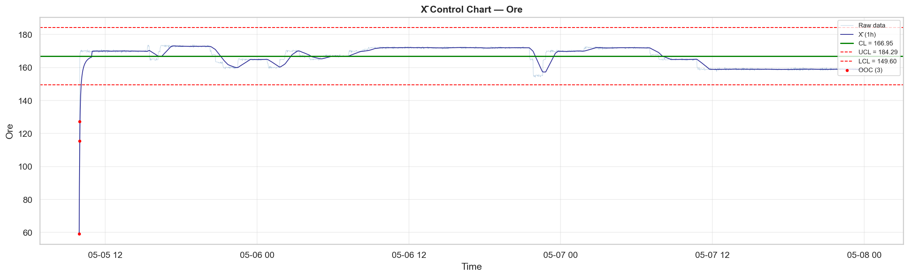
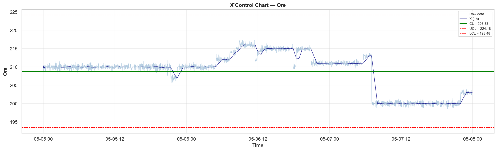
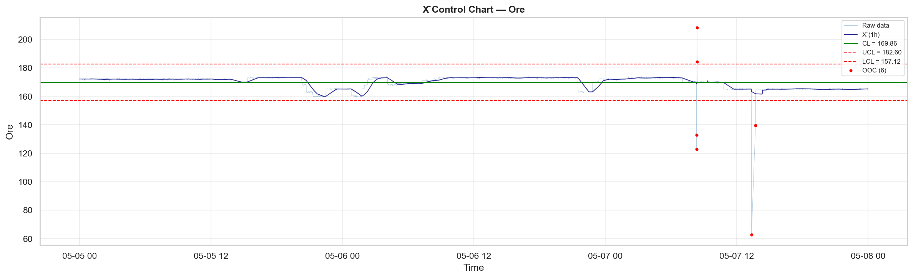
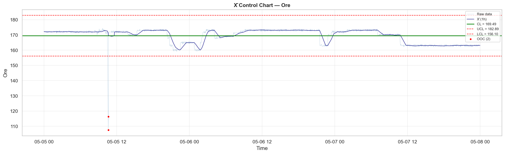
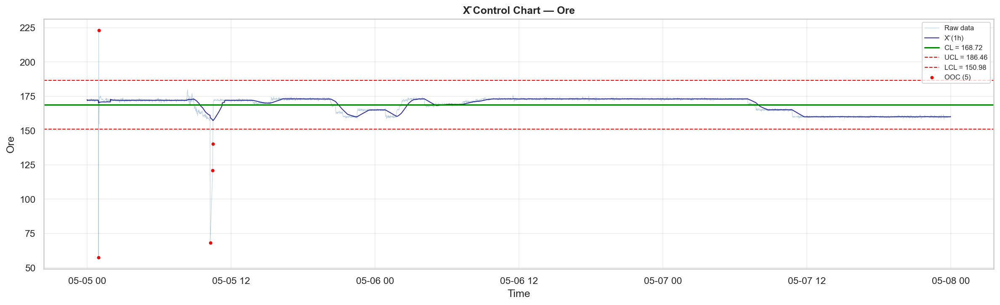
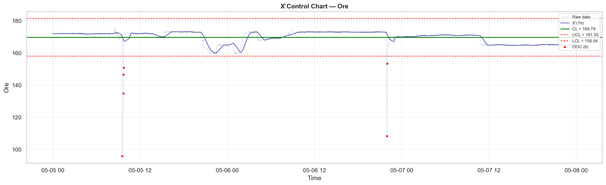
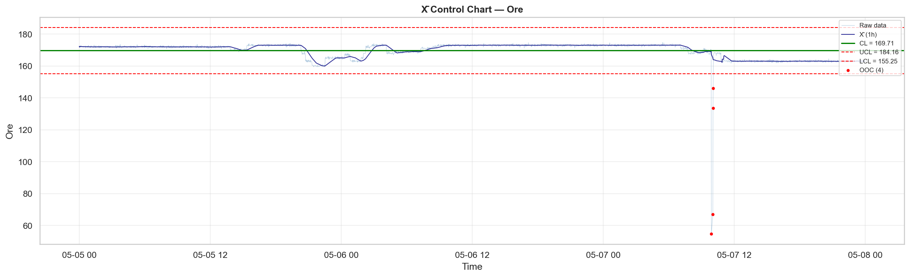
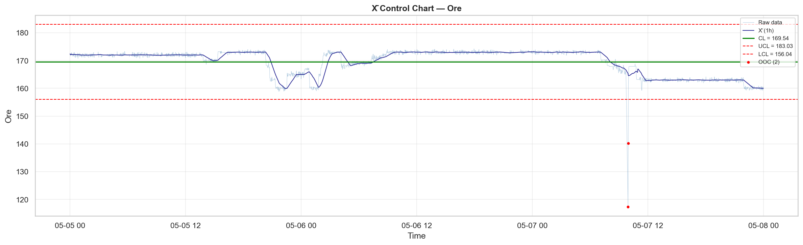
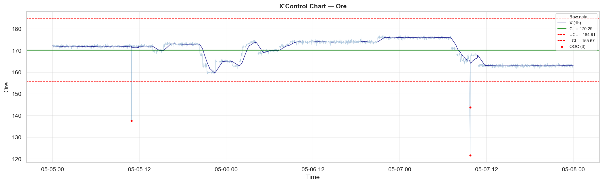
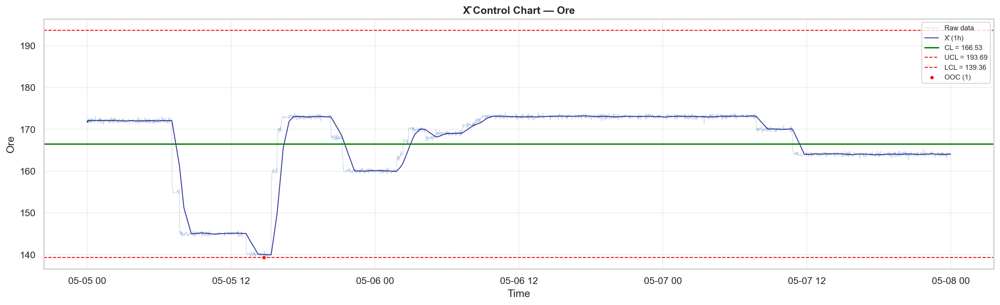
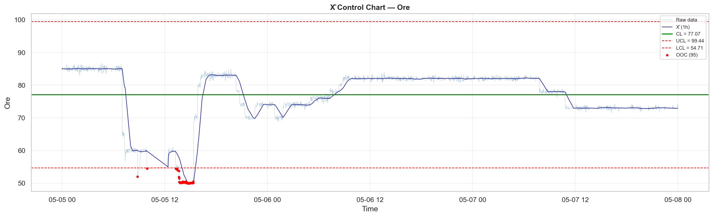
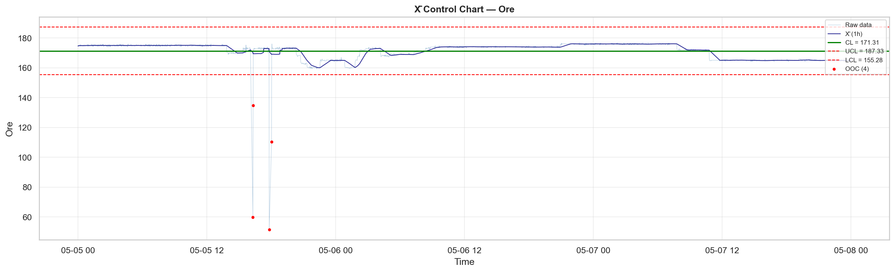

## Изводи
1. **Стабилност:** Повечето мелници показват висока стабилност, като процентът на точките извън контрол е минимален (под 0.2%).
2. **Аномалия Мелница 11:** Високият процент точки извън контролните граници (2.3%) потвърждава, че работата на Мелница 11 не е в „статистически контролирано състояние“. Това налага незабавна техническа намеса.
3. **Мелница 2:** Въпреки високото средно натоварване, Мелница 2 демонстрира перфектна стабилност (0.0% извън контрол), което предполага предвидим и добре настроен процес.