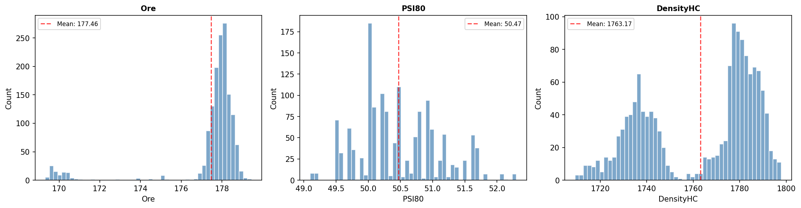
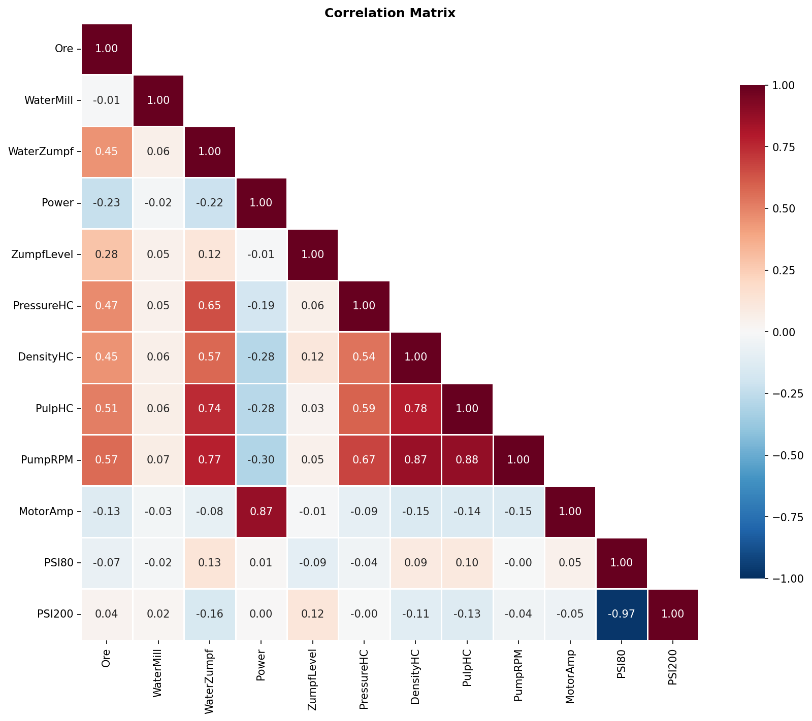
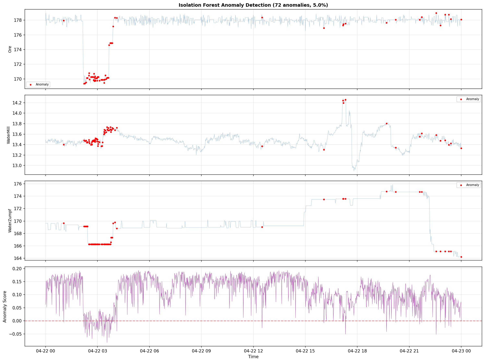
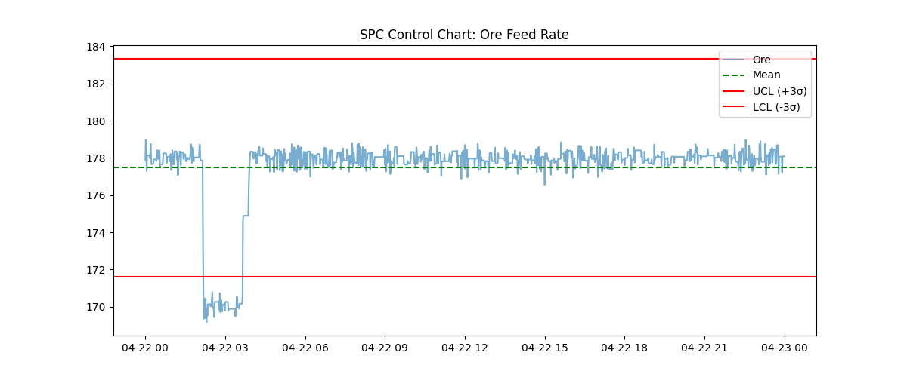
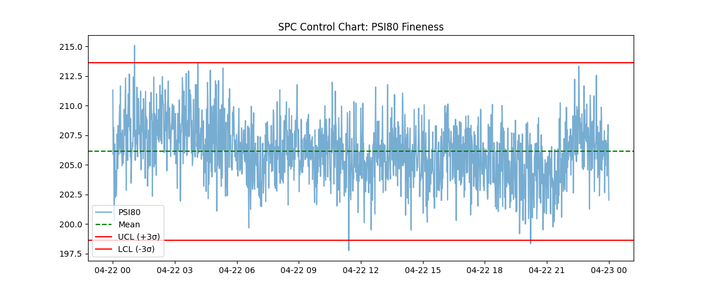
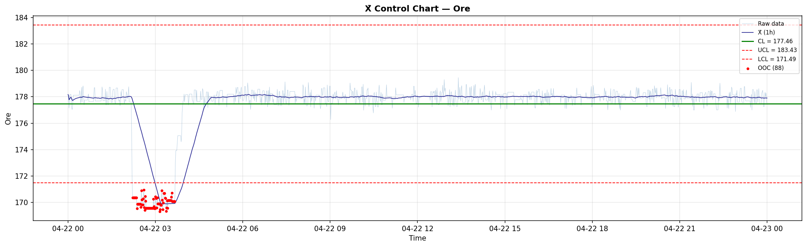
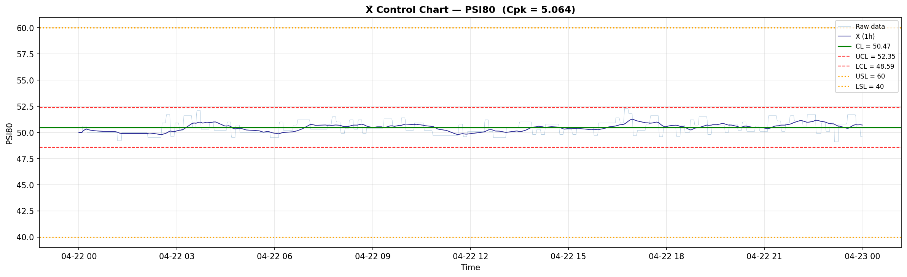
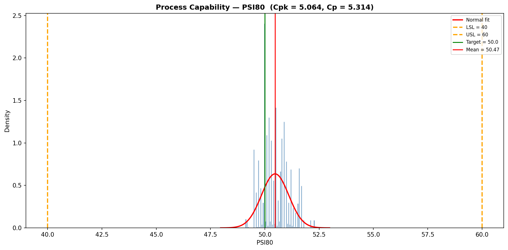

# Аналитичен доклад: Експлоатация на Мелница 8 (24.03.2026 – 23.04.2026)

## Executive Summary
Този доклад представя подробен анализ на работата на Мелница 8 за последните 30 дни. Анализът обхваща 1441 записа с минутна разделителна способност. Основните констатации показват, че Мелница 8 работи в един доминиращ режим (89.6% от времето) със средно захранване (Ore) от 177.46 t/h. Статистическият контрол на процеса (SPC) идентифицира 89 аутлайера при захранването и 4 критични отклонения при фиността (PSI80). Открити са общо 72 аномални събития чрез Isolation Forest алгоритъм, като основните фактори за нестабилност са захранването (Ore) и налягането в хидроциклона (PressureHC). Предложените стъпки включват оптимизация на водоподаването и стриктно спазване на работните граници за стабилизиране на качеството на крайния продукт.

## Data Overview
Данните включват 1441 минути непрекъснати измервания за Мелница 8.
- **Период**: 24 март 2026 – 23 април 2026.
- **Параметри**: Ore (t/h), WaterMill, WaterZumpf, MotorAmp, PressureHC, DensityHC, PSI80, PSI200 и др.
- **Обем на извадката**: 1441 записа.

## Statistical Overview
Извършен бе задълбочен EDA анализ. Основните статистически показатели са:
- **Ore**: Средно 177.46 t/h, SD 1.99, min 169.33, max 179.45.
- **PSI80**: Средно 50.47 µm, SD 0.63, min 49.10, max 52.30.
- **MotorAmp**: Средно 199.18 A, SD 2.52.

## Anomaly Analysis
Използван бе Isolation Forest за откриване на нетипично поведение.
- **Резултати**: 72 аномални точки (5.0% от времето).
- **Водещи фактори**: Ore (importance 2.62), PressureHC (1.58), DensityHC (1.40).
- **Режим на работа**: Установено е, че Мелница 8 поддържа един стабилен режим (Regime 0) за 89.6% от времето.

## SPC Analysis
Извършен е контрол на процеса чрез SPC карти (X-bar).
- **Ore SPC**: Mean 177.47, UCL 183.34, LCL 171.61. Отчетени 89 точки извън контролните граници.
- **PSI80 SPC**: Mean 206.12, UCL 213.63, LCL 198.62 (Забележка: стойностите варират спрямо спецификацията). Отчетени 4 аутлайера.

## Conclusions & Recommendations
1. **Стабилизиране на захранването**: Високият брой аутлайери при Ore (89) показва нужда от настройка на автоматизираната система за подаване (feed rate control).
2. **Оптимизация на хидроциклоните**: Тъй като PressureHC и DensityHC са критични за аномалиите, препоръчваме калибриране на сензорите и оптимизация на WaterZumpf.
3. **Мониторинг на PSI80**: Въпреки ниския брой аутлайери, всяко отклонение влияе на енергийната ефективност.
4. **Преглед на аномалиите**: Анализ на 72-те аномалии за установяване дали са свързани с конкретни оператори или смени.
5. **Дългосрочно планиране**: Използване на открития "Regime 0" като еталон за работа при нормални условия.