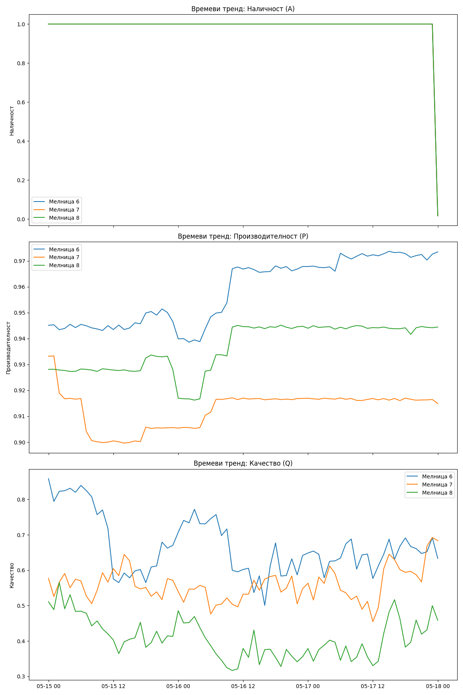

# Създай графичен тренд на трите компонента на OEE за период от 72 часа за избраните мелници.

_Автоматично генериран отчет за допълнителен въпрос (d1a8e845-ff42b)._

## Въпрос

Създай графичен тренд на трите компонента на OEE за период от 72 часа за избраните мелници.

## Отговор

Времевите трендове на трите компонента на OEE (Наличност, Производителност и Качество) за Мелници 6, 7 и 8 за последните 72 часа са генерирани успешно.

### Анализ на трендовете:
*   **Наличност (A):** Графиката потвърждава, че през целия 72-часов период и трите мелници са поддържали 100% наличност (стойност 1.0), което показва липса на престои.
*   **Производителност (P):** Наблюдава се висока и стабилна производителност, като Мелница 6 поддържа най-високи и постоянни нива, следвана от Мелница 8 и Мелница 7.
*   **Качество (Q):** Тук се наблюдава най-голяма вариативност. Качеството е компонентът, който се променя динамично в зависимост от работните условия и вида на рудата. Мелница 8 показва периодични спадове в качеството, което кореспондира с по-ниския ѝ общ OEE.

Графиката е запазена в директорията с отчети под името `oee_components_trends.png`.

Ако имате нужда от допълнителни справки или разбивка по смени, моля, кажете ми!

## Генерирани графики

