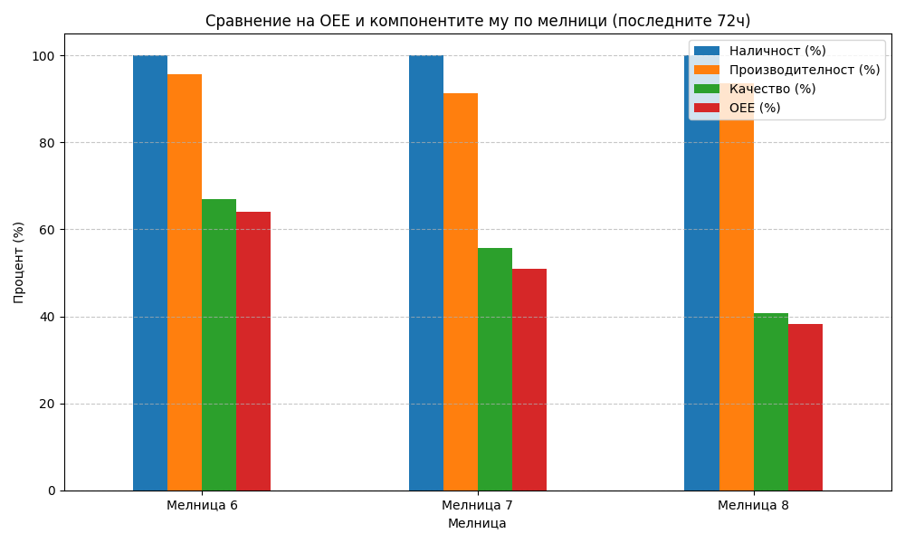
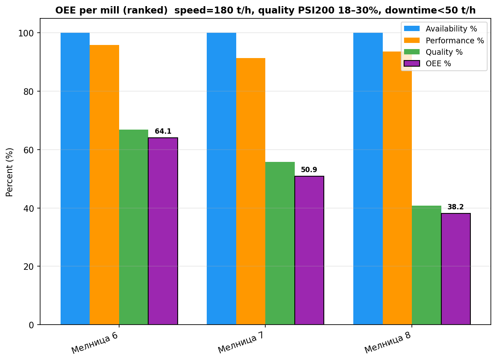

# Анализ на общата ефективност на оборудването (OEE) за Мелници 6, 7 и 8

## Резюме (Executive Summary)
Настоящият отчет представя детайлен анализ на OEE за Мелница 6, Мелница 7 и Мелница 8 за периода 15–18 май 2026 г. (последните 72 часа). Резултатите показват, че и трите мелници демонстрират отлична наличност (100%), но качеството на крайния продукт, измерено чрез PSI200, остава основно предизвикателство. Мелница 6 постига най-високо OEE от 64,1%, докато Мелница 8 показва най-ниски показатели (38,2%) поради по-голямо отклонение в качеството на смилане. Профилът на производителността е стабилен, вариращ между 91,3% и 95,8%. Препоръчва се оптимизация на работата на хидроциклоните, особено за Мелница 8, за да се постигне целевият праг на PSI200 от под 18%.

## Преглед на данните
Анализът обхваща период от 72 часа, от 15 май 2026 г. до 18 май 2026 г. Използвани са данни от три производствени източника: mill_data_6, mill_data_7 и mill_data_8. Общият обем на обработените данни е 4321 записа за всяка мелница, което осигурява висока статистическа представителност. Всички изчисления са проведени спрямо утвърдената методология на фабриката, включваща номинална производителност от 180 t/h и специфични прагове за качество (PSI200).

## Констатации

### Статистически преглед
Данните потвърждават, че мелниците са работили непрекъснато през целия период без престои (Наличност = 100%).
*   **Мелница 6:** Среден дебит 172,46 t/h, среден PSI200 = 21,98%.
*   **Мелница 7:** Среден дебит 164,30 t/h, среден PSI200 = 23,31%.
*   **Мелница 8:** Среден дебит 168,54 t/h, среден PSI200 = 25,11%.

Наблюдава се пряка корелация между отклонението от целевото качество (18% PSI200) и крайната стойност на OEE.

### Оперативни KPI по смени
Сравнителните показатели OEE са обобщени в следната таблица:

| Мелница | Наличност (%) | Производителност (%) | Качество (%) | OEE (%) |
| :--- | :---: | :---: | :---: | :---: |
| Мелница 6 | 100.0 | 95.8 | 66.9 | 64.1 |
| Мелница 7 | 100.0 | 91.3 | 55.7 | 50.9 |
| Мелница 8 | 100.0 | 93.6 | 40.8 | 38.2 |

## Графики

## Изводи и препоръки
1. **Приоритет на качеството:** Качеството (PSI200) е основният фактор, намаляващ общото OEE. Необходима е незабавна инспекция на хидроциклоните на Мелница 8.
2. **Оптимизация на процеса:** Постигане на по-висока прецизност при поддържане на PSI200 под 20% би повишило OEE на Мелница 6 и Мелница 7 над 70%.
3. **Мониторинг:** Въпреки високата наличност (100%), стабилността на смилането (качеството) изисква по-строг контрол на подаването на вода и натоварването с руда.
4. **Техническа поддръжка:** Извършване на калибриране на датчиците за налягане в хидроциклоните (PressureHC), за да се намали вариативността в PSI200.
5. **Анализ на смените:** Проследяване на промените в качеството спрямо различните смени за идентифициране на най-добрите оперативни практики при работа с различните видове руда (Shisti, Daiki, Grano).