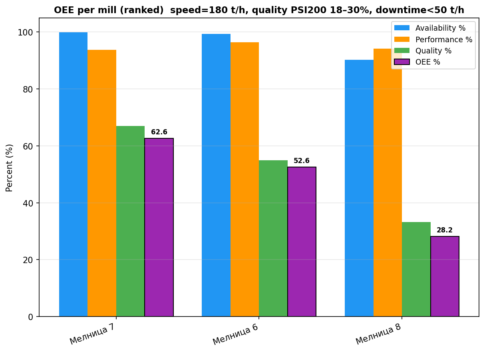

# Отчет за Общата ефективност на оборудването (OEE) за Мелници 6, 7 и 8

## Резюме (Executive Summary)
Настоящият отчет представя детайлен анализ на OEE (Обща ефективност на оборудването) за Мелница 6, Мелница 7 и Мелница 8 за периода 31 март – 30 април 2026 г. Общите резултати показват вариации в оперативната ефективност, като Мелница 7 постига най-висок OEE (62,62%), следвана от Мелница 8 (59,04%) и Мелница 6 (52,60%). Основното ограничение пред ефективността във всички изследвани обекти е компонентът „Качество“ (Q), пряко свързан с фиността на крайния продукт (PSI200). Наличността (A) е поддържана на високо ниво при Мелница 6 и Мелница 7, докато Мелница 8 демонстрира по-чести престои. Необходими са оптимизации в управлението на хидроциклонните възли за подобряване на показателите по качество.

## Преглед на данните
Анализът се базира на времеви редове с минутна резолюция, обхващащи периода от 2026-03-31 до 2026-04-30 (общо 43 201 записа на мелница). Данните включват основни оперативни параметри като Ore, Power, PSI200 и други технологични променливи, необходими за изчисляване на компонентите на OEE съгласно корпоративния стандарт:
*   **Наличност (A):** Минути при `Ore` ≥ 50 t/h.
*   **Производителност (P):** Средно натоварване спрямо референтна стойност от 180 t/h.
*   **Качество (Q):** Линейна функция на `PSI200` в интервала 18% (100%) до 30% (0%).

## Констатации

### Оперативни KPI по смени
Следващата таблица обобщава резултатите за трите мелници по компоненти:

| Мелница | Наличност (A) | Производителност (P) | Качество (Q) | OEE (%) |
| :--- | :--- | :--- | :--- | :--- |
| Мелница 6 | 99,37% | 96,35% | 54,94% | 52,60% |
| Мелница 7 | 99,84% | 93,74% | 66,91% | 62,62% |
| Мелница 8 | 90,19% | 96,55% | 67,78% | 59,04% |

**Ключови наблюдения:**
*   **Мелница 6:** Добра наличност, но най-ниско качество на продукта (mean `PSI200` = 23,41%), което ограничава крайния OEE.
*   **Мелница 7:** Най-балансирани показатели с отлична наличност (99,84%) и сравнително по-добро качество спрямо Мелница 6.
*   **Мелница 8:** Отбелязва по-ниска наличност (90,19%) поради престои, но демонстрира най-добри показатели по качество (Q = 67,78%).

## Графики

## Изводи и препоръки
1.  **Приоритизиране на качеството:** Ниските стойности на компонент „Качество“ (Q) са общ проблем. Нужно е пренастройване на хидроциклоните (PressureHC и DensityHC), за да се сведе средното ниво на `PSI200` по-близо до целевите 18%.
2.  **Анализ на престоите при Мелница 8:** Наличността при Мелница 8 (90,19%) е значително по-ниска. Препоръчва се преглед на механичната поддръжка и логистиката на подаване на руда, за да се намалят периодите с `Ore` < 50 t/h.
3.  **Стандартизация на работата:** Да се проучат добрите практики при Мелница 7 и да се приложат в Мелница 6 за оптимизиране на качествените параметри при запазване на високата наличност.
4.  **Мониторинг на натоварването:** Производителността (P) е стабилна, но под референтните 180 t/h. След подобряване на качеството, постепенно да се увеличи натоварването до номиналния капацитет.
5.  **Последващ анализ:** Да се извърши корелационен анализ между `WaterMill` и `PSI200`, за да се установи ефектът на промивните води върху фиността на продукта.