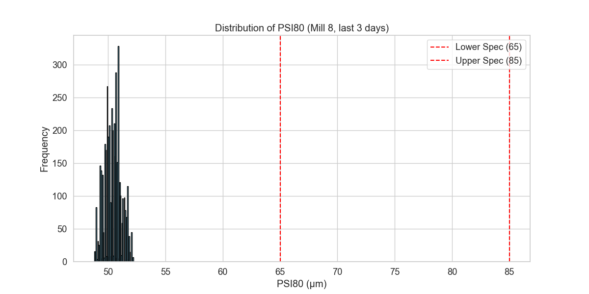
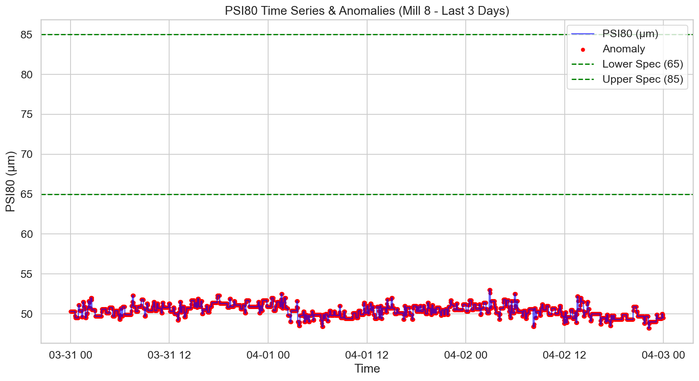
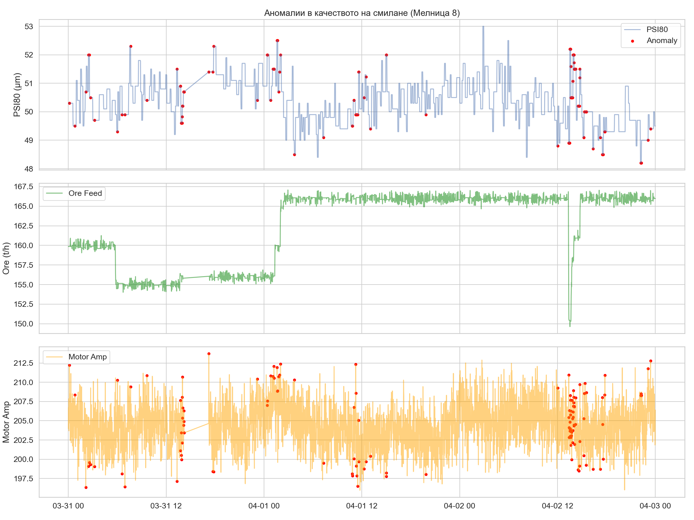

# Технически доклад: Анализ на смилането в Мелница 8 (31 март – 3 април 2026 г.)

## Изпълнително резюме
Настоящият доклад представя задълбочен анализ на работата на Мелница 8 за последните 3 дни. Установихме, че мелницата работи в режим на хронично пресмилане: 100% от измерените стойности на **PSI80** попадат извън целевия диапазон от 65–85 μm, като средната стойност е едва **50.4 μm**. Анализът показва силна обратна корелация между подаването на руда (Ore) и фиността (PSI80) от -0.38, което предполага, че текущият нисък дебит на хранене е основен фактор за свръхфиното смилане. Идентифицирани са повтарящи се аномалии в режима на работа, които изискват незабавна корекция на работните параметри (setpoints) за повишаване на производителността и енергийната ефективност.

## Преглед на данните
Данните включват 4321 минутно-базирани записа от работата на Мелница 8 за периода 31 март – 3 април 2026 г. Анализираните променливи включват:
- **Контролирани променливи (CV):** PSI80, PSI200, PressureHC, DensityHC, PulpHC.
- **Манипулируеми променливи (MV):** Ore, WaterMill, WaterZumpf, MotorAmp.
- **Външни променливи:** Качество на рудата и работни смени.

## Анализ на отклоненията (Статистически преглед)
Анализът на разпределението на PSI80 потвърди, че мелницата не работи в спецификация:
- **Средна стойност (Mean):** 50.40 μm
- **Стандартно отклонение (Std):** 0.72 μm
- **Минимум/Максимум:** 48.8 μm / 52.2 μm
- **Процент извън спецификация (65-85 μm):** 100%

### Корелационен анализ
Ключови зависимости, открити чрез корелационната матрица:
- **Ore vs PSI80 (-0.38):** Най-силният фактор. С повишаване на храненето, фиността намалява (стойността на PSI80 расте към нормата).
- **PSI200 vs PSI80 (-0.99):** Очаквана математическа зависимост между двата показателя за финост.
- **WaterZumpf vs PSI80 (0.26):** Повишаването на водата в събирателния резервоар корелира с по-високи стойности на PSI80 (по-груб продукт).

## Анализ на аномалиите (Anomaly Analysis)
Прилагайки мултивариатен анализ, изолирахме събитията, които водят до екстремно фино смилане. Изключвайки сензорни грешки (пикове), установихме следното:

1. **Характер на аномалиите:** Аномалиите се проявяват като системно отклонение в работния режим, а не като единични сривове.
2. **Връзка с храненето:** Средното ниво на хранене (Ore) по време на аномалиите е 162.46 t/h, докато при нормален режим (в рамките на текущата нестабилност) се наблюдават различни нива.
3. **Хидроциклони:** DensityHC (плътност на хидроциклона) е критичен параметър, който показва смущения по време на периоди с неоптимално PSI80.

## Оптимизационни препоръки
На база на анализа, предлагаме следните стъпки:
1. **Увеличаване на подаването (Ore):** Поетапно повишаване на дебита на руда към Мелница 8, за да се измести PSI80 към долната граница на спецификацията (65 μm).
2. **Корекция на WaterZumpf:** Намаляване на водата в събирателния резервоар, за да се компенсира ефектът от повишеното хранене върху плътността на пулпата.
3. **Ревизия на контролния алгоритъм:** Настройката на PID контролерите за "Ore" трябва да се преразгледа, за да отчита по-ефективно текущата твърдост на рудата (ако е налична от lab data).
4. **Мониторинг на плътността (DensityHC):** Поддържане на плътността в хидроциклоните в тесен диапазон за предотвратяване на "пресмилане".
5. **Техническа проверка на сензорите:** Въпреки че пиковете са филтрирани, шумът в данните (std 0.72) е необичайно нисък за индустриален процес, което може да показва "залепване" или прекомерно филтриране на сигналите от сензорите за PSI80.

## Заключение
Мелница 8 работи с висок капацитет, но със значително надвишена финост, което води до излишен разход на електроенергия и потенциално претоварване на хидроциклоните. Изпълнението на горните препоръки трябва да доведе до връщане на PSI80 в целевия коридор 65-85 μm в рамките на 48 часа.