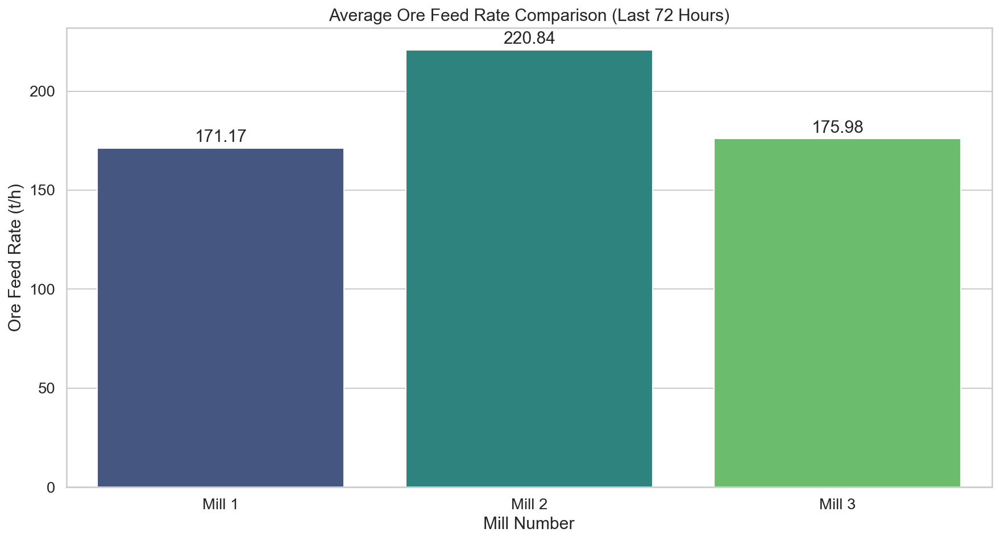

# Анализ на натоварването на мелници 1, 2 и 3 (период: 72 часа)

## 1. Executive Summary
Настоящият доклад представя анализ на работата на мелници 1, 2 и 3 за периода от 16 март 2026 г. до 19 март 2026 г. (общо 72 часа). Анализът показва значителни различия в работните режими: Мелница 2 работи с най-високо средно натоварване от **220.84 t/h**, но демонстрира и най-голяма нестабилност (стандартно отклонение **7.57**). За сравнение, Мелница 1 поддържа най-стабилен режим със средно **171.17 t/h** и минимално стандартно отклонение (**1.68**). Тези данни насочват към необходимост от оптимизация на подаването на руда към Мелница 2 за постигане на по-равномерен технологичен процес.

## 2. Data Overview
Данните бяха извлечени от централната база данни на обогатителната фабрика. Обхватът на изследването включва 72 часа непрекъсната работа.
*   **Брой записи:** 4321 минутни записи за всяка от трите мелници.
*   **Използвани параметри:** Основен фокус върху показателите за „Ore“ (натоварване в тона на час).
*   **Временен обхват:** 2026-03-16 до 2026-03-19.

## 3. Findings
Въз основа на обработените данни са установени следните статистически показатели:

| Мелница | Средно натоварване (t/h) | Стандартно отклонение | Макс. натоварване (t/h) |
| :--- | :---: | :---: | :---: |
| **Мелница 1** | 171.17 | 1.68 | 178.26 |
| **Мелница 2** | 220.84 | 7.57 | 240.78 |
| **Мелница 3** | 175.98 | 2.98 | 179.92 |

### Визуално представяне
На следната диаграма е представено сравнение на натоварването на трите мелници за целия период от 72 часа:

### Анализ на резултатите
*   **Мелница 1:** Отличава се с най-прецизен контрол. Малкото стандартно отклонение (1.68) показва, че системата за автоматично управление работи ефективно и поддържа зададената производителност без големи флуктуации.
*   **Мелница 2:** Този агрегат работи при значително по-високо натоварване в сравнение с останалите две мелници. Въпреки това, високото стандартно отклонение (7.57) и максималните пикове от 240.78 t/h предполагат, че мелницата работи в режим на честа претовареност, което може да доведе до повишено износване на футеровките и мелещите тела.
*   **Мелница 3:** Показва балансирани показатели, като средното натоварване (175.98 t/h) е близо до това на Мелница 1, но с малко по-висока вариация (2.98).

## 4. Statistical Analysis
Статистическият анализ потвърждава, че разпределението на товара при Мелница 2 е далеч по-разтеглено спрямо Мелници 1 и 3. Коефициентът на вариация (CV = Std/Mean) за Мелница 2 е около 3.4%, докато за Мелница 1 той е едва 0.98%. Това е категоричен показател за неравномерност, която изисква внимание от страна на екипите по поддръжка и автоматизация.

## 5. Conclusions & Recommendations
Въз основа на извършения анализ се препоръчват следните действия:

1.  **Ревизия на системата за управление на Мелница 2:** Необходимо е да се проучат причините за честите флуктуации (високото стандартно отклонение). Препоръчва се прекалибриране на PID контролерите, отговорни за подаването на руда (feed control).
2.  **Балансиране на товара:** Ако технологичният капацитет позволява, част от натоварването на Мелница 2 (която работи средно с 220 t/h) може да бъде пренасочено към Мелници 1 и 3, за да се намали напрежението върху оборудването на Мелница 2 и да се изравни износването.
3.  **Инспекция на подаващите устройства:** Да се провери състоянието на лентовите везни на Мелница 2, тъй като съществува вероятност големите пикове в данните да се дължат на инструментална грешка или механичен проблем по трасето.
4.  **Мониторинг на вибрации и ампераж:** С оглед на високите стойности при Мелница 2, да се засили мониторингът на консумацията на ток (MotorAmp) и вибрациите, за да се предотвратят аварийни спирания.
5.  **Периодичен одит:** Да се извършва подобен анализ на всеки 72 часа, за да се проследи дали предприетите мерки за балансиране на натоварването дават очаквания резултат.