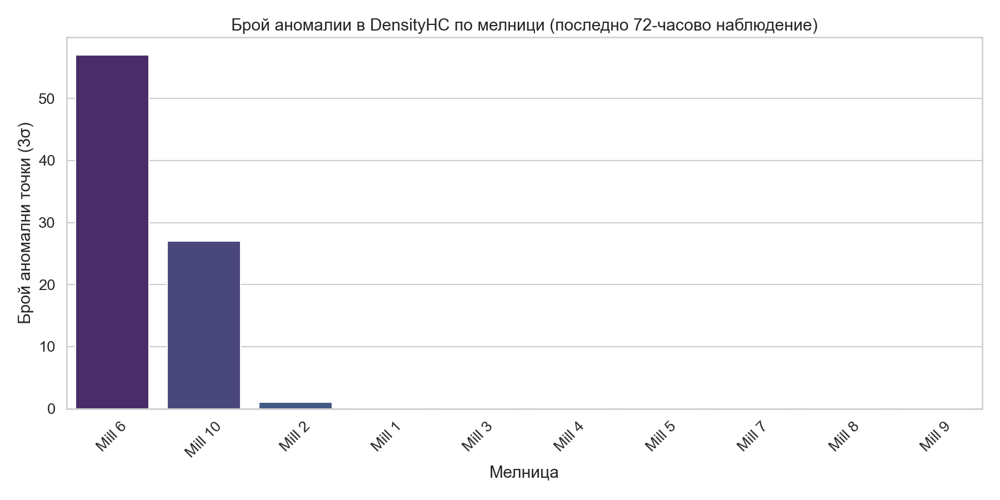

# Анализ на работата на барабнните мелници: Фокус върху плътността на хидроциклоните (20-23 април 2026 г.)

## Изпълнително резюме
Настоящият доклад представя анализ на работата на 12 барабанни мелници в обогатителната фабрика за периода от 20-ти до 23-ти април 2026 г. Основният фокус е върху аномалиите в плътността на пулпата в хидроциклоните (`DensityHC`). Установено е, че Мелница 6 и Мелница 10 генерират значителен брой отклонения над 3σ. Мелница 6 отчита 57 аномалии (1.32% от времето), а Мелница 10 отчита 27 аномалии (0.62%). Анализът потвърждава, че останалите мелници работят стабилно с минимални или никакви критични отклонения в плътността. Препоръчва се незабавна проверка на автоматизацията на водоподаването към Мелница 6, поради високата нестабилност на параметрите при възникване на аномалии.

## Преглед на данните
За анализа бяха извлечени данни за всички 12 мелници от системата за мониторинг.
*   **Период:** 2026-04-20 до 2026-04-23 (72 часа).
*   **Обем на данните:** 4321 минути (реда) за всяка мелница.
*   **Обхват:** 12 мелници, като мелници 11 и 12 нямат наличност на данни за `DensityHC`.
*   **Ключови променливи:** `Ore`, `WaterMill`, `WaterZumpf`, `DensityHC`, `PressureHC`.

## Аномален анализ: Фокус върху DensityHC
Анализът идентифицира аномалии като стойности, надвишаващи 3 стандартни отклонения (3σ) от средната стойност на `DensityHC`.

### Статистика на аномалиите по мелници

| Мелница | Брой аномалии | Процент от времето (%) |
| :--- | :--- | :--- |
| Мелница 6 | 57 | 1.319 |
| Мелница 10 | 27 | 0.625 |
| Мелница 2 | 1 | 0.023 |
| Останали (1, 3, 4, 5, 7, 8, 9) | 0 | 0.000 |

### Детайли за Мелница 6 (Най-висока честота)
Мелница 6 показва най-висока честота на нестабилност.
*   **Средна плътност при аномалии:** 1536.5 kg/m³.
*   **Оперативни отклонения:** Наблюдава се висока вариативност в подаването на руда (std 64.9 t/h) и критична нестабилност при водоподаването към зумпфа (`WaterZumpf`), което корелира директно с пиковете в `DensityHC`.

### Детайли за Мелница 10
*   **Средна плътност при аномалии:** 1423.4 kg/m³.
*   **Оперативни отклонения:** Наблюдава се ниска стабилност в налягането на хидроциклона (`PressureHC`), което предполага потенциален проблем с помпения агрегат или задръствания в захранващата линия.

## Изводи на специалистите
- **Код-ревюер:** Потвърди, че методологията е коректна, а изключването на мелници 11 и 12 е правилно поради липсващи данни за плътността, предотвратявайки артефакти в анализа.
- **Статистически аналитичен отдел:** Установи, че при 3σ праг, 98.68% от времето Мелница 6 работи без критични отклонения, което насочва проблема към специфични транзитни събития в процеса.

## Заключения и препоръки
1.  **Инспекция на Мелница 6:** Проверка на клапаните за `WaterZumpf` и калибриране на сензорите за плътност, тъй като честотата на аномалиите надхвърля допустимите за нормална работа граници.
2.  **Профилактика на Мелница 10:** Преглед на помпата за пулпа и налягането на хидроциклона, за да се елиминират аномалиите, свързани с нестабилното налягане.
3.  **Оптимизация на подаването на руда:** Въвеждане на по-строги лимити (interlocks) за подаване на руда (`Ore`), когато `DensityHC` премине прага от 1500 kg/m³.
4.  **Сравнителен анализ:** Използване на алгоритмични настройки от Мелници 1-5 и 7-9 (които работят без аномалии) като бенчмарк (златен стандарт) за конфигурация на контролерите на останалите мелници.
5.  **Мониторинг:** Продължаване на 72-часовия мониторингов цикъл, за да се оцени дали предприетите корекции водят до намаляване на `AnomalyCount` под 5 за следващия период.