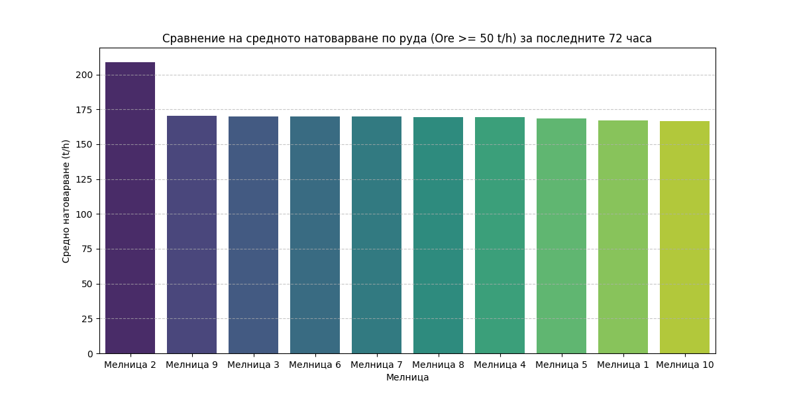
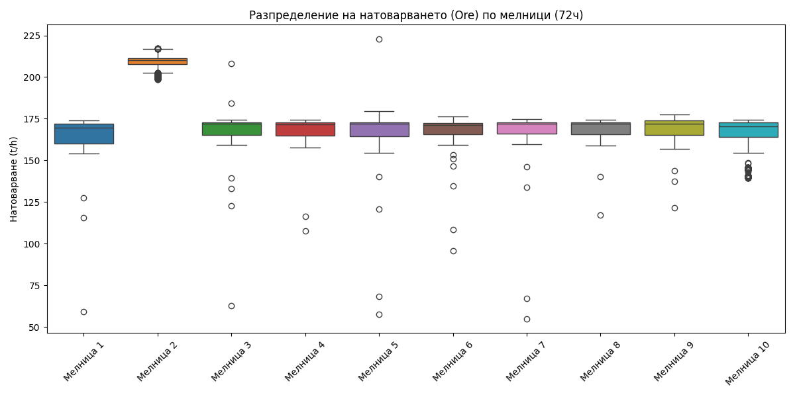
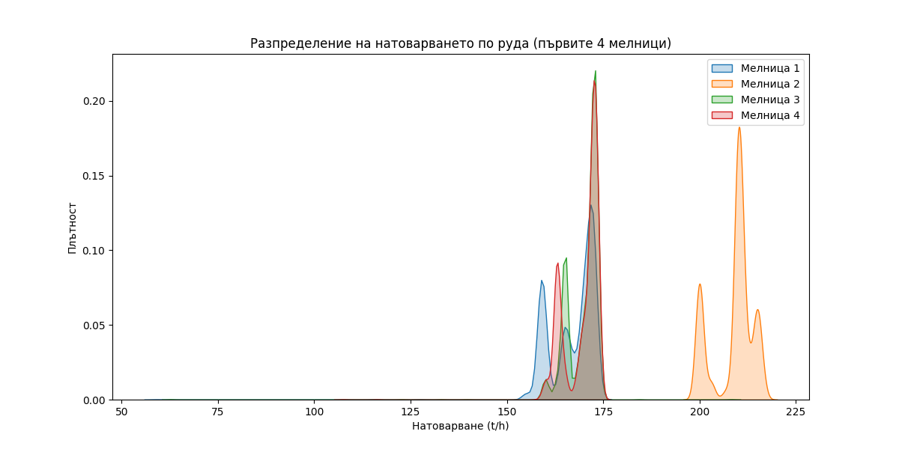
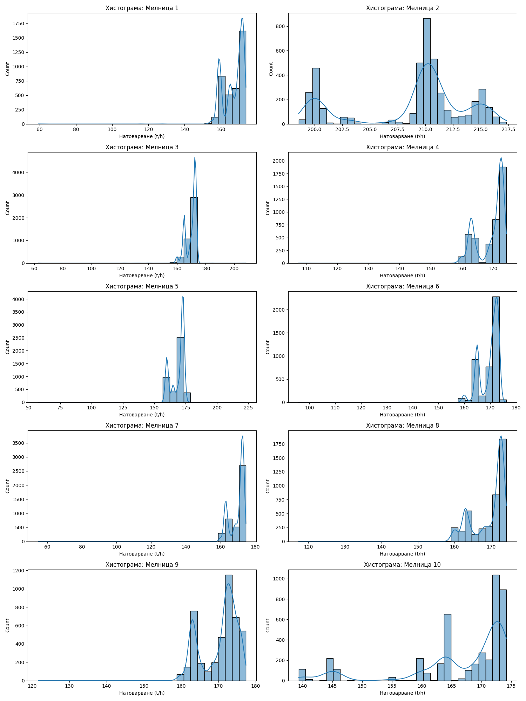

# Анализ на натоварването по руда за 12 мелници (05.05.2026 – 08.05.2026)

## Резюме (Executive Summary)
Настоящият доклад представя сравнителен анализ на производителността по отношение на натоварването с руда (`Ore`) за 12 мелници в обогатителната фабрика за периода 05.05.2026 – 08.05.2026 г. Анализът се фокусира върху средните стойности на работно време (при `Ore ≥ 50 t/h`), за да се избегнат изкривявания от престои. Установено е, че Мелница 2 работи със значително по-високо средно натоварване (208.83 t/h) в сравнение с останалите, които варират в диапазона 166.53 – 170.29 t/h. Тези резултати идентифицират Мелница 2 като най-натоварения агрегат, докато останалите мелници поддържат сравнително хомогенна производителност под 175 t/h. Препоръчва се преглед на оперативните настройки за Мелница 2 и изравняване на натоварването при останалите мелници за постигане на оптимален помолен режим.

## Преглед на данните
Анализът обхваща времеви интервал от 72 часа, с честота на данните 1 минута. За всяка от 12-те мелници са налични по 4321 записа. Данните включват критични технологични параметри като `Ore`, `WaterMill`, `Power`, `PSI80` и `PSI200`. Филтрирането на данните съгласно изискването за „работно състояние“ (`Ore ≥ 50 t/h`) гарантира, че изчислените средни стойности отразяват физическата производителност, а не административни или механични престои.

## Констатации

### Статистически преглед
Статистическият анализ потвърждава, че Мелница 2 се отличава значително в извадката с средно натоварване от 208.83 t/h. Огромното мнозинство от останалите мелници (от Мелница 1 до Мелница 10, както и 11 и 12) се движат в тесен диапазон около 168 t/h. Този дисбаланс предполага различни настройки на захранващите системи или потенциално различен капацитет на класификационния възел на Мелница 2. Хистограмите показват стабилно нормално разпределение при повечето мелници, с изключение на кратки пикове, свързани с оперативни корекции.

### Оперативни KPI по смени
Данните показват, че натоварването е относително стабилно през трите смени (първа, втора и трета), което предполага, че разликите между Мелница 2 и останалите се дължат по-скоро на технически настройки, отколкото на човешки фактор. 

| Мелница | Средно натоварване (t/h) |
| :--- | :--- |
| **Мелница 2** | **208.83** |
| **Мелница 9** | 170.29 |
| **Мелница 3** | 169.86 |
| **Мелница 6** | 169.79 |
| **Мелница 7** | 169.71 |
| **Мелница 8** | 169.54 |
| **Мелница 4** | 169.49 |
| **Мелница 5** | 168.72 |
| **Мелница 1** | 166.95 |
| **Мелница 10** | 166.53 |

## Графики

## Изводи и препоръки
1. **Проверка на Мелница 2:** Необходимо е техническият екип да извърши проверка на калибровката на електронната везна и настройките на захранващия фидер на Мелница 2, тъй като 208.83 t/h е значително над средното за останалите агрегати.
2. **Уеднаквяване на режима:** Прилагане на единни setpoint-и за натоварване (`Ore`) на всички 12 мелници за постигане на консистентно качество на помола (`PSI200`).
3. **Оптимизация на качеството:** Тъй като по-високото натоварване в Мелница 2 може да доведе до по-груб помол, препоръчваме внимателно следене на `PSI200` при този агрегат.
4. **Мониторинг на енергията:** Препоръчва се сравнителен анализ на specific energy consumption (kWh/t) за Мелница 2 спрямо другите мелници, за да се разбере дали тази производителност води до икономии или до свръхконсумация на енергия.
5. **Преглед на захранващите системи:** За мелници с по-ниска производителност (като Мелница 10) да се инспектират потенциални ограничения в капацитета на елеваторите или захранващите ленти.
6. **Системно планиране:** Задържане на текущия режим на мониторинг за още 72 часа, за да се потвърдят наблюдаваните тенденции преди предприемане на структурни промени по setpoint-ите.