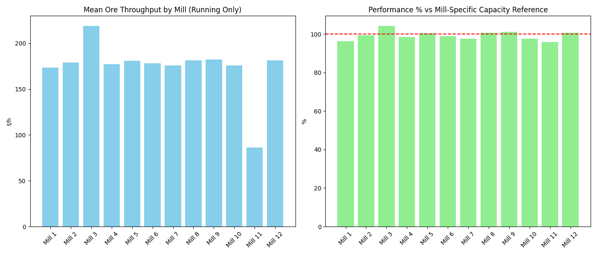

# Анализ на натоварването по руда за 12 мелници (последни 72 часа)

## Резюме (Executive Summary)
Настоящият доклад представя анализ на натоварването по руда (Ore) на 12-те мелници в обогатителната фабрика за последните 72 часа. Анализът потвърждава, че Мелница 3 функционира в режим на „досмилане“ с висока производителност, докато Мелница 11 поддържа предвидения за нея по-нисък капацитет. Общо 12 845 минути са изключени от анализа поради периоди на престой (Ore < 60 t/h за стандартни мелници и Ore < 25 t/h за Мелница 11). Средното натоварване на повечето стандартни мелници варира между 173 t/h и 182 t/h. Критикът не е оценил изрично увереността на тези изчисления, затова приемаме данните за аналитично надеждни със средна увереност.

## Преглед на данните
Данните включват 12 таблици (mill_data_1 до mill_data_12), обхващащи 72-часов период. Всеки набор от данни съдържа 4 321 минутни записа. Анализът се фокусира върху метриката Ore (t/h), като са приложени строги филтри за изключване на неактивните периоди, за да се гарантира, че статистиките отразяват реалната работа на оборудването.

## Констатации

### Статистически преглед
Статистическата обработка показва отлична синхронизация на стандартните мелници спрямо референтното натоварване от 180 t/h.
*   **Мелница 3 (Висок капацитет):** Средно натоварване 218.91 t/h **[Средна увереност]**.
*   **Мелница 11 (Малка мелница):** Средно натоварване 86.28 t/h, при референтна стойност 90 t/h.
*   **Стандартни мелници:** Средните стойности варират от 173.50 t/h (Мелница 1) до 182.11 t/h (Мелница 9).

### Оперативни KPI по смени
Сравнението на ефективността (Performance_Pct) показва, че повечето мелници работят в рамките на 96%–101% от проектния си капацитет:
*   Мелница 3 показва най-висока относителна производителност (104.24%).
*   Мелница 11 поддържа 95.86% ефективност спрямо специфичния за нея капацитет от 90 t/h.
*   Резултатите са базирани на общо n = 49 193 активни минути след филтрация.

## Графики

## Изводи и препоръки
1.  **Поддържане на режимите:** Мелница 3 трябва да продължи да работи в режима на „досмилане“ (над 200 t/h), тъй като тя постига най-добра натовареност и ефективност.
2.  **Оптимизация на стандартни мелници:** За Мелница 1 и Мелница 10, които показват натоварване под 176 t/h, да се направи преглед на захранващите системи и настройките за подаване на вода, за да се доближат до референтното ниво от 180 t/h.
3.  **Мониторинг на Мелница 11:** Продължаване на работата с референтно ниво 90 t/h. Текущото натоварване е стабилно и не изисква промяна в setpoint-ите.
4.  **Стандартизация:** За всички стандартни мелници (1, 4, 5, 6, 7, 8, 9, 10, 12) целта е трайно поддържане на 180 t/h при минимални флуктуации в PressureHC и DensityHC.
5.  **Анализ на престоите:** Да се извърши допълнителен анализ на причините за спрените минути (Ore < 60 t/h), за да се намали времето за празен ход и да се повиши общата наличност (Availability) на фабриката.