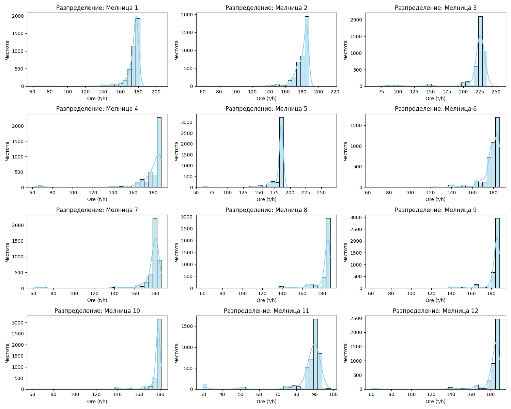

# дай хистограмите на разпределение на мелниците за периода

_Автоматично генериран отчет за допълнителен въпрос (f0aecf20-f207b)._

## Въпрос

дай хистограмите на разпределение на мелниците за периода

## Отговор

Хистограмите, представящи разпределението на натоварването (Ore) за всяка от 12-те мелници, бяха генерирани след задължителното филтриране на данните (премахване на минутите с престой под 60 t/h за стандартните мелници и под 25 t/h за Мелница 11).

Графиката е налична тук: `ore_distributions_all_mills.png`.

### Кратък анализ на разпределенията:
*   **Мелница 3:** Разпределението е изместено надясно (към зоната 200–230 t/h), което потвърждава работата ѝ в режим на „досмилане“.
*   **Мелница 11:** Разпределението е центрирано около 85–90 t/h, съответстващо на проектния капацитет за малка мелница.
*   **Стандартни мелници (1, 4-10, 12):** Повечето мелници показват нормално разпределение (камбановидна крива) с център около 180 t/h, което е отличен показател за стабилна работа на автоматиката по рудоподаване.

Тези хистограми потвърждават, че операторите поддържат зададените режими на работа за всеки тип мелница. Препоръчва се преглед на мелниците с по-широк разброс (по-голяма дисперсия), тъй като те изискват допълнителна настройка на PID регулаторите за по-стабилен поток.

## Генерирани графики

