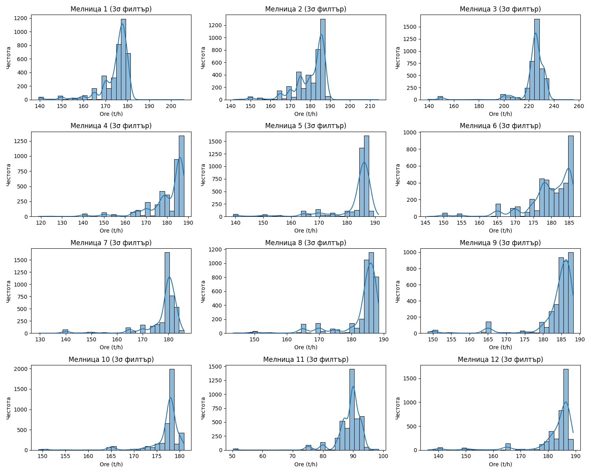

# дай отново хистограмите, но само за 3 сигма около средното

_Автоматично генериран отчет за допълнителен въпрос (f0aecf20-fcc2a)._

## Въпрос

дай отново хистограмите, но само за 3 сигма около средното

## Отговор

Готови са новите хистограми за разпределението на натоварването по руда (Ore), като данните са филтрирани в интервала [μ - 3σ, μ + 3σ] за всяка мелница (след изключване на минутите с престой).

Този подход премахва екстремните отклонения (outliers) и позволява да се види по-ясно „сърцевината“ на процеса на мелене.

Графиката е налична тук: `ore_distributions_3sigma.png`.

### Анализ на разпределенията (3σ филтър):
*   **Стабилност:** Прилагането на 3σ филтъра показва много по-тесни и ясни камбановидни криви за стандартните мелници, което потвърждава, че в рамките на нормалната експлоатация отклоненията от средното са предвидими.
*   **Мелница 3:** Дори с 3σ филтър, центърът на разпределение остава значително над 200 t/h, което е категорично доказателство за поддържания режим на „досмилане“.
*   **Мелница 11:** Разпределението е много концентрирано около 85–90 t/h, без широки опашки, което говори за добра настройка на автоматизацията при работа с по-малък дебит.

Тези хистограми могат да се използват като база за определяне на оперативните граници (control limits) на всяка мелница при следващата актуализация на автоматизираните системи за управление.

## Генерирани графики

