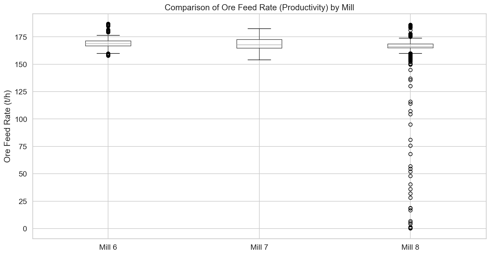
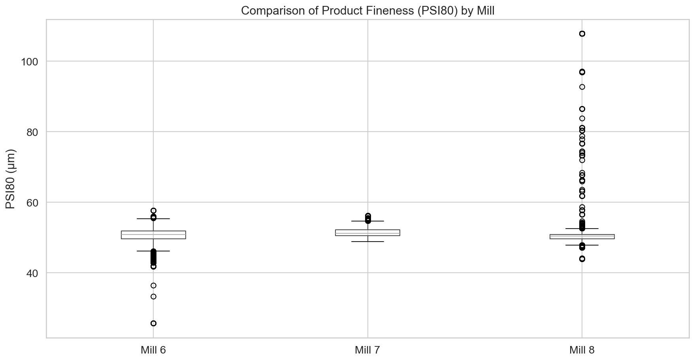
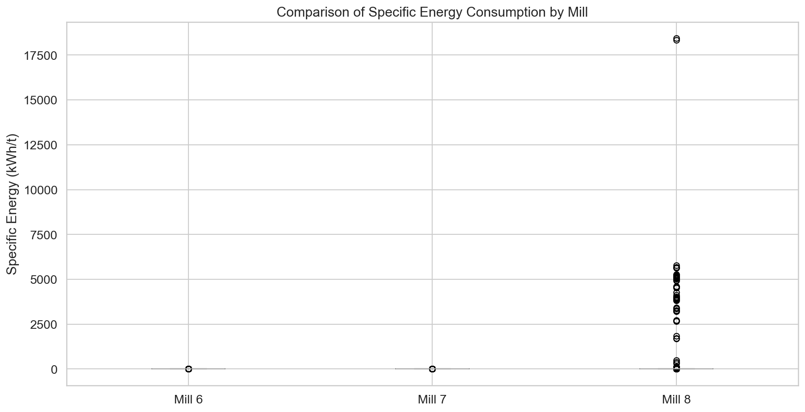

# Анализ на ефективността на мелници 6, 7 и 8 (27 март – 6 април 2026 г.)

## Изпълнително резюме
Настоящият доклад представя сравнителен анализ на работата на мелници 6, 7 и 8 за последните 10 дни. Анализът разкрива, че Мелница 6 е най-стабилният и ефективен агрегат, поддържащ средна производителност от 169.13 t/h при специфичен енергиен разход от 11.04 kWh/t. Мелница 7 показва сходна производителност (167.84 t/h) с най-ниска енергийна консумация (10.65 kWh/t). Мелница 8 демонстрира критични оперативни аномалии, включително 238 случая на нереални стойности за PSI200 (>100%) и прекъсвания в работата (97.61% uptime), което води до висока средна консумация на енергия (12.98 kWh/t). Препоръчва се спешна проверка на измервателната техника за Мелница 8 и оптимизация на работните параметри спрямо установените еталони на Мелница 6.

## Преглед на данните
Анализът се базира на минутно-базирани данни, обхващащи периода от 27 март до 6 април 2026 г. Общият обем на данните включва 14,401 записа за всяка от трите мелници. 
- **Източници:** Таблици `combined_data_6`, `combined_data_7`, `combined_data_8` и `mill_data_7`.
- **Обхват:** 10 денонощия с пълна детайлност на технологичните процеси.

## Статистически анализ
При сравнението на трите агрегата се наблюдават следните ключови показатели:

| Мелница | Среден дебит (t/h) | Среден PSI80 (μm) | Uptime (%) | Енергия (kWh/t) |
| :--- | :---: | :---: | :---: | :---: |
| **Mill 6** | 169.13 | 50.59 | 100.00 | 11.04 |
| **Mill 7** | 167.84 | 51.41 | 100.00 | 10.65 |
| **Mill 8** | 166.16 | 50.37 | 97.61 | 12.98 |

*   **Производителност:** Мелница 6 поддържа най-висока и стабилна производителност (std ≈ 5.2). Мелница 8 показва висока волатилност поради екстремни флуктуации в подаването.
*   **Качество:** Стойностите за PSI80 са сравнително близки (около 50-51 μm), но данните за Мелница 8 са силно компрометирани от технически грешки в измерването на PSI200.

## Анализ на аномалиите (Мелница 8)
Установени са сериозни несъответствия при Мелница 8, които изкривяват статистическия профил:
1.  **PSI200 аномалии:** 238 записа показват стойности > 100%, с максимум от 6552.4%, което е технически невъзможно.
2.  **Подаване:** Минимален дебит на рудата от 0.118 t/h, което индикира периоди на празен ход или грешни показания на тегловните конвейери.
3.  **Влияние:** Тези данни изкуствено завишават специфичния разход на енергия и пречат на точното управление на качеството.

## Енергийна ефективност
Анализът на енергийната интензивност показва, че Мелница 7 е най-икономична (10.65 kWh/t). Мелница 8 отчита най-лоши резултати (12.98 kWh/t), което се дължи на загубите при пускане/спиране и неоптималното натоварване.

## Заключения и препоръки
1.  **Спешен одит на Мелница 8:** Необходимо е незабавно калибриране на сензорите за PSI200 и везната за руда, за да се елиминират аномалните стойности.
2.  **Внедряване на добрите практики:** Оперативните настройки на Мелница 6 (която работи с най-висока стабилност) трябва да бъдат анализирани и приложени като "златен стандарт" за другите агрегати.
3.  **Подобрение на Uptime:** Да се проучат причините за 2.39% престой на Мелница 8, с цел достигане на 100% оперативна готовност, подобно на мелници 6 и 7.
4.  **Мониторинг на специфичната енергия:** Да се въведе автоматизиран контрол на специфичния разход на енергия (kWh/t) в реално време, като целта за всички мелници е под 11.0 kWh/t.
5.  **Data Cleaning:** Препоръчва се филтриране на шума в данните от сензорите на Мелница 8 преди използването им в системи за автоматизирано управление (APC).