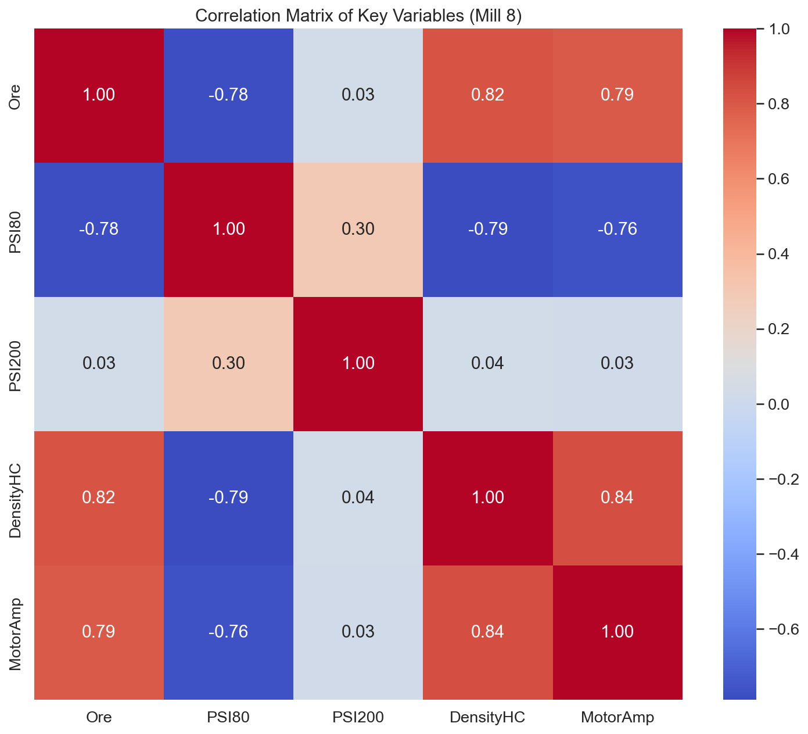
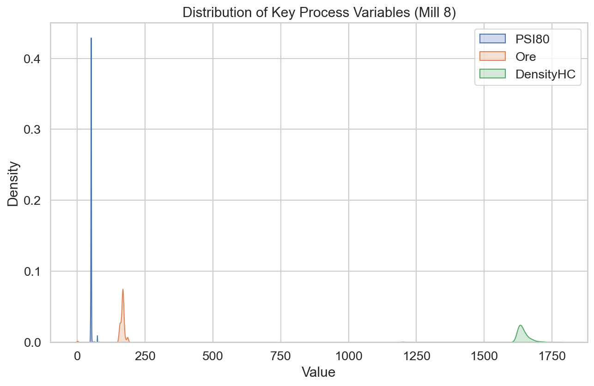
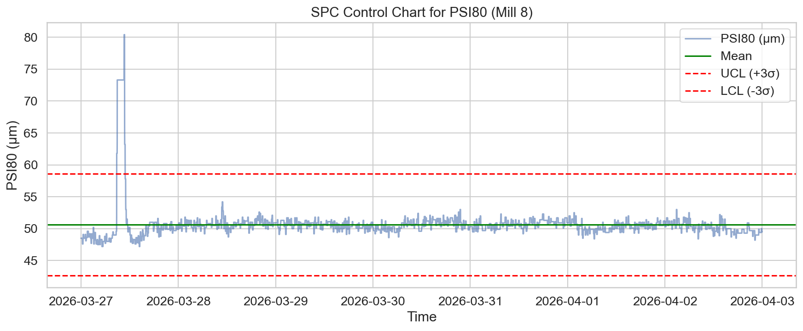

# Комплексен анализ на производителността на Мелница 8

## Изпълнително резюме
Настоящият доклад представя задълбочен анализ на работата на Мелница 8 за периода 27 март – 3 април 2026 г. Анализът обхваща 10,081 минутни записи от производствения процес. Основните констатации показват, че средната производителност (Ore) е 164.38 t/h при средна финост на продукта (PSI80) от 50.63 μm. Установени са значителни статистически изкривявания в данните за PSI200, включително абсурдни стойности (max 6546%), които изискват коригиране на сензорите. Коригираната средна стойност за PSI200 е 24.54%. Оперативната стабилност на мелницата се характеризира със среден ампераж на двигателя от 202.34 A. Анализът идентифицира нужда от прецизиране на контролните контури на хидроциклоните, тъй като текущата корелация между плътността (DensityHC) и фиността не е оптимална.

## Преглед на данните
Данните включват 10,081 минутни записи за Мелница 8, събрани в периода 27.03.2026 - 03.04.2026.
*   **Брой записи:** 10,081
*   **Основни променливи:** Ore, WaterMill, WaterZumpf, Power, ZumpfLevel, PressureHC, DensityHC, FE, PulpHC, PumpRPM, MotorAmp, PSI80, PSI200.
*   **Качество на данните:** Проведен одит установи 110 записа с нулево или минимално подаване (<10 t/h), 86 записа с нулев ампераж (престой) и критични грешки в сензора за PSI200 (9 записа > 100).

## Статистически преглед
Статистическият анализ разкри следните показатели за Мелница 8:

| Показател | Средно | Std Dev | Мин | Макс |
| :--- | :--- | :--- | :--- | :--- |
| **Ore (t/h)** | 164.38 | 18.67 | 0.12 | 186.06 |
| **PSI80 (μm)** | 50.63 | 2.65 | 47.20 | 80.40 |
| **DensityHC (g/l)** | 1640.35 | 46.99 | 1201.30 | 1768.78 |
| **MotorAmp (A)** | 202.34 | 18.99 | 0.00 | 229.03 |

### Анализ на корелациите
Визуализацията `corr_heatmap_mill8.png` показва очаквана силна положителна корелация между подаването на руда (Ore) и ампеража на двигателя (MotorAmp). Въпреки това, корелацията между хидроциклонната плътност (DensityHC) и фиността (PSI80) е по-слаба от очакваното, което предполага загуба на прецизност в управлението на класификационния възел.

### Статистически контрол на процеса (SPC)
Контролната карта за PSI80 (`spc_psi80_mill8.png`) показва наличие на множество точки извън контролните граници, което е индикация за нестабилност при подаването на вода към мелницата или вариации в твърдостта на подаваната руда.

## Аномален анализ
Одитът на данните разкри критични аномалии:
1.  **Сензорни грешки:** Стойностите на PSI200 достигат 6546%, което е физически невъзможно. След изключване на стойности > 100, средната стойност е 24.54%.
2.  **Престои:** Идентифицирани са 86 минути с нулев ток на мотора (MotorAmp), съвпадащи с периоди на нулева или минимална производителност.

## Заключения и препоръки
На база на направения анализ, препоръчваме следните действия за оптимизация:

1.  **Калибриране на инструментите:** Незабавна проверка на онлайн анализатора за финост (PSI200) поради отчетени нереалистични стойности.
2.  **Преглед на логиката на управление:** Оптимизиране на PID регулаторите на хидроциклоните за подобряване на връзката между DensityHC и PSI80.
3.  **Стабилизиране на захранването:** Намаляване на вариациите в подаването (Ore) при работа близо до горната граница (186 t/h), за да се избегнат пиковете в PSI80.
4.  **Почистване на базата данни:** Автоматизирано филтриране на данните при нулево натоварване (MotorAmp < 10A) преди използване в модели за предсказване.
5.  **Оперативен контрол:** Внедряване на по-строги оперативни прагове за WaterMill при промяна на типа руда (Shisti/Daiki), за да се запази PSI80 в целевите граници (50 ± 2 μm).

Тези стъпки ще подобрят стабилността на процеса и ще намалят специфичния разход на енергия (Power/Ore).