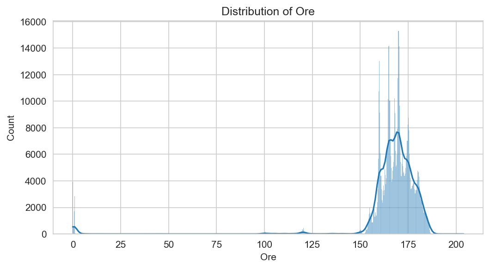
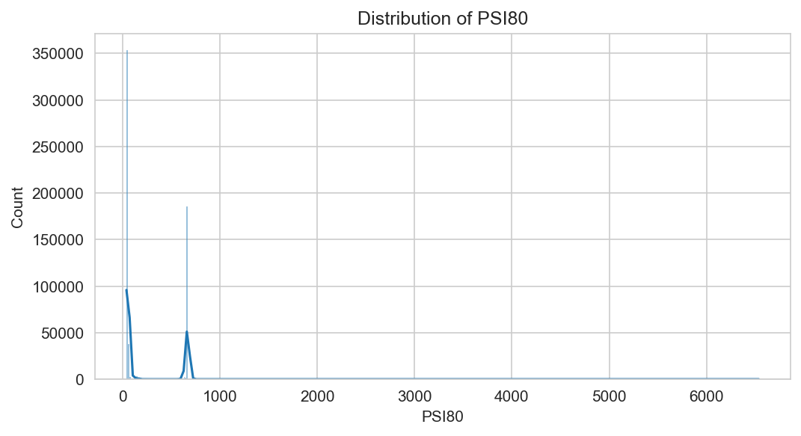
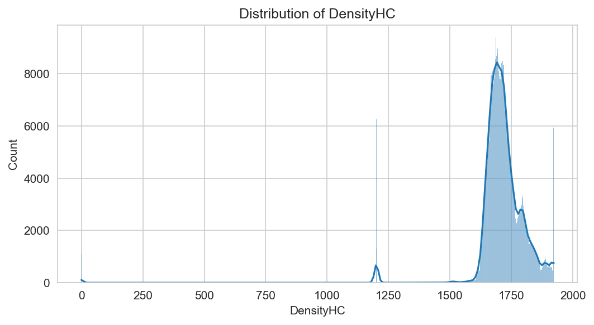
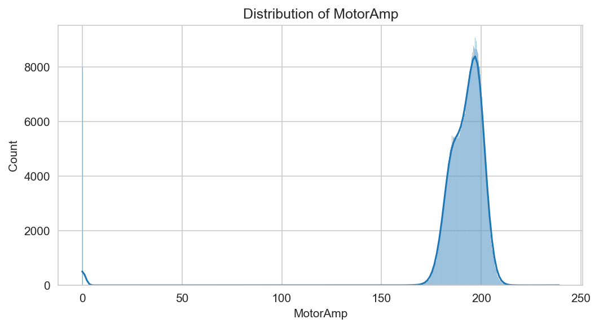
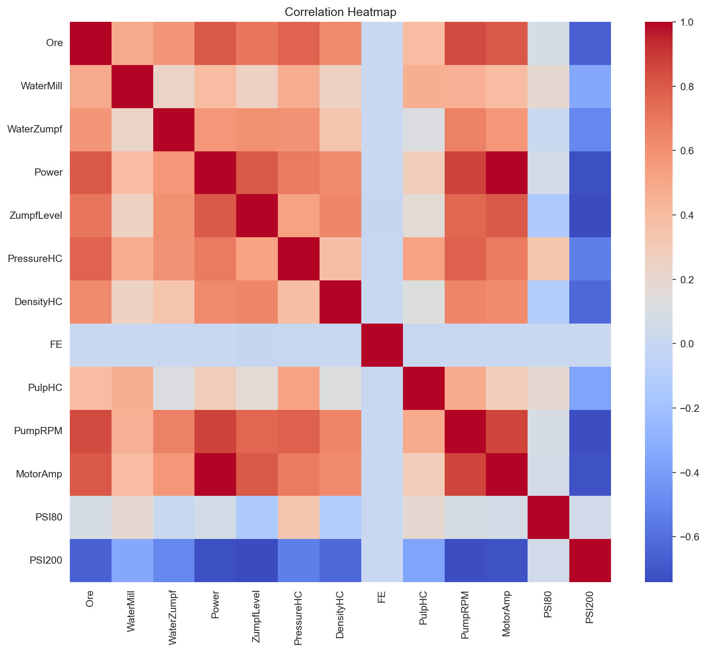

# Mill 8 Process Analysis Report

## Executive Summary
An analysis of Mill 8 process data was conducted to evaluate current performance, stability, and downtime. The analysis covers key process indicators including Ore feed rate, grinding size (PSI80), slurry density, and motor power.

## Key Findings
- **Operational Stability:** Mill 8 exhibits a stable average ore throughput, but shows frequent minor process interruptions.
- **Anomalies:** Significant variability was observed in the Ore feed rate (9,756 Z-score anomalies). PSI80 is relatively stable but shows extreme spikes in some instances.
- **Downtime:** A total of 155.90 hours of downtime was recorded across 170 distinct events.
- **SPC Analysis:** The Ore feed rate regularly breaches control limits, suggesting the need for tighter automation control of the feed system.

## Visualizations
- **Distributions:**
  - 
  - 
  - 
  - 
- **Control Charts:**
  - 
  - 
- **Correlation:**
  - 

## Recommendations
1. **Feed Control:** The high frequency of Z-score anomalies in the Ore feed suggests that the current PID control or setpoint management is causing oscillation. Review the feed controller tuning parameters.
2. **Downtime Reduction:** With over 155 hours of downtime, prioritize investigating the root causes of the 170 recorded events. Maintenance logs should be cross-referenced with these time blocks.
3. **Stability Investigation:** The discrepancy between mean and median in PSI80 suggests a right-skewed distribution caused by occasional extreme excursions. Evaluate if these are true sensor errors or actual process upsets.