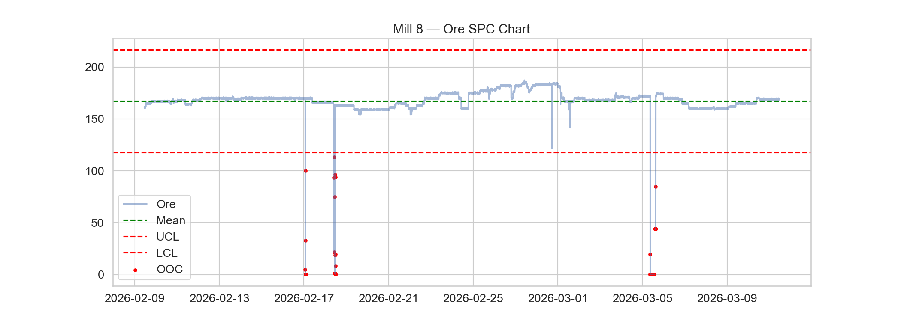
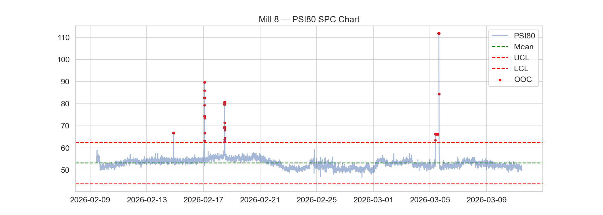
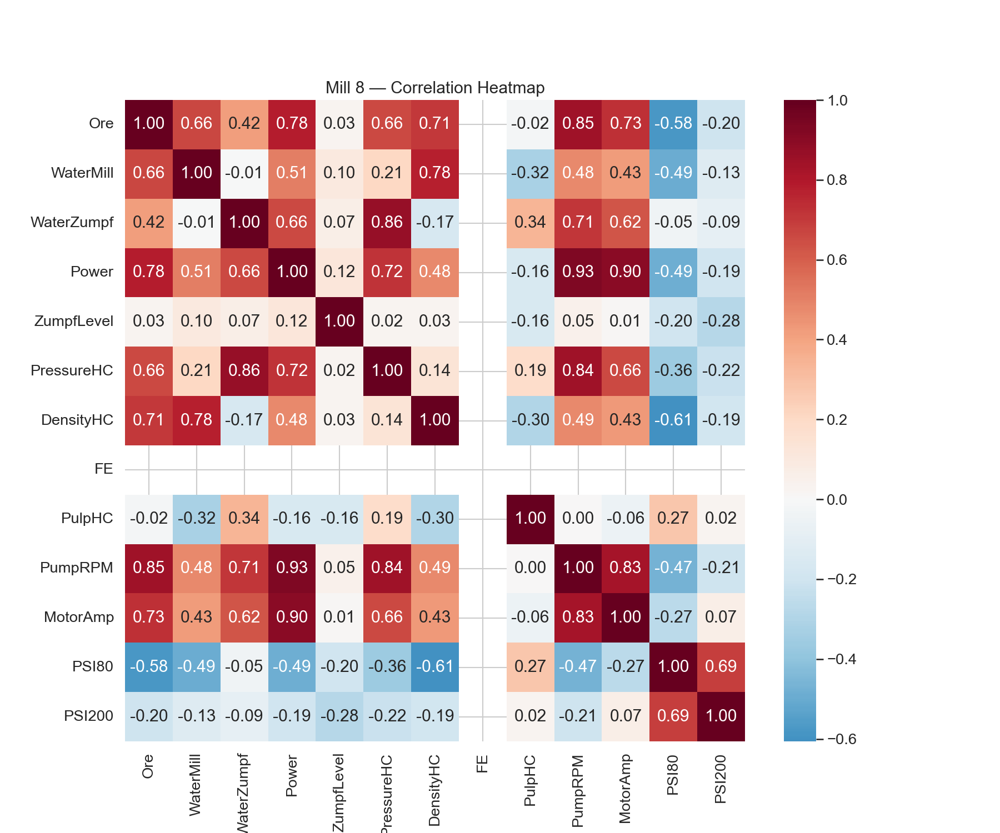
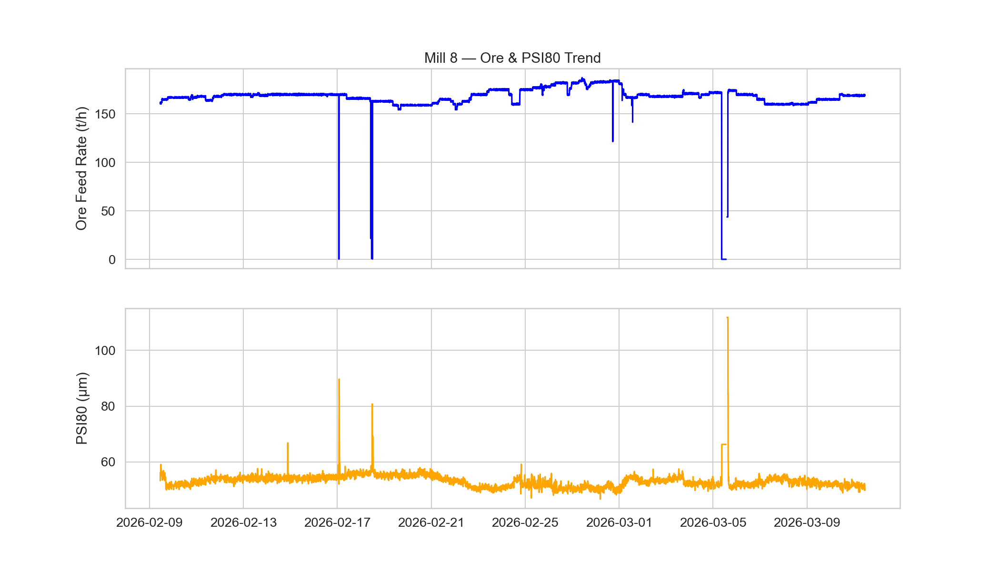

# Mill 8 Process Performance Analysis Report

## Executive Summary
This report analyzes the performance of Mill 8 over the last 30 days. Key process variables were evaluated for stability (SPC), anomalies, and correlations. Mill 8 shows generally stable operation with 4 significant downtime events totaling 5.37 hours. 

## Data Overview
- **Period:** Last 30 days
- **Key Variables:** Ore Feed Rate, PSI80 (Product Size), DensityHC, MotorAmp.
- **Data Quality:** Dataset is clean, covering 43,140-minute intervals.

## Key Findings & Analysis
### 1. SPC & Stability
The Statistical Process Control analysis reveals that both Ore Feed Rate and PSI80 experience periodic out-of-control (OOC) events.
- **Ore Feed Rate:** 382 OOC points detected. UCL: 216.68 t/h, LCL: 117.95 t/h.
- **PSI80:** 435 OOC points detected. UCL: 62.68 μm, LCL: 43.80 μm.

### 2. Correlations
A strong correlation (0.93) exists between **PumpRPM and Power**, as well as **MotorAmp and Power** (0.90), which is expected for mill motor dynamics. 

### 3. Anomalies & Downtime
- **Anomalies:** 382 instances for Ore and 435 for PSI80 exceeded the 3σ threshold.
- **Downtime:** 4 major events were identified where Ore < 10 t/h. The longest continuous outage lasted 271 minutes (4.5 hours).

## Recommendations
1. **Downtime Mitigation:** The mean downtime event duration is 80.5 minutes. Investigate the root causes of the 4 major downtime events to reduce MTTR (Mean Time To Repair).
2. **Process Control:** The number of OOC points in PSI80 suggests that the control logic for product size needs recalibration, especially during feed rate transitions.
3. **Correlation Monitoring:** Continue monitoring the Power/PumpRPM relationship as a primary indicator of mill load health.