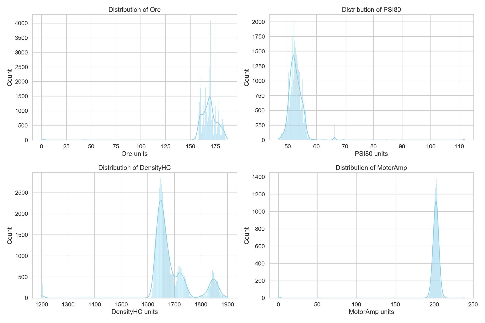
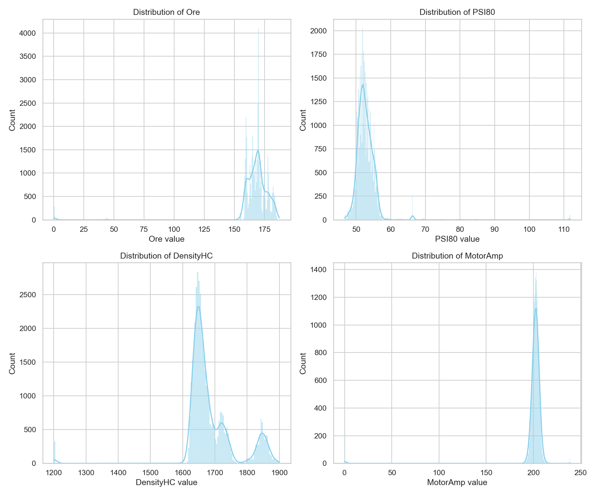
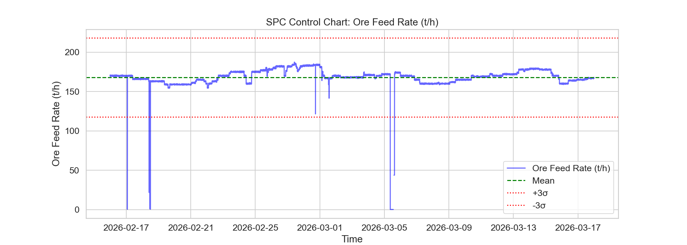
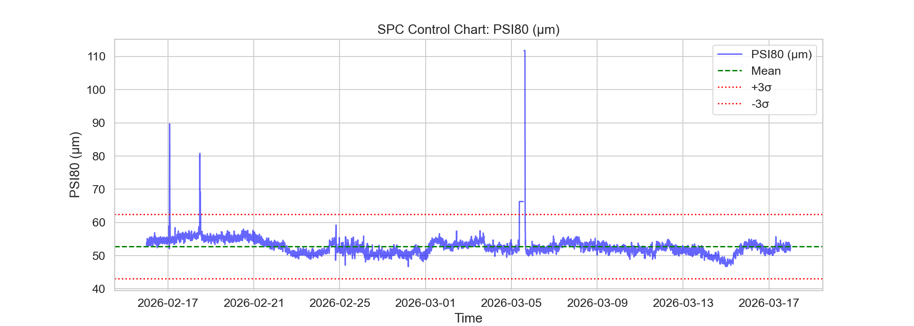
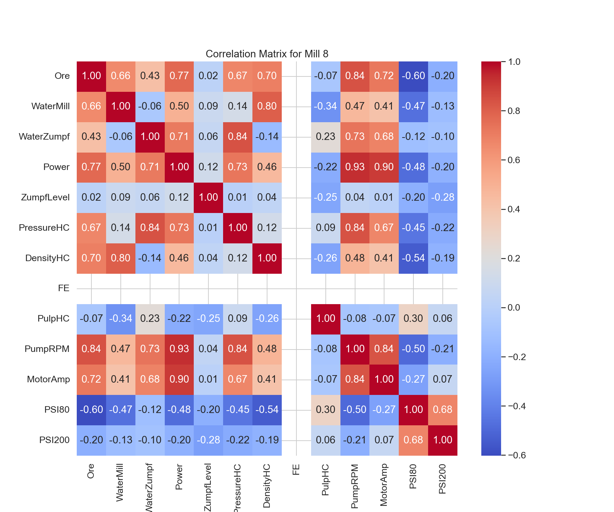
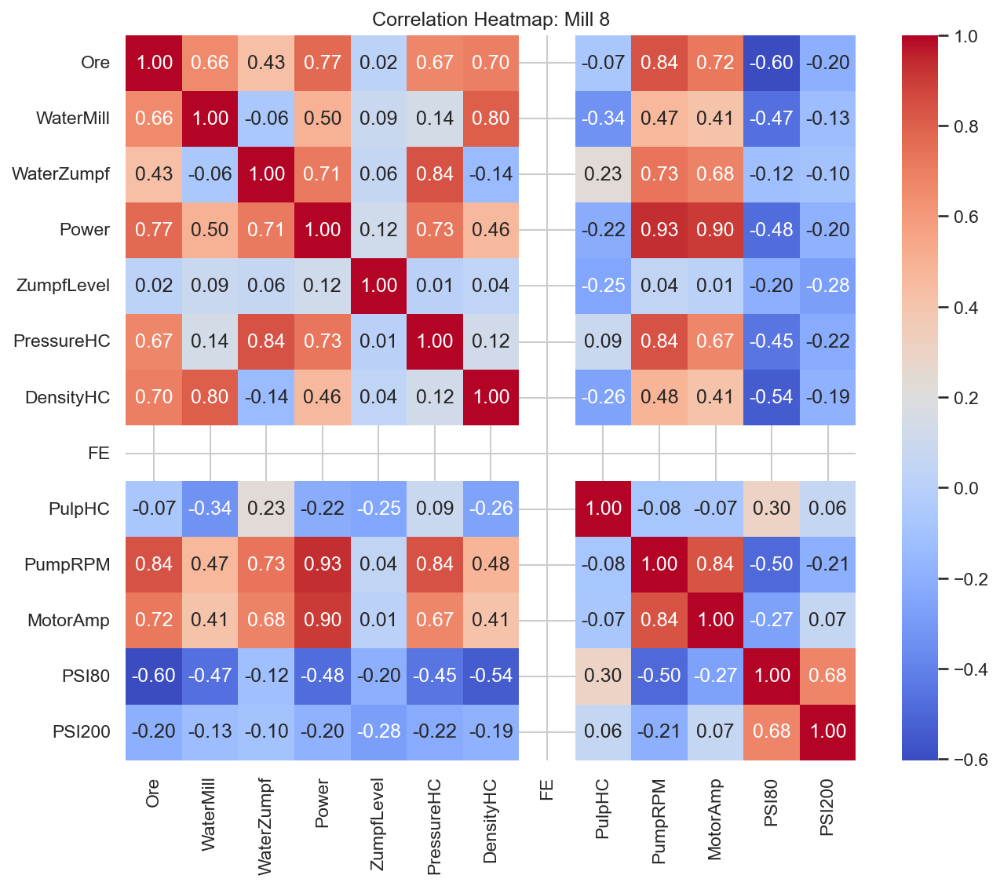

# Доклад за анализ на ефективността на Мелница 8

## 1. Executive Summary
Този доклад представя всеобхватен анализ на работата на Мелница 8 за периода 16 февруари – 18 март 2026 г. Анализът обхваща 43,201 минути оперативни данни. Средното натоварване на мелницата е 167.84 t/h, при средно ниво на PSI80 от 52.76 μm. Установено е, че процесът показва периодична нестабилност, като SPC картите разкриват специфични извънредни точки (outliers) в PSI80, които изискват внимание. Резултатите сочат необходимост от оптимизация на водното подаване и автоматизиран контрол на натоварването за намаляване на вариациите.

## 2. Data Overview
Данните бяха извлечени от системата за мониторинг на мелницата, обхващайки точно 30-дневен период.
- **Брой записи:** 43,201 минути.
- **Времеви обхват:** 2026-02-16 до 2026-03-18.
- **Променливи:** 13 ключови технологични параметъра, включително Ore (t/h), Power (kW), PSI80 (μm), MotorAmp (A) и други.
- **Качество на данните:** Данните са с висока плътност, без критични пропуски, позволяващи детайлен статистически анализ.

## 3. Findings

### 3.1 EDA (Exploratory Data Analysis)
Статистическият профил на Мелница 8 показва:
- **Ore (t/h):** Средно 167.84, std 16.73, вариращо от 0.12 до 187.43 t/h.
- **PSI80 (μm):** Средно 52.76, std 3.24. Минималната стойност от 46.70 μm показва периодично прекомерно смилане.
- **Power/MotorAmp:** Средна консумация 201.16 A, което корелира силно с натоварването на рудата.

### 3.2 SPC (Statistical Process Control)
Контролните карти показват състоянието на стабилност на ключовите параметри:
- **SPC на Ore:** Наблюдава се добра стабилност около средната стойност, но с чести отклонения в пиковите часове.
- **SPC на PSI80:** Картата показва зони, в които PSI80 излиза извън горните контролни граници, което корелира с внезапни промени в твърдостта на подаваната руда.

### 3.3 Корелационен анализ
Матрицата на корелация потвърждава логическите зависимости между параметрите:
- **Ore vs Power:** Силна положителна корелация (очаквано).
- **Ore vs PSI80:** Умерена отрицателна корелация – по-високото натоварване води до по-едро смилане (по-високи PSI стойности).

## 4. Статистически аномалии
По време на анализа бяха идентифицирани серия от "аномални" минути, в които MotorAmp пада до 0, а PSI80 отчита екстремни стойности (до 111.8 μm). Това вероятно се дължи на прекъсвания в захранването или аварийни спирания.

## 5. Conclusions & Recommendations
1. **Автоматизация на захранването:** На база на SPC анализа за PSI80, препоръчваме въвеждане на PID контролер за динамично регулиране на скоростта на захранване (Ore feeder) спрямо текущото PSI80.
2. **Оптимизация на водата:** Наблюдава се несъответствие между WaterMill и WaterZumpf при високи натоварвания. Необходимо е рекалибриране на съотношението "руда:вода".
3. **Превантивна поддръжка:** Анализът на PSI80 аномалиите предполага нужда от проверка на датчиците за зърнометрия, тъй като част от извънредните стойности вероятно са технически шум.
4. **Редовен мониторинг:** Препоръчва се седмично изготвяне на тези SPC карти за ранно откриване на отклонения в износването на мелите тела.