# Architecture Deep-Dive

> Technical walkthrough of every component in the `data_analysis_lg` project — how data flows, how agents are built, how tools are wired, and how the system stays within LLM token limits.

---

## Table of Contents

- [1. Conceptual Layers](#1-conceptual-layers)
- [2. The MCP Tool Server](#2-the-mcp-tool-server)
  - [2.1 Tool Pattern (Three-Part Convention)](#21-tool-pattern-three-part-convention)
  - [2.2 Tool Registry](#22-tool-registry)
  - [2.3 Server Wiring](#23-server-wiring)
  - [2.4 In-Memory DataFrame Store](#24-in-memory-dataframe-store)
  - [2.5 Python Executor: Sandboxed Code Execution](#25-python-executor-sandboxed-code-execution)
- [3. The MCP-to-LangChain Bridge](#3-the-mcp-to-langchain-bridge)
  - [3.1 JSON Schema → Pydantic Conversion](#31-json-schema--pydantic-conversion)
  - [3.2 Tool Wrapping with Closure](#32-tool-wrapping-with-closure)
  - [3.3 Handling Optional / Nullable Parameters](#33-handling-optional--nullable-parameters)
- [4. The Multi-Agent Graph](#4-the-multi-agent-graph)
  - [4.1 Custom State: AnalysisState](#41-custom-state-analysisstate)
  - [4.2 The Manager Node](#42-the-manager-node)
  - [4.3 Specialist Agent Factory](#43-specialist-agent-factory)
  - [4.4 Routing Logic (Three Router Functions)](#44-routing-logic-three-router-functions)
  - [4.5 Graph Assembly](#45-graph-assembly)
  - [4.6 Message Compression (Token Management)](#46-message-compression-token-management)
- [5. The Entry Point (main.py)](#5-the-entry-point-mainpy)
- [6. Data Flow: End-to-End Trace](#6-data-flow-end-to-end-trace)
- [7. Design Decisions & Trade-offs](#7-design-decisions--trade-offs)

---

## 1. Conceptual Layers

The project is organized into four conceptual layers, each with a clear responsibility:

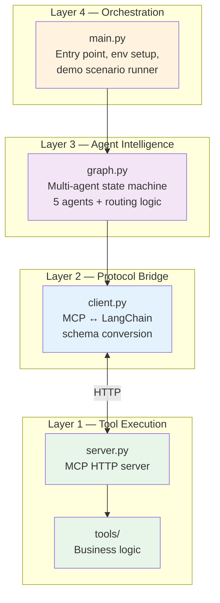

| Layer                            | Files                  | Responsibility                                 |
| -------------------------------- | ---------------------- | ---------------------------------------------- |
| **Layer 1 — Tool Execution**     | `server.py`, `tools/*` | Host MCP tools, execute data operations        |
| **Layer 2 — Protocol Bridge**    | `client.py`            | Convert MCP tools ↔ LangChain StructuredTools  |
| **Layer 3 — Agent Intelligence** | `graph.py`             | Define agents, prompts, routing, state machine |
| **Layer 4 — Orchestration**      | `main.py`              | Wire everything together, run analysis         |

---

## 2. The MCP Tool Server

### 2.1 Tool Pattern (Three-Part Convention)

Every tool in this project follows the exact same pattern inherited from the `lg_mcp_01` reference project. This consistency makes adding new tools trivial.

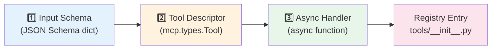

Here's the pattern applied to `load_csv` as an example:

**Part 1 — Input Schema** (defines what the LLM sees as parameters):

```python
load_csv_input_schema = {
    "type": "object",
    "properties": {
        "file_path": {
            "type": "string",
            "description": "Path to the CSV file, relative to csv/ folder or absolute.",
        },
        "nrows": {
            "type": "integer",
            "description": "Optional: max rows to load. Omit to load all rows.",
        },
    },
    "required": ["file_path"],  # nrows is optional
}
```

**Part 2 — Tool Descriptor** (MCP metadata for discovery):

```python
load_csv_tool = types.Tool(
    name="load_csv",
    description="Load a CSV file into the server's in-memory dataframe store...",
    inputSchema=load_csv_input_schema,
)
```

**Part 3 — Async Handler** (does the actual work):

```python
async def load_csv(arguments: dict) -> list[types.TextContent]:
    file_path = arguments.get("file_path", "").strip()
    nrows = arguments.get("nrows", 0)
    # ... load data, return JSON result
    return [types.TextContent(type="text", text=json.dumps(result, default=str))]
```

> **Adding a new tool** requires only: (1) create the three parts in a file under `tools/`, (2) add one entry in `tools/__init__.py`. No changes to `server.py` or `client.py`.

---

### 2.2 Tool Registry

The `tools/__init__.py` file acts as a central catalog. The server iterates this dict to respond to `list_tools` and `call_tool` requests:

```python
# tools/__init__.py
tools = {
    load_csv_tool.name:              {"tool": load_csv_tool,              "handler": load_csv},
    get_dataframe_info_tool.name:    {"tool": get_dataframe_info_tool,    "handler": get_dataframe_info},
    execute_python_tool.name:        {"tool": execute_python_tool,        "handler": execute_python},
    list_output_files_tool.name:     {"tool": list_output_files_tool,     "handler": list_output_files},
    write_markdown_report_tool.name: {"tool": write_markdown_report_tool, "handler": write_markdown_report},
}
```

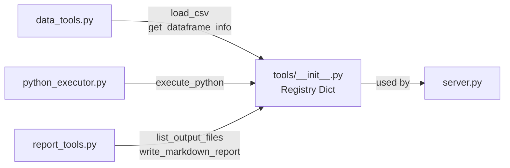

---

### 2.3 Server Wiring

`server.py` sets up the MCP server with two handler functions that delegate everything to the registry:

```python
@server.list_tools()
async def handle_list_tools() -> list[types.Tool]:
    return [entry["tool"] for entry in tools.values()]

@server.call_tool()
async def handle_call_tool(name: str, arguments: dict) -> list[types.TextContent]:
    if name not in tools:
        raise ValueError(f"Unknown tool: {name}")
    handler = tools[name]["handler"]
    return await handler(arguments)
```

The transport stack is:

```
Tool Handlers → MCP Server → StreamableHTTPSessionManager → Starlette App → Uvicorn (port 8002)
```

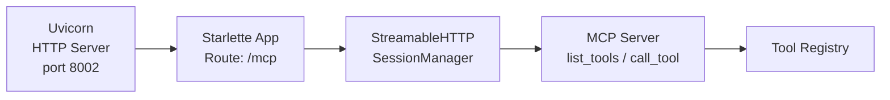

---

### 2.4 In-Memory DataFrame Store

The DataFrame is stored in a module-level dictionary in `data_tools.py`. This is a simple but effective approach for a single-server demo:

```python
# Shared across all tools in this server process
_dataframes: dict[str, pd.DataFrame] = {}

def get_dataframe(name: str = "default") -> pd.DataFrame | None:
    return _dataframes.get(name)

def set_dataframe(df: pd.DataFrame, name: str = "default") -> None:
    _dataframes[name] = df
```

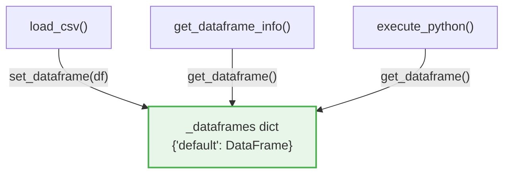

**Why a dict with a `name` key?** This allows future multi-dataset support (e.g., loading two CSVs and joining them). Currently only `"default"` is used.

---

### 2.5 Python Executor: Sandboxed Code Execution

The `execute_python` tool is the most complex tool. It runs arbitrary Python code from the LLM in a controlled namespace:

```python
# Build execution namespace
namespace = {
    "df": df.copy(),          # Copy to prevent mutation of the shared store
    "pd": pd, "np": np,
    "sns": sns, "plt": plt,
    "os": os,
    "OUTPUT_DIR": OUTPUT_DIR,
    "__builtins__": __builtins__,
}

# Capture stdout
old_stdout = sys.stdout
sys.stdout = captured_stdout = io.StringIO()

try:
    exec(code, namespace)
except Exception:
    error_msg = traceback.format_exc()
finally:
    sys.stdout = old_stdout
    plt.close("all")       # Free memory from any unclosed figures
```

Key features:

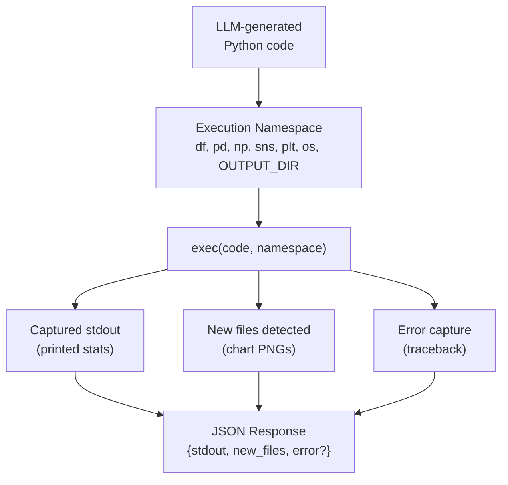

| Feature               | Implementation                     | Why                                                |
| --------------------- | ---------------------------------- | -------------------------------------------------- |
| **DataFrame copy**    | `df.copy()`                        | Prevents LLM code from corrupting the shared store |
| **stdout capture**    | `io.StringIO` redirect             | Agents see `print()` output from executed code     |
| **File detection**    | `set(os.listdir(OUTPUT_DIR))` diff | Tracks which charts were saved                     |
| **Figure cleanup**    | `plt.close("all")` in `finally`    | Prevents memory leaks from matplotlib              |
| **Error handling**    | `traceback.format_exc()`           | Agent sees the error and can retry                 |
| **Output truncation** | `stdout[:5000]`, `error[:3000]`    | Prevents huge outputs from blowing up context      |

> **Security note:** This is a demo. In production, use a proper sandbox (e.g., Docker container, gVisor, or a dedicated code execution service).

---

## 3. The MCP-to-LangChain Bridge

`client.py` solves a critical integration problem: **MCP tools use JSON Schema**, but **LangGraph's ToolNode needs Pydantic models**. The bridge converts between the two worlds.

### 3.1 JSON Schema → Pydantic Conversion

```python
def _json_schema_to_pydantic(schema: dict, model_name: str) -> Type[BaseModel]:
    properties = schema.get("properties", {})
    required = set(schema.get("required", []))

    field_definitions: dict[str, Any] = {}
    for prop_name, prop_meta in properties.items():
        json_type = prop_meta.get("type", "string")
        python_type = int if json_type == "integer" else str

        if prop_name in required:
            field_definitions[prop_name] = (python_type, ...)       # Required
        else:
            field_definitions[prop_name] = (Optional[python_type], None)  # Optional

    return create_model(model_name, **field_definitions)
```

This dynamically builds Pydantic models at runtime:

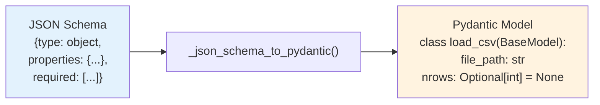

### 3.2 Tool Wrapping with Closure

Each MCP tool is wrapped as a LangChain `StructuredTool` using a closure that captures the live MCP session:

```python
def mcp_tool_to_langchain(tool: mcp_types.Tool, session: ClientSession) -> BaseTool:
    args_schema = _json_schema_to_pydantic(tool.inputSchema, model_name=tool.name)

    async def _call(**kwargs: Any) -> str:
        clean_kwargs = {k: v for k, v in kwargs.items() if v is not None}
        result = await session.call_tool(name=tool.name, arguments=clean_kwargs)
        if result.isError:
            return f"Error: {result.content[0].text}"
        return result.content[0].text

    return StructuredTool.from_function(
        coroutine=_call,
        name=tool.name,
        description=tool.description,
        args_schema=args_schema,
    )
```

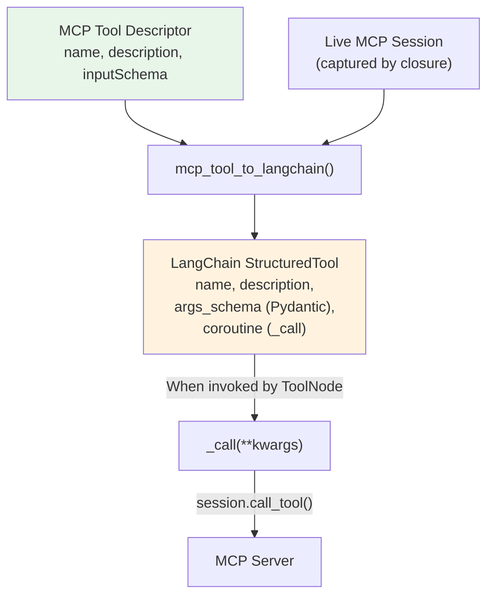

### 3.3 Handling Optional / Nullable Parameters

A subtle but important fix: LLMs often send `null` for optional parameters (e.g., `{"nrows": null}`). The Groq API validates strictly against the JSON schema and rejects `null` for `integer` types. Two fixes work together:

1. **Pydantic side:** Optional fields use `Optional[int]` so the schema allows `null`
2. **Call side:** `None` values are filtered out before sending to the MCP server

```python
# In _call closure:
clean_kwargs = {k: v for k, v in kwargs.items() if v is not None}
```

This prevents the error: `tool call validation failed: parameters for tool load_csv did not match schema: /nrows: expected integer, but got null`.

---

## 4. The Multi-Agent Graph

### 4.1 Custom State: AnalysisState

LangGraph's built-in `MessagesState` provides a shared message list. We extend it with a `next_agent` field so the Manager can signal routing decisions:

```python
class AnalysisState(MessagesState):
    next_agent: str
```

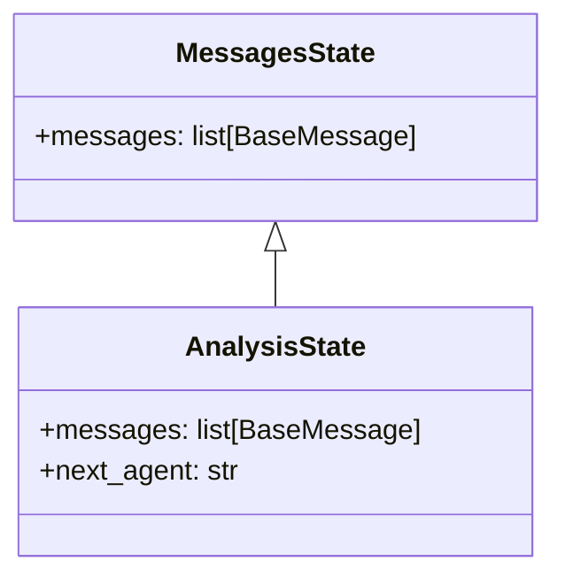

The `messages` list is **append-only** — every agent adds its output, and tool results are automatically inserted by `ToolNode`. This gives each agent full context of what has happened so far (subject to compression, see [4.6](#46-message-compression-token-management)).

---

### 4.2 The Manager Node

The Manager is the only agent that **does not use tools**. It reads the conversation and emits a routing directive:

```python
def manager_node(state: AnalysisState) -> dict:
    messages = [SystemMessage(content=MANAGER_PROMPT)] + compress_messages(state["messages"])
    response = llm.invoke(messages)  # No tools bound

    # Parse the NEXT: directive from the response
    next_agent = "FINISH"
    for line in content.strip().split("\n"):
        if line.strip().startswith("NEXT:"):
            next_agent = line.split("NEXT:")[1].strip()
            break

    return {
        "messages": [AIMessage(content=content, name="manager")],
        "next_agent": next_agent,
    }
```

The Manager's system prompt enforces a strict output format:

```
Respond with a 1-2 sentence instruction, then on its own line:
NEXT: <agent_name>
```

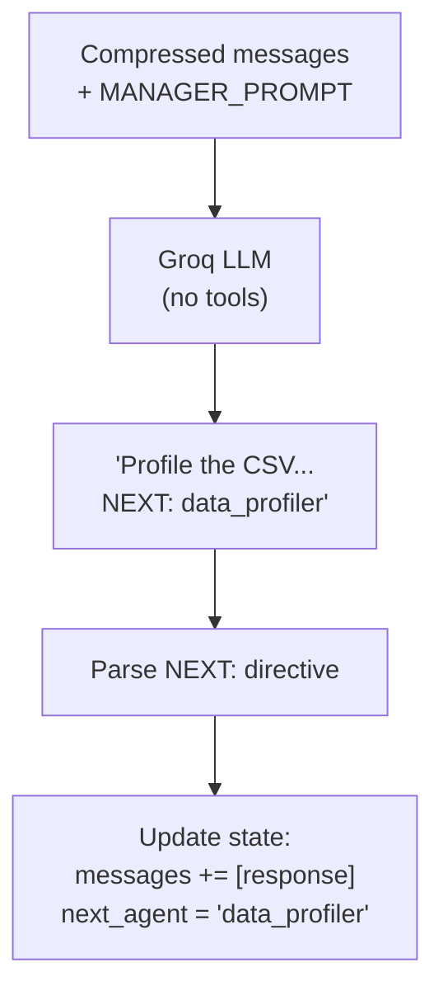

---

### 4.3 Specialist Agent Factory

All four specialist agents are created by the same factory function, differentiated only by their system prompt:

```python
def make_specialist_node(name: str, system_prompt: str):
    def specialist_node(state: AnalysisState) -> dict:
        iteration = sum(1 for m in state["messages"] if getattr(m, "name", None) == name) + 1
        messages = [SystemMessage(content=system_prompt)] + compress_messages(state["messages"])
        response = llm_with_tools.invoke(messages)   # Tools ARE bound here
        response.name = name
        return {"messages": [response]}
    return specialist_node
```

Key differences from the Manager:

- Uses `llm_with_tools` (tools are bound to the LLM)
- Does **not** set `next_agent` — routing back to Manager is handled by conditional edges
- Tags each response with `response.name = name` for tracking

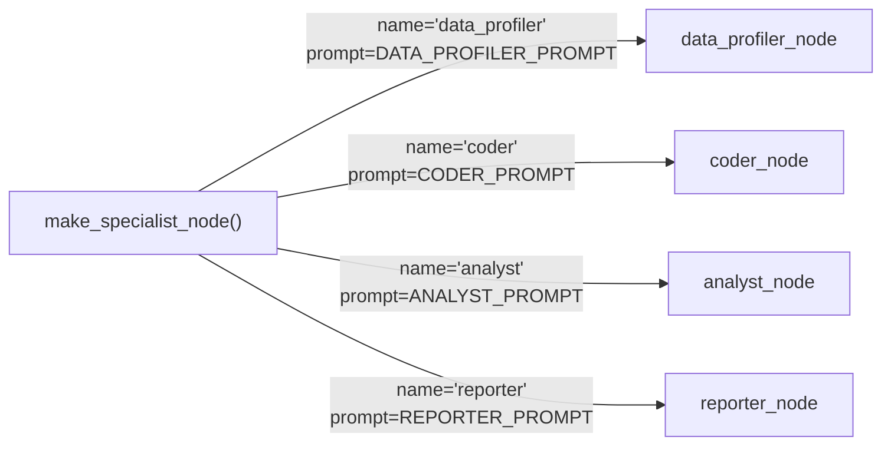

---

### 4.4 Routing Logic (Three Router Functions)

The graph uses three routing functions for conditional edges:

#### Router 1: `manager_router` — Where does the Manager send work?

```python
def manager_router(state: AnalysisState) -> str:
    next_agent = state.get("next_agent", "FINISH")
    if next_agent in ("data_profiler", "coder", "analyst", "reporter"):
        return next_agent
    return "end"
```

#### Router 2: `specialist_router` — Does the specialist need tools?

```python
def specialist_router(state: AnalysisState) -> str:
    last_message = state["messages"][-1]
    if hasattr(last_message, "tool_calls") and last_message.tool_calls:
        return "tools"
    return "manager"      # Done — hand back to manager
```

#### Router 3: `post_tool_router` — After tools run, who called them?

```python
def post_tool_router(state: AnalysisState) -> str:
    for msg in reversed(state["messages"]):
        if hasattr(msg, "tool_calls") and msg.tool_calls and getattr(msg, "name", None):
            return msg.name   # Return to the specialist that made the call
    return "manager"
```

Together these create the **specialist ↔ tools loop**:

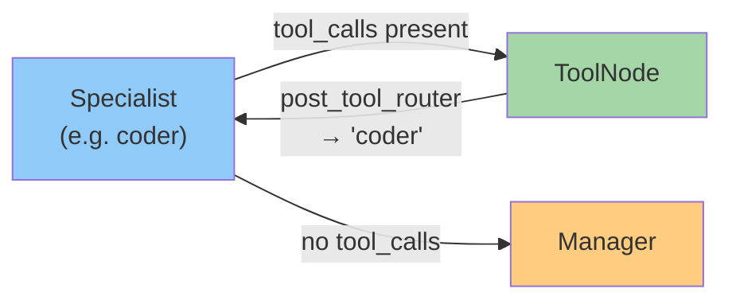

A specialist can call tools **multiple times** in a row. For example, the Data Profiler typically:

1. Calls `load_csv` → gets routed back → sees result
2. Calls `get_dataframe_info` → gets routed back → sees result
3. Writes a summary (no tool_calls) → routes to Manager

---

### 4.5 Graph Assembly

The full graph is assembled with `StateGraph`:

```python
graph_builder = StateGraph(AnalysisState)

# Register all nodes
graph_builder.add_node("manager", manager_node)
graph_builder.add_node("data_profiler", data_profiler_node)
graph_builder.add_node("coder", coder_node)
graph_builder.add_node("analyst", analyst_node)
graph_builder.add_node("reporter", reporter_node)
graph_builder.add_node("tools", tool_node)

# Entry point
graph_builder.set_entry_point("manager")

# Manager → specialist or END
graph_builder.add_conditional_edges("manager", manager_router, {
    "data_profiler": "data_profiler",
    "coder": "coder",
    "analyst": "analyst",
    "reporter": "reporter",
    "end": END,
})

# Each specialist → tools or manager
for specialist in ["data_profiler", "coder", "analyst", "reporter"]:
    graph_builder.add_conditional_edges(specialist, specialist_router, {
        "tools": "tools",
        "manager": "manager",
    })

# Tools → back to calling specialist
graph_builder.add_conditional_edges("tools", post_tool_router, {
    "data_profiler": "data_profiler",
    "coder": "coder",
    "analyst": "analyst",
    "reporter": "reporter",
    "manager": "manager",
})
```

Full compiled graph visualization:

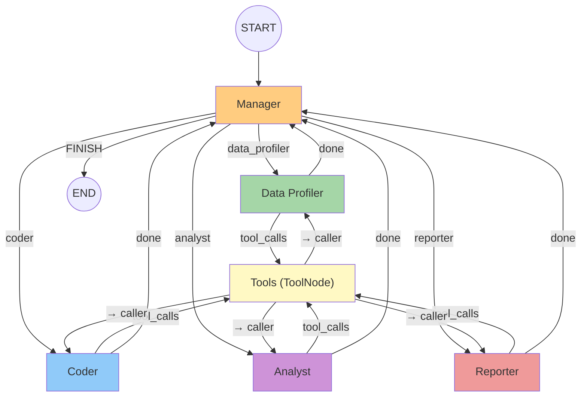

---

### 4.6 Message Compression (Token Management)

The Groq free tier has an **8,000 tokens-per-minute (TPM)** limit. Without compression, the conversation quickly exceeds this as tool results accumulate (e.g., DataFrame info with 20+ columns, code execution stdout).

The `compress_messages()` function truncates large messages before sending them to the LLM:

```python
MAX_TOOL_OUTPUT_CHARS = 1500

def compress_messages(messages: list[BaseMessage]) -> list[BaseMessage]:
    compressed = []
    for msg in messages:
        if isinstance(msg, ToolMessage):
            content = msg.content if isinstance(msg.content, str) else str(msg.content)
            if len(content) > MAX_TOOL_OUTPUT_CHARS:
                truncated = content[:MAX_TOOL_OUTPUT_CHARS] + "\n... [truncated]"
                compressed.append(ToolMessage(
                    content=truncated,
                    tool_call_id=msg.tool_call_id,
                    name=msg.name,
                ))
            else:
                compressed.append(msg)
        elif isinstance(msg, AIMessage) and msg.content and len(msg.content) > 2000:
            truncated_msg = AIMessage(
                content=msg.content[:2000] + "\n... [truncated]",
                name=getattr(msg, "name", None),
                tool_calls=msg.tool_calls if msg.tool_calls else [],
            )
            compressed.append(truncated_msg)
        else:
            compressed.append(msg)
    return compressed
```

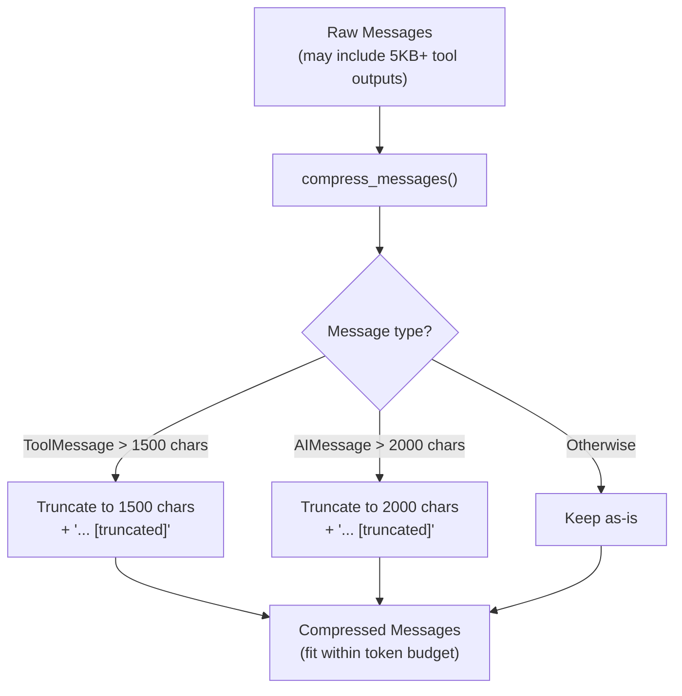

**Where is compression applied?**

- ✅ Before every Manager LLM call
- ✅ Before every Specialist LLM call
- ❌ NOT on the actual state (original messages are preserved for downstream agents)

This means the **state retains full fidelity**, but each LLM call only sees a compressed view.

---

## 5. The Entry Point (main.py)

`main.py` wires everything together in a clean async pipeline:

```python
async def main() -> None:
    api_key = os.getenv("GROQ_API_KEY")

    async with streamable_http_client(SERVER_URL) as (read, write, _):
        async with ClientSession(read, write) as session:
            await session.initialize()

            # Fetch tools once, build graph once
            langchain_tools = await get_mcp_tools(session)
            graph = build_graph(langchain_tools, api_key)

            # Run each demo analysis
            for label, user_input in DEMO_REQUESTS:
                await run_analysis(graph, label, user_input)
```

The `DEMO_REQUESTS` list defines analysis scenarios to run:

```python
DEMO_REQUESTS = [
    (
        "Correlation Analysis",
        "Calculate the correlation of the 'Ore' and 'DensityHC' columns...",
    ),
]
```

Each request is invoked with:

```python
final_state = await graph.ainvoke(
    {"messages": [HumanMessage(content=user_input)]},
    config={
        "configurable": {"thread_id": label},
        "recursion_limit": 50,
    },
)
```

---

## 6. Data Flow: End-to-End Trace

Here's a complete trace of a typical analysis request flowing through the system:

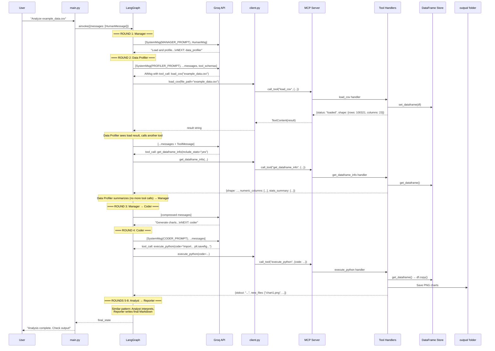

---

## 7. Design Decisions & Trade-offs

| Decision                                   | Rationale                                                | Alternative Considered                               |
| ------------------------------------------ | -------------------------------------------------------- | ---------------------------------------------------- |
| **Two-process architecture**               | Follows MCP spec; tools could run on a different machine | Single-process with direct function calls            |
| **Manager as router (not LLM tool)**       | Simpler parsing; avoids tool-call overhead for routing   | LangGraph's built-in `Command` for routing           |
| **Factory pattern for specialists**        | DRY — same logic, different prompts                      | Separate functions per agent                         |
| **Message compression**                    | Required for Groq free tier (8K TPM limit)               | Summarization via separate LLM call (more expensive) |
| **`exec()` for code execution**            | Fast, direct access to DataFrame                         | Docker container (safer but slower)                  |
| **In-memory DataFrame dict**               | Simple; works for single-user demo                       | Database or file-based store for multi-user          |
| **Compact tool outputs**                   | Keep token count low per interaction                     | Full outputs with aggressive summarization           |
| **`NEXT:` directive parsing**              | Simple string parsing; works reliably                    | Structured output / function call for routing        |
| **Single `ToolNode` shared by all agents** | All agents share the same tool set                       | Per-agent tool subsets (more restrictive)            |
| **`df.copy()` in executor**                | Prevents LLM code from corrupting shared state           | Copy-on-write (more complex)                         |
