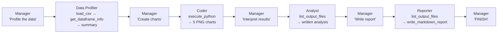
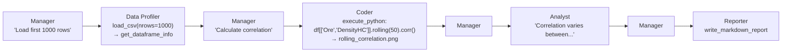

# Examples & Usage Guide

> Practical scenarios showing how to use the multi-agent data analysis system — from simple queries to full EDA pipelines, with sample outputs and tips for writing effective prompts.

---

## Table of Contents

- [1. Running the System](#1-running-the-system)
- [2. Example Scenarios](#2-example-scenarios)
  - [Scenario 1: Full Exploratory Data Analysis](#scenario-1-full-exploratory-data-analysis)
  - [Scenario 2: Targeted Correlation Analysis](#scenario-2-targeted-correlation-analysis)
  - [Scenario 3: Outlier Detection](#scenario-3-outlier-detection)
  - [Scenario 4: Time-Series Trend Analysis](#scenario-4-time-series-trend-analysis)
  - [Scenario 5: Shift-Based Comparison](#scenario-5-shift-based-comparison)
- [3. Sample Output Walkthrough](#3-sample-output-walkthrough)
  - [Console Output](#console-output)
  - [Generated Charts](#generated-charts)
  - [Generated Report](#generated-report)
- [4. How to Write Effective Prompts](#4-how-to-write-effective-prompts)
- [5. Adding Custom Scenarios](#5-adding-custom-scenarios)
- [6. Using Your Own CSV Data](#6-using-your-own-csv-data)
- [7. Troubleshooting](#7-troubleshooting)

---

## 1. Running the System

Every analysis requires **two terminals** — one for the MCP tool server, one for the client:

```
┌─────────────────────────────────┐    ┌─────────────────────────────────┐
│ Terminal 1 — MCP Server         │    │ Terminal 2 — LangGraph Client   │
│                                 │    │                                 │
│ > .venv\Scripts\activate        │    │ > .venv\Scripts\activate        │
│ > python data_analysis_lg\     │    │ > python data_analysis_lg\     │
│        server.py                │    │        main.py                  │
│                                 │    │                                 │
│ INFO: Uvicorn running on        │    │ Connecting to MCP server...     │
│   http://0.0.0.0:8002           │    │ Tools loaded from MCP server:   │
│                                 │    │   - load_csv                    │
│ (keep running)                  │    │   - get_dataframe_info          │
│                                 │    │   - execute_python              │
│                                 │    │   - list_output_files           │
│                                 │    │   - write_markdown_report       │
│                                 │    │                                 │
│                                 │    │ ══════════════════════════════  │
│                                 │    │   USER (Full EDA)               │
│                                 │    │   I have a CSV file called...   │
│                                 │    │ ══════════════════════════════  │
│                                 │    │                                 │
│                                 │    │   [manager] Routing to:         │
│                                 │    │     data_profiler               │
│                                 │    │   [data_profiler] iteration 1   │
│                                 │    │   ...                           │
└─────────────────────────────────┘    └─────────────────────────────────┘
```

---

## 2. Example Scenarios

### Scenario 1: Full Exploratory Data Analysis

The most comprehensive scenario — triggers all four agents in sequence.

**Prompt:**

```python
DEMO_REQUESTS = [
    (
        "Full EDA",
        "I have a CSV file called 'example_data.csv' with industrial sensor data "
        "(ore processing plant). Please perform a complete exploratory data analysis: "
        "load the data, profile its structure, create visualizations for time series trends, "
        "distributions of key variables, correlation analysis between sensors, and "
        "generate a comprehensive Markdown report with all findings, charts, and recommendations."
    ),
]
```

**What happens:**



**Expected outputs:**

```
output/
├── time_series.png              # Ore, Power, PressureHC over time
├── distribution_histograms.png  # Key variable distributions
├── correlation_heatmap.png      # Full sensor correlation matrix
├── boxplot_outliers.png         # FE and PSI200 outlier detection
├── ore_by_shift.png             # Ore concentration by production shift
├── EDA_report.md                # Coder's preliminary report
└── Industrial_Sensor_EDA_Report.md  # Reporter's final polished report
```

**Agent flow (typical):** 8 Manager rounds, ~20 total LLM calls, ~15 tool invocations.

---

### Scenario 2: Targeted Correlation Analysis

A focused request — the agents skip unnecessary broad analysis and focus on specific columns.

**Prompt:**

```python
DEMO_REQUESTS = [
    (
        "Correlation Analysis",
        "Calculate the correlation of the 'Ore' and 'DensityHC' columns in the "
        "'example_data.csv' file for the first 1000 rows and plot a chart of the "
        "correlation for a moving window of 50 rows.",
    ),
]
```

**What happens:**



**Key differences from full EDA:**

- `load_csv` is called with `nrows=1000` (agent picks this up from the prompt)
- Coder generates fewer, more targeted charts
- Analysis and report are more focused

---

### Scenario 3: Outlier Detection

Ask the system to find and visualize anomalous sensor readings.

**Prompt:**

```python
DEMO_REQUESTS = [
    (
        "Outlier Detection",
        "Load 'example_data.csv' and identify outliers in the sensor columns. "
        "Use IQR method and z-scores. Create boxplots and highlight the most "
        "anomalous readings. Which sensors have the most outliers and why?",
    ),
]
```

**Expected agent behavior:**

- **Data Profiler:** Loads data, notes columns with high variance (`PSI200`, `FE`)
- **Coder:** Generates code computing IQR bounds, z-scores, boxplots per sensor
- **Analyst:** Identifies `FE = -9999` as sentinel values, `PSI200` spikes as potential sensor faults
- **Reporter:** Documents findings with chart references and remediation recommendations

---

### Scenario 4: Time-Series Trend Analysis

Focus on temporal patterns in the data.

**Prompt:**

```python
DEMO_REQUESTS = [
    (
        "Time Series Trends",
        "Analyze the time-series patterns in 'example_data.csv'. Focus on the "
        "'Power', 'Ore', and 'PressureHC' columns. Detect daily cycles, trends, "
        "and any sudden changes. Create time-series decomposition charts and "
        "rolling averages with different windows (1h, 6h, 24h).",
    ),
]
```

**Expected code the Coder might generate:**

```python
# Rolling averages for Power
fig, axes = plt.subplots(3, 1, figsize=(14, 10), sharex=True)
for ax, col in zip(axes, ['Power', 'Ore', 'PressureHC']):
    ax.plot(df['TimeStamp'][:5000], df[col][:5000], alpha=0.3, label='Raw')
    ax.plot(df['TimeStamp'][:5000], df[col][:5000].rolling(60).mean(), label='1h MA')
    ax.plot(df['TimeStamp'][:5000], df[col][:5000].rolling(360).mean(), label='6h MA')
    ax.set_ylabel(col)
    ax.legend()
plt.savefig(os.path.join(OUTPUT_DIR, 'rolling_averages.png'), dpi=150, bbox_inches='tight')
plt.close()
```

---

### Scenario 5: Shift-Based Comparison

Compare sensor performance across production shifts.

**Prompt:**

```python
DEMO_REQUESTS = [
    (
        "Shift Comparison",
        "Load 'example_data.csv' and compare sensor readings across the three "
        "shifts (column 'Shift' has values 1, 2, 3). Create grouped boxplots, "
        "calculate mean/std per shift for Power, Ore, and MotorAmp. "
        "Are there statistically significant differences between shifts?",
    ),
]
```

**Expected Coder output:**

- Grouped boxplots: Ore by Shift, Power by Shift, MotorAmp by Shift
- ANOVA or Kruskal-Wallis test results printed to stdout
- Shift-level summary statistics

---

## 3. Sample Output Walkthrough

This section shows actual outputs from a successful Full EDA run.

### Console Output

The console shows the agent orchestration in real-time:

```
Connecting to MCP server at http://localhost:8002/mcp...
Connected to MCP server at http://localhost:8002/mcp

Tools loaded from MCP server:
  - load_csv: Load a CSV file into the server's in-memory dataframe store...
  - get_dataframe_info: Return detailed info about the currently loaded dataframe...
  - execute_python: Execute Python code for data analysis...
  - list_output_files: List all files currently in the output/ directory...
  - write_markdown_report: Write a Markdown report file to the output/ directory...

══════════════════════════════════════════════════════════════════════
  USER (Full EDA)
  I have a CSV file called 'example_data.csv' with industrial sensor data...
══════════════════════════════════════════════════════════════════════

  [manager] Reviewing conversation (1 messages)...
  [manager] Response: Profile the CSV file 'example_data.csv' to understand
    its schema, data types, missing values, and basic statistics.
    NEXT: data_profiler
  [manager] Routing to: data_profiler

  [data_profiler] iteration 1 — processing...
  [data_profiler] Requesting tools: ['load_csv']

  [data_profiler] iteration 2 — processing...
  [data_profiler] Requesting tools: ['get_dataframe_info']

  [data_profiler] iteration 3 — processing...
  [data_profiler] Response: "**Data Profile – example_data.csv**
    | Aspect | Details |
    | Shape  | 100,321 rows × 23 columns..."

  [manager] Reviewing conversation (7 messages)...
  [manager] Routing to: coder

  [coder] iteration 1 — processing...
  [coder] Requesting tools: ['execute_python']

  [coder] iteration 2 — processing...
  [coder] Response: "The exploratory data analysis is complete..."

  [manager] Routing to: analyst
  ...
  [manager] Routing to: reporter
  ...

══════════════════════════════════════════════════════════════════════
  Analysis complete. Check data_analysis_lg/output/ for results.
══════════════════════════════════════════════════════════════════════
```

### Generated Charts

Here are the types of charts the Coder agent typically produces:

#### Time Series Plot

Shows sensor evolution over time. The Coder usually plots 2–3 key variables on a shared x-axis with the `TimeStamp` column.

```
     Power (kW)
2000 ┤ ╭──────╮    ╭──────╮    ╭──────╮
     │╯      ╰────╯      ╰────╯      ╰──
1800 ┤
     │
     ├─────────────────────────────────────
       06-15 08  06-15 16  06-16 00  06-16 08
                       Time
```

#### Correlation Heatmap

A color-coded matrix showing Pearson correlations between all numeric sensor columns. Strong positives appear in red, strong negatives in blue.

```
           Ore  Power  MotorAmp  PumpRPM  PressureHC
Ore         1.0   0.55    0.52     0.31      0.28
Power      0.55   1.0     0.99     0.58      0.42
MotorAmp   0.52  0.99     1.0      0.57      0.41
PumpRPM    0.31  0.58    0.57      1.0       0.59
PressureHC 0.28  0.42    0.41     0.59       1.0
```

#### Distribution Histograms

Side-by-side histograms for key variables, showing the spread of values. The Coder often adds log-scale for skewed distributions like `PSI200`.

#### Boxplot Outliers

Boxplots highlighting extreme values. In the example data, `FE` shows sentinel values at `-9999` and `PSI200` has spike outliers above `1000`.

---

### Generated Report

The Reporter agent produces a structured Markdown document. Here's a typical structure:

```markdown
# Exploratory Data Analysis Report

**Dataset:** `example_data.csv` (Industrial sensor data)

## 1. Dataset Overview

| Metric     | Value                    |
| ---------- | ------------------------ |
| Rows       | 100,321                  |
| Columns    | 23                       |
| Memory     | 17.6 MB                  |
| Time Range | 2025-06-15 to 2025-08-21 |

## 2. Key Findings

### 2.1 Time-Series Patterns


All sensors show stable operation with minor fluctuations...

### 2.2 Correlation Analysis


- **Power ↔ MotorAmp**: r = 0.99 (nearly perfect linear relationship)
- **Grano ↔ Daiki**: r = 0.88 (related mineral fractions)
  ...

## 3. Anomalies

- `FE` contains sentinel value **-9999** (invalid readings)
- `PSI200` has extreme spikes up to 6,528

## 4. Recommendations

1. Replace FE = -9999 with NaN before modeling
2. Investigate PSI200 spikes for sensor faults
3. Power and MotorAmp are redundant — consider dropping one
   ...
```

---

## 4. How to Write Effective Prompts

The quality of the analysis depends heavily on how you phrase the request. Here are guidelines:

### Be Specific About the CSV File

```diff
- "Analyze my data"
+ "Load 'example_data.csv' and analyze the sensor columns"
```

The agents need to know the **exact filename** to pass to `load_csv`.

### Mention Specific Columns When Relevant

```diff
- "Find correlations"
+ "Calculate the correlation between 'Power' and 'MotorAmp' columns"
```

### Specify Row Limits for Large Datasets

```diff
- "Plot a time series"
+ "Plot a time series of the first 5000 rows for 'Ore' and 'Power'"
```

This helps the Coder generate efficient code and keeps charts readable.

### Request Specific Chart Types

```diff
- "Show me the data"
+ "Create a heatmap of correlations, boxplots for outlier detection,
   and histograms for key variable distributions"
```

### Ask for Actionable Insights

```diff
- "What does the data show?"
+ "What sensors are most correlated? Are there outliers that suggest
   sensor faults? Which shifts perform differently?"
```

### Prompt Structure Template

```
Load '[filename].csv' [optional: first N rows].
[Specific analysis request].
[Specific visualizations to create].
[Questions to answer / insights to extract].
Generate a Markdown report with findings and recommendations.
```

---

## 5. Adding Custom Scenarios

To add your own analysis scenario, edit the `DEMO_REQUESTS` list in `main.py`:

```python
DEMO_REQUESTS = [
    (
        "Label for console output",
        "Your natural language analysis request here. "
        "Be specific about the CSV file, columns, and desired outputs.",
    ),
    # You can add multiple scenarios — they run sequentially
    (
        "Second Analysis",
        "Another analysis request...",
    ),
]
```

Each tuple is `(label, user_question)`. The label is used for console output and as the LangGraph `thread_id`.

### Running Multiple Scenarios

Multiple entries in `DEMO_REQUESTS` run sequentially in the same session. Note:

- The **MCP server retains the DataFrame** between runs (last `load_csv` wins)
- The **LangGraph state resets** for each scenario (fresh conversation)
- The **output folder accumulates** files (charts from previous runs persist)

To start fresh, delete the `output/` folder before running:

```powershell
Remove-Item -Recurse -Force data_analysis_lg\output\*
```

---

## 6. Using Your Own CSV Data

### Step 1: Place Your File

Copy your CSV into the `data_analysis_lg/csv/` folder:

```
data_analysis_lg/csv/
├── example_data.csv       # Ships with the project
└── your_data.csv          # Your file
```

### Step 2: Update the Prompt

Reference your file in the `DEMO_REQUESTS`:

```python
DEMO_REQUESTS = [
    (
        "My Analysis",
        "Load 'your_data.csv' and perform exploratory data analysis. "
        "The data contains temperature, pressure, and flow rate measurements. "
        "Focus on correlations and time-series trends.",
    ),
]
```

### Step 3: Tips for Best Results

| Tip                                                              | Why                                             |
| ---------------------------------------------------------------- | ----------------------------------------------- |
| Include a timestamp column named `TimeStamp`, `Date`, or similar | Auto-parsed by `load_csv`                       |
| Use numeric columns for sensor data                              | Enables statistical analysis                    |
| Keep file under 500K rows                                        | Larger files work but charts take longer        |
| Mention column names in the prompt                               | Helps agents focus on relevant data             |
| Describe the domain                                              | Helps the Analyst provide domain-aware insights |

### CSV Format Requirements

```csv
TimeStamp,Sensor1,Sensor2,Category,Value
2025-01-01 00:00:00,42.5,100.2,A,3.14
2025-01-01 00:01:00,43.1,99.8,B,3.15
...
```

- **Encoding:** UTF-8
- **Separator:** Comma (standard CSV)
- **Header row:** Required
- **Timestamp format:** ISO 8601 preferred (`YYYY-MM-DD HH:MM:SS`)

---

## 7. Troubleshooting

### Common Issues

#### "Connection refused" when running main.py

```
httpx.ConnectError: [Errno 111] Connection refused
```

**Fix:** Start the MCP server first (`python data_analysis_lg/server.py`).

---

#### "GROQ_API_KEY not found"

```
ERROR: GROQ_API_KEY not found. Create .env file with your key.
```

**Fix:** Create `data_analysis_lg/.env` with:

```
GROQ_API_KEY=gsk_your_key_here
```

Make sure the file is **UTF-8 encoded** (not UTF-16). On Windows, PowerShell's `echo` creates UTF-16 — use this instead:

```powershell
[System.IO.File]::WriteAllText("data_analysis_lg\.env", "GROQ_API_KEY=gsk_your_key_here", [System.Text.UTF8Encoding]::new($false))
```

---

#### "Error code: 413 — Request too large"

```
groq.APIStatusError: Error code: 413 - Request too large for model ... Limit 8000
```

**Fix:** The conversation grew too large for the Groq free tier. Options:

1. **Reduce `MAX_TOOL_OUTPUT_CHARS`** in `graph.py` (e.g., from 1500 to 1000)
2. **Use `nrows` parameter** in your prompt: `"Load first 5000 rows of..."`
3. **Upgrade to Groq Dev tier** for higher TPM limits

---

#### "Model has been decommissioned"

```
groq.BadRequestError: The model `xxx` has been decommissioned
```

**Fix:** Update `GROQ_MODEL` in `graph.py`. Check available models at [console.groq.com/docs/models](https://console.groq.com/docs/models).

---

#### "Port 8002 already in use"

```
ERROR: [Errno 10048] error while attempting to bind on address ('0.0.0.0', 8002)
```

**Fix:** Kill the existing process:

```powershell
Get-NetTCPConnection -LocalPort 8002 | ForEach-Object { Stop-Process -Id $_.OwningProcess -Force }
```

---

#### "tool call validation failed: /nrows: expected integer, but got null"

This was a known issue that has been fixed. The client now:

1. Declares optional params as `Optional[int]` in Pydantic schemas
2. Filters out `None` values before calling the MCP server

If you encounter this on an older version, update `client.py`.

---

#### Charts not appearing in the report

The Reporter references charts by filename. If the filenames don't match, images won't display. Ensure:

- The Coder saves charts with descriptive names (not random UUIDs)
- The Reporter calls `list_output_files` to get exact filenames
- Charts and the report are in the **same `output/` directory**

---

### Performance Tips

| Tip                                   | Impact                                                   |
| ------------------------------------- | -------------------------------------------------------- |
| Use `nrows` in prompts for large CSVs | Faster loading, smaller tool outputs                     |
| Request fewer charts (3-4 max)        | Fewer tool calls, less context growth                    |
| Keep prompts under 200 words          | Less tokens consumed by the initial message              |
| Clear `output/` between runs          | Prevents `list_output_files` from returning stale charts |
| Monitor Groq rate limits              | Free tier: 8K TPM, 30 RPM                                |
