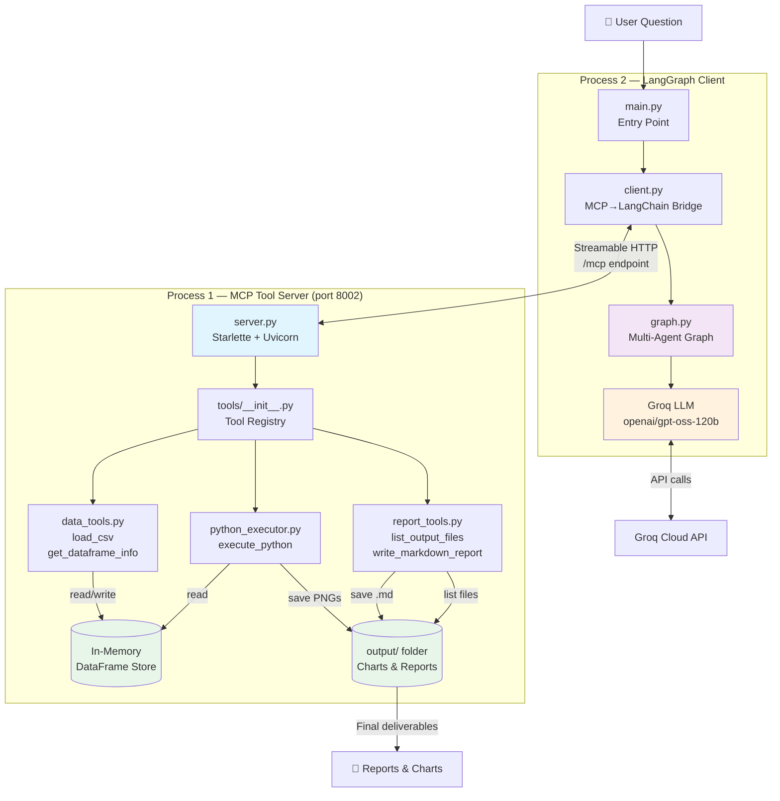
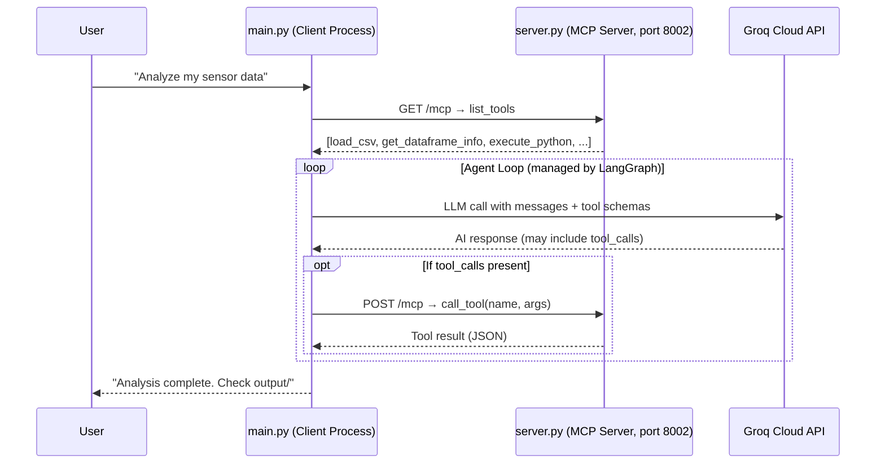
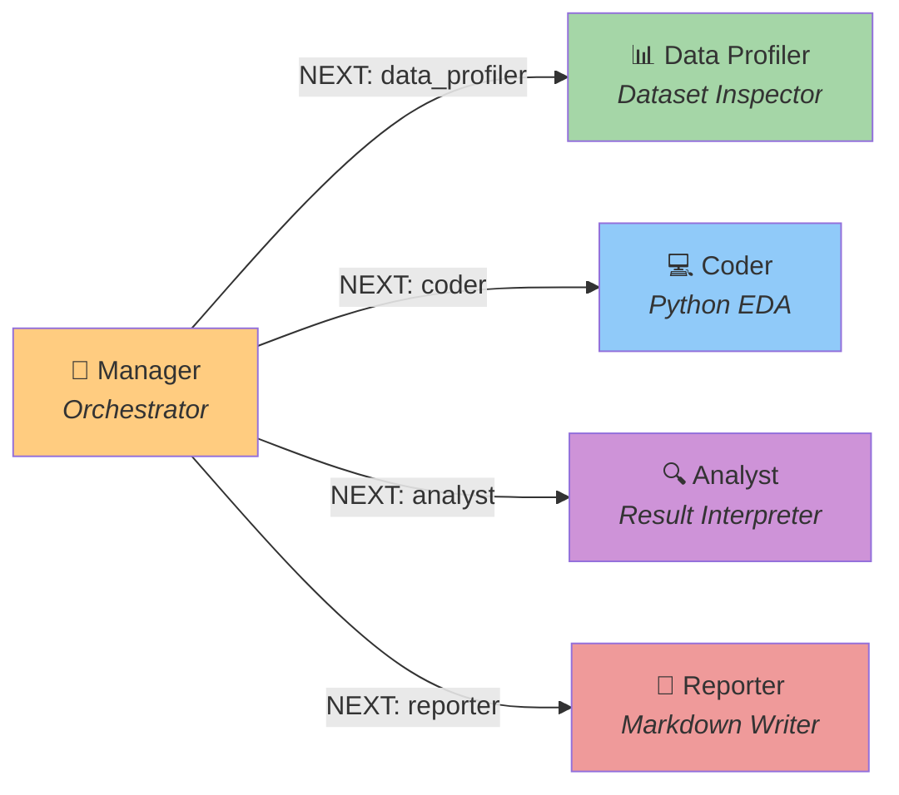
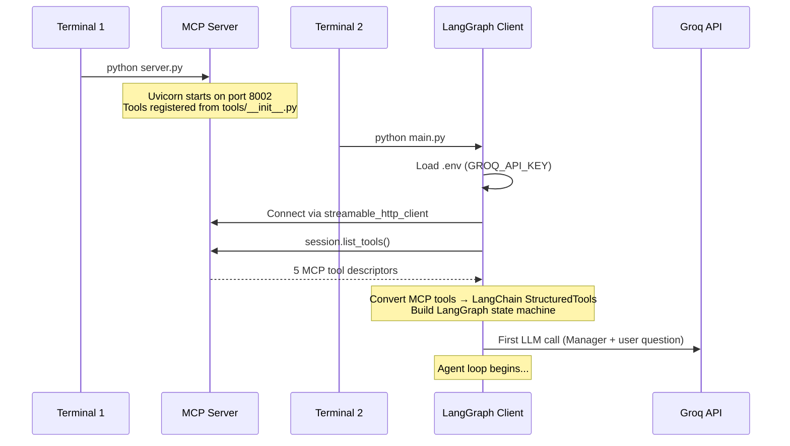
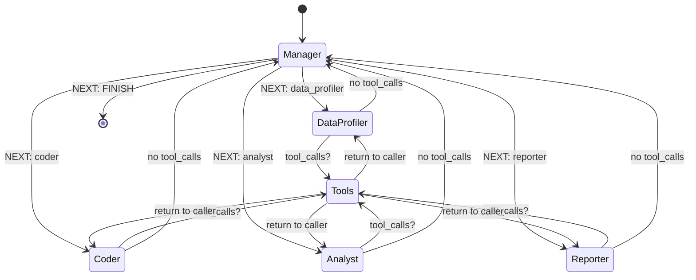
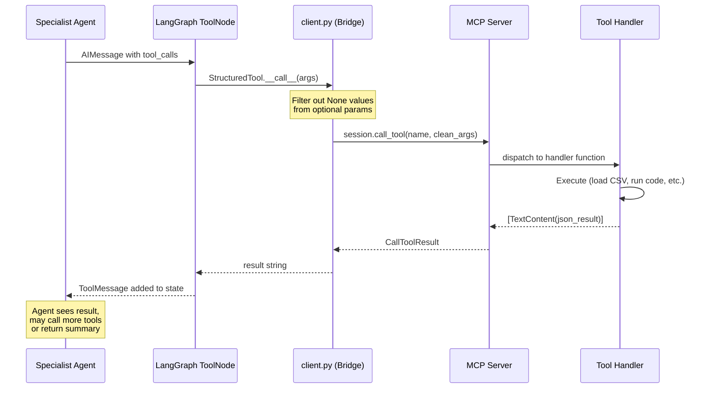

# Data Analysis LG — Multi-Agent Data Analysis with MCP & LangGraph

> **A multi-agent system that performs automated exploratory data analysis on CSV datasets using LLM-powered agents, coordinated by LangGraph and communicating through the Model Context Protocol (MCP).**

---

## Table of Contents

- [Overview](#overview)
- [Key Technologies](#key-technologies)
- [Project Structure](#project-structure)
- [Architecture Overview](#architecture-overview)
  - [High-Level System Diagram](#high-level-system-diagram)
  - [The Two-Process Model](#the-two-process-model)
  - [Agent Team](#agent-team)
- [How It Works](#how-it-works)
  - [Startup Sequence](#startup-sequence)
  - [Agent Orchestration Flow](#agent-orchestration-flow)
  - [Tool Execution Cycle](#tool-execution-cycle)
- [MCP Tool Catalog](#mcp-tool-catalog)
- [Quick Start](#quick-start)
- [Configuration](#configuration)
- [Further Reading](#further-reading)

---

## Overview

This project demonstrates a **production-style multi-agent architecture** for automated data analysis. Instead of a single monolithic LLM call, the system decomposes data analysis into specialized roles — profiling, coding, analysis, and reporting — each handled by a dedicated agent.

The agents communicate through a **shared message state** managed by LangGraph, and they interact with data through **MCP tools** served over HTTP. The result is a system that can:

1. Load and profile any CSV dataset
2. Generate and execute Python code for EDA (charts, statistics, correlations)
3. Interpret the results with domain-aware reasoning
4. Produce a polished Markdown report with embedded chart references

```
 User Question                          Output
 ┌─────────────┐                       ┌──────────────────────┐
 │ "Analyze my  │  ──► Multi-Agent ──►  │ ✅ Markdown Report    │
 │  sensor data"│       Pipeline        │ ✅ PNG Charts         │
 └─────────────┘                       │ ✅ Statistical Tables  │
                                       └──────────────────────┘
```

---

## Key Technologies

| Technology                                                                         | Role                                      | Version        |
| ---------------------------------------------------------------------------------- | ----------------------------------------- | -------------- |
| **[LangGraph](https://github.com/langchain-ai/langgraph)**                         | Multi-agent state machine & orchestration | ≥ 0.2.0        |
| **[MCP (Model Context Protocol)](https://modelcontextprotocol.io/)**               | Tool server/client protocol over HTTP     | ≥ 1.26.0       |
| **[LangChain](https://python.langchain.com/)**                                     | LLM abstraction & tool interface          | ≥ 0.3.0        |
| **[Groq](https://groq.com/)**                                                      | LLM inference (ultra-fast)                | API            |
| **[Pandas](https://pandas.pydata.org/) / [NumPy](https://numpy.org/)**             | Data manipulation                         | ≥ 2.0 / ≥ 1.24 |
| **[Matplotlib](https://matplotlib.org/) / [Seaborn](https://seaborn.pydata.org/)** | Visualization                             | ≥ 3.7 / ≥ 0.12 |
| **[Pydantic](https://docs.pydantic.dev/)**                                         | Schema validation for tool arguments      | ≥ 2.0          |
| **[Starlette](https://www.starlette.io/) + [Uvicorn](https://www.uvicorn.org/)**   | HTTP server for MCP transport             | latest         |

---

## Project Structure

```
data_analysis_lg/
├── .env                    # GROQ_API_KEY (not committed)
├── main.py                 # 🚀 Entry point — wires MCP client + LangGraph
├── graph.py                # 🧠 Multi-agent LangGraph definition
├── client.py               # 🔌 MCP ↔ LangChain bridge
├── server.py               # 🖥️ MCP tool server (port 8002)
├── tools/
│   ├── __init__.py         # 📋 Central tool registry
│   ├── data_tools.py       # 📊 load_csv, get_dataframe_info
│   ├── python_executor.py  # 🐍 execute_python (sandboxed code runner)
│   └── report_tools.py     # 📝 list_output_files, write_markdown_report
├── csv/
│   └── example_data.csv    # 📁 Sample industrial sensor data (100K rows)
├── output/                 # 📂 Generated charts & reports land here
├── README.md               # ← You are here
├── ARCHITECTURE.md          # Detailed technical deep-dive
└── EXAMPLES.md              # Usage scenarios & sample outputs
```

---

## Architecture Overview

### High-Level System Diagram



### The Two-Process Model

The system runs as **two separate processes** that communicate over HTTP:



**Why two processes?**

| Concern            | Server (Process 1)               | Client (Process 2)           |
| ------------------ | -------------------------------- | ---------------------------- |
| **Responsibility** | Execute tools, manage data       | Orchestrate agents, call LLM |
| **State**          | Holds DataFrame in memory        | Holds conversation messages  |
| **Protocol**       | MCP over Streamable HTTP         | LangGraph state machine      |
| **Scaling**        | Could run on a different machine | Could run multiple analyses  |

This separation follows the **MCP specification** — tools are hosted as a service, and any MCP-compatible client can connect to them.

---

### Agent Team

The system uses **5 specialized agents**, each with a focused role:



| Agent             | System Prompt Focus                 | Tools Used                                   | Output                       |
| ----------------- | ----------------------------------- | -------------------------------------------- | ---------------------------- |
| **Manager**       | Route work to the right specialist  | _None_ (LLM only)                            | `NEXT: <agent>` directive    |
| **Data Profiler** | Load CSV, inspect structure & stats | `load_csv`, `get_dataframe_info`             | Dataset summary              |
| **Coder**         | Write & execute Python EDA code     | `execute_python`                             | Charts (PNG) + printed stats |
| **Analyst**       | Interpret charts, stats, patterns   | `list_output_files`                          | Written analysis             |
| **Reporter**      | Assemble final Markdown report      | `list_output_files`, `write_markdown_report` | `.md` report file            |

---

## How It Works

### Startup Sequence



### Agent Orchestration Flow

This is the core loop that drives the entire analysis. The **Manager** acts as a router, reading the conversation history and deciding which specialist should act next:



**Key design decisions:**

- Each specialist can call tools **multiple times** (the specialist ↔ tools loop continues until the agent responds without tool_calls)
- The Manager sees the **full compressed conversation** and decides the next step
- The `AnalysisState` carries both `messages` (conversation) and `next_agent` (routing signal)

### Tool Execution Cycle

When a specialist agent decides to use a tool, the following happens:



---

## MCP Tool Catalog

All tools follow the same three-part pattern:

```
1. Input Schema  (JSON Schema dict)    → Defines parameters
2. Tool Descriptor (mcp.types.Tool)    → Name + description for LLM
3. Async Handler  (async function)     → Executes the work
```

### `load_csv`

> Load a CSV file into the server's in-memory DataFrame store.

| Parameter   | Type    | Required | Description                                         |
| ----------- | ------- | -------- | --------------------------------------------------- |
| `file_path` | string  | ✅       | Path to CSV (relative to `csv/` folder or absolute) |
| `nrows`     | integer | ❌       | Max rows to load (omit for all)                     |

**Returns:** shape, column names, dtypes, first 2 rows as JSON.

---

### `get_dataframe_info`

> Return detailed metadata about the loaded DataFrame.

| Parameter       | Type   | Required | Description                               |
| --------------- | ------ | -------- | ----------------------------------------- |
| `include_stats` | string | ❌       | Set to `"yes"` for descriptive statistics |

**Returns:** shape, memory usage, numeric/non-numeric columns, null counts, optional stats summary.

---

### `execute_python`

> Execute Python code with access to the loaded DataFrame and data science libraries.

| Parameter | Type   | Required | Description            |
| --------- | ------ | -------- | ---------------------- |
| `code`    | string | ✅       | Python code to execute |

**Execution namespace includes:** `df`, `pd`, `np`, `sns`, `plt`, `os`, `OUTPUT_DIR`

**Returns:** stdout capture, list of newly created files, any errors.

---

### `list_output_files`

> List files in the `output/` directory.

| Parameter          | Type   | Required | Description                                |
| ------------------ | ------ | -------- | ------------------------------------------ |
| `extension_filter` | string | ❌       | Filter by extension (e.g. `"png"`, `"md"`) |

**Returns:** file count, list of `{name, size_kb}` objects.

---

### `write_markdown_report`

> Write a Markdown report to the `output/` directory.

| Parameter  | Type   | Required | Description                                   |
| ---------- | ------ | -------- | --------------------------------------------- |
| `filename` | string | ✅       | Report filename (e.g. `"analysis_report.md"`) |
| `content`  | string | ✅       | Full Markdown content                         |

**Returns:** status, file path, size, line count.

---

## Quick Start

### Prerequisites

- Python ≥ 3.11
- A [Groq API key](https://console.groq.com/)
- [`uv`](https://github.com/astral-sh/uv) (recommended) or `pip`

### 1. Install Dependencies

```powershell
# From the repository root (MCP_Playground/)
uv venv .venv
.venv\Scripts\activate          # Windows
uv pip install -e . --native-tls
```

### 2. Set Up Environment

Create `data_analysis_lg/.env`:

```
GROQ_API_KEY=gsk_your_key_here
```

### 3. Place Your Data

Put your CSV file in `data_analysis_lg/csv/`. The project ships with `example_data.csv` (100K rows of industrial sensor data).

### 4. Start the MCP Server

```powershell
# Terminal 1
.venv\Scripts\activate
python data_analysis_lg/server.py
# Output: Server is running on http://localhost:8002/mcp
```

### 5. Run the Analysis

```powershell
# Terminal 2
.venv\Scripts\activate
python data_analysis_lg/main.py
```

### 6. Check Results

```
data_analysis_lg/output/
├── analysis_report.md       # Markdown report
├── time_series.png          # Time series chart
├── correlation_heatmap.png  # Sensor correlation matrix
├── distribution_histograms.png
├── boxplot_outliers.png
└── ore_by_shift.png
```

---

## Configuration

| Setting                 | Location       | Default                     | Description                                    |
| ----------------------- | -------------- | --------------------------- | ---------------------------------------------- |
| `GROQ_API_KEY`          | `.env`         | —                           | Your Groq API key                              |
| `GROQ_MODEL`            | `graph.py:37`  | `openai/gpt-oss-120b`       | LLM model name                                 |
| `MAX_TOOL_OUTPUT_CHARS` | `graph.py:40`  | `1500`                      | Max chars per tool response (token management) |
| `SERVER_URL`            | `client.py:23` | `http://localhost:8002/mcp` | MCP server endpoint                            |
| `recursion_limit`       | `main.py:67`   | `50`                        | Max LangGraph iterations                       |

---

## Further Reading

- **[ARCHITECTURE.md](ARCHITECTURE.md)** — Deep technical dive: code walkthrough, state management, message compression, routing logic
- **[EXAMPLES.md](EXAMPLES.md)** — Example scenarios, sample outputs, how to write custom analysis requests
