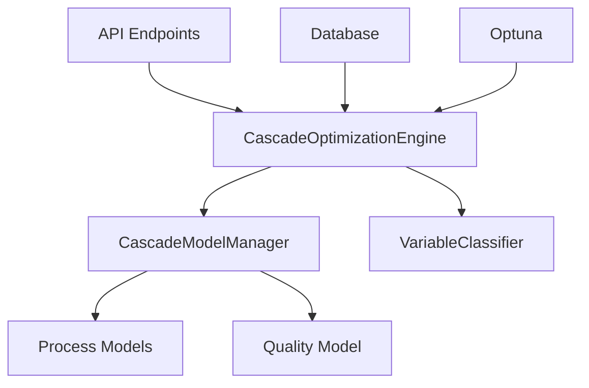
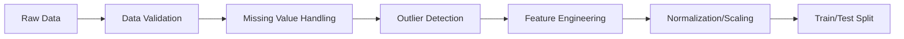
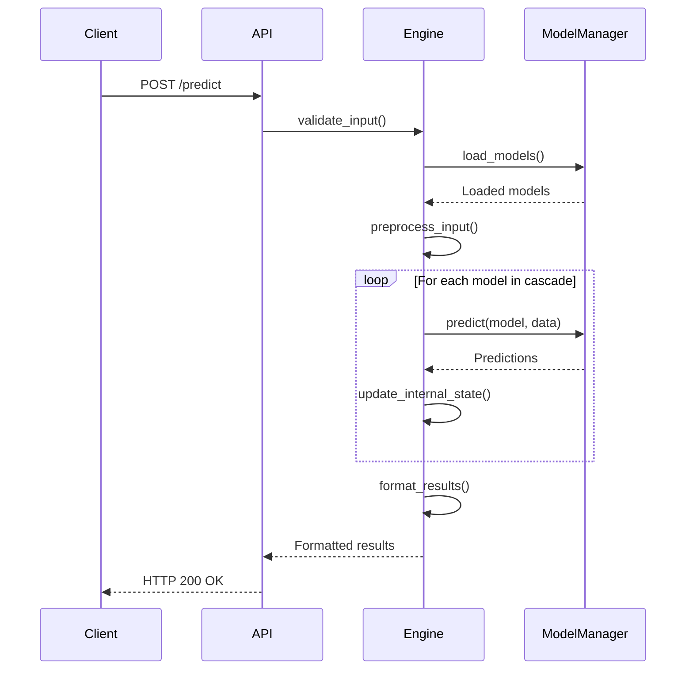
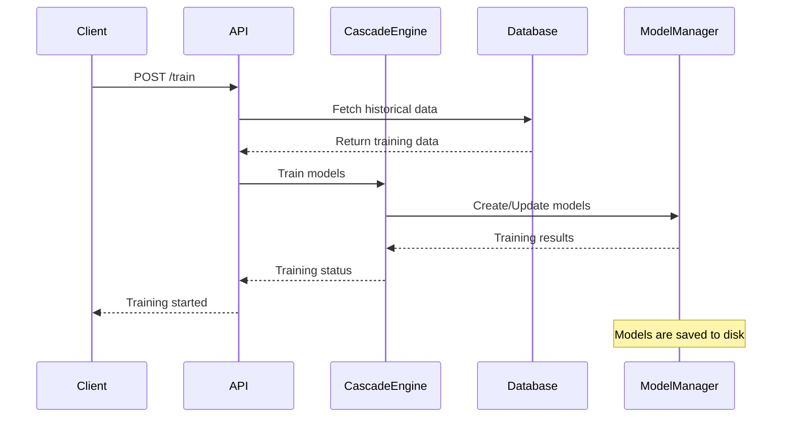
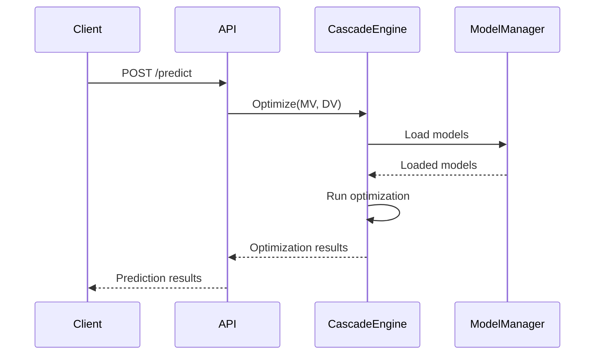

# Cascade Optimization System Guide

## Overview

The Cascade Optimization System is a sophisticated framework for industrial process optimization, specifically designed for mill operations. It implements a multi-stage optimization approach that models the relationships between:

- **Manipulated Variables (MVs)**: Process parameters that can be directly controlled (e.g., feed rate, water flow)
- **Disturbed Variables (DVs)**: External factors that affect the process but cannot be controlled (e.g., ore hardness)
- **Controlled Variables (CVs)**: Intermediate process measurements
- **Target Variables**: Final quality metrics to optimize (e.g., PSI200)

The system operates in several modes to support different stages of the optimization lifecycle:

1. **Training Mode**: Building and validating models from historical data
2. **Prediction Mode**: Making real-time predictions using trained models
3. **Optimization Mode**: Finding optimal process parameters to achieve target outcomes
4. **Simulation Mode**: Testing scenarios without affecting live processes

The Cascade Optimization System is a sophisticated machine learning-based optimization framework designed for industrial process control, specifically for mill operations. It implements a multi-stage optimization approach that models the relationships between manipulated variables (MVs), controlled variables (CVs), and target variables (Targets).

## System Architecture



## Core Components

### 1. CascadeModelManager

The `CascadeModelManager` is responsible for the entire lifecycle of cascade models. It handles:

```python
class CascadeModelManager:
    def __init__(self, models_dir: Union[str, Path] = None):
        # Initialize with model directory
        self.models_dir = Path(models_dir) if models_dir else Path(__file__).parent / "cascade_models"
        self.models_dir.mkdir(parents=True, exist_ok=True)
        self.models: Dict[str, Any] = {}
        self.model_metadata: Dict[str, Dict] = {}
        self.current_model_id: Optional[str] = None

    async def train_model(
        self,
        model_id: str,
        X_train: pd.DataFrame,
        y_train: pd.Series,
        model_params: Optional[Dict] = None,
        feature_names: Optional[List[str]] = None,
        target_name: Optional[str] = None,
        **kwargs
    ) -> Dict:
        # Implementation for model training
        pass

    async def predict(self, model_id: str, X: pd.DataFrame) -> Dict:
        # Implementation for making predictions
        pass

    def save_model(self, model_id: str) -> bool:
        # Save model to disk
        pass

    def delete_model(self, model_id: str) -> bool:
        # Delete a trained model
        pass

    def list_models(self) -> List[Dict]:
        # List all available models
        pass
```

Key features:
- **Model Persistence**: Saves models to disk for later use
- **Versioning**: Tracks different model versions
- **Memory Management**: Handles model loading/unloading
- **Metadata Storage**: Stores additional information about each model

Manages the lifecycle of cascade models including training, prediction, and persistence.

**Key Features:**
- Model training and validation
- Model persistence to disk
- Prediction interface
- Model versioning and management

### 2. CascadeOptimizationEngine

The `CascadeOptimizationEngine` implements the core optimization logic:

```python
class CascadeOptimizationEngine:
    def __init__(self, model_manager: CascadeModelManager, study_name: str = "cascade_optimization"):
        self.model_manager = model_manager
        self.classifier = VariableClassifier()
        self.study_name = study_name
        self.current_study = None
        self.optimization_results = {}
        
        # Default optimization settings
        self.default_settings = {
            'n_trials': 1000,
            'timeout': 300,  # 5 minutes
            'n_jobs': 1,
            'direction': 'minimize',
            'sampler_seed': 42
        }

    async def optimize(
        self,
        mv_bounds: Dict[str, Tuple[float, float]],
        dv_values: Dict[str, float],
        target: str = "PSI200",
        constraints: Optional[Dict] = None,
        **kwargs
    ) -> Dict:
        """
        Run optimization to find optimal MV values
        
        Args:
            mv_bounds: Dict of MV names to (min, max) bounds
            dv_values: Current DV values
            target: Target variable to optimize
            constraints: Optional constraints on CVs or other variables
            
        Returns:
            Dict containing optimization results
        """
        # Implementation of optimization logic
        pass
```

Key features:
- **Bayesian Optimization**: Uses Optuna with TPE sampler
- **Multi-objective Support**: Can optimize for multiple targets
- **Constraint Handling**: Supports both hard and soft constraints
- **Parallel Execution**: Can run multiple trials in parallel

Implements the core optimization logic using Bayesian optimization with Optuna.

**Key Features:**
- Multi-objective optimization
- Constraint handling
- Robust optimization across scenarios
- Integration with Optuna for efficient search

### 3. VariableClassifier

The `VariableClassifier` categorizes process variables and defines their relationships:

```python
class VariableClassifier:
    def __init__(self):
        self.mv_vars = ["ore_feed_rate", "water_flow", "mill_speed"]
        self.dv_vars = ["ore_hardness", "moisture_content"]
        self.cv_vars = ["mill_load", "pump_pressure"]
        self.target_vars = ["PSI200", "throughput"]
    
    def get_variable_type(self, var_name: str) -> str:
        """Classify a variable as MV, DV, CV, or Target"""
        if var_name in self.mv_vars:
            return "MV"
        elif var_name in self.dv_vars:
            return "DV"
        elif var_name in self.cv_vars:
            return "CV"
        elif var_name in self.target_vars:
            return "Target"
        return "Unknown"
    
    def get_relationships(self) -> Dict[str, List[str]]:
        """Get relationships between variable types"""
        return {
            "MV_to_CV": ["ore_feed_rate -> mill_load", "water_flow -> pump_pressure"],
            "CV_to_Target": ["mill_load -> PSI200", "pump_pressure -> throughput"]
        }
```

Key features:
- **Variable Classification**: Automatically categorizes process variables
- **Relationship Mapping**: Defines how variables influence each other
- **Extensible**: Easy to add new variable types and relationships

Classifies variables into different types for the cascade optimization process.

**Variable Types:**
- Manipulated Variables (MVs)
- Disturbance Variables (DVs)
- Controlled Variables (CVs)
- Target Variables (e.g., PSI200)

## API Endpoints and Usage Modes

The system supports several operational modes through its API endpoints:

### 1. Training Mode

**Endpoint:** `POST /api/v1/cascade/train`

**Purpose:** Train new models or update existing ones with historical data

**Request Flow:**
1. Client sends training request with data parameters
2. System fetches historical data from database
3. Data is preprocessed and split into training/validation sets
4. Models are trained asynchronously
5. Training progress is tracked and can be queried

**Example Request:**
```python
import requests
import pandas as pd
from datetime import datetime, timedelta

# Prepare training data
today = datetime.now()
start_date = (today - timedelta(days=30)).strftime("%Y-%m-%d")
end_date = today.strftime("%Y-%m-%d")

# Make training request
response = requests.post(
    "http://localhost:8000/api/v1/cascade/train",
    json={
        "mill_number": 8,
        "start_date": start_date,
        "end_date": end_date,
        "test_size": 0.2,
        "resample_freq": "5min"
    }
)

# Check training status
training_id = response.json()["training_id"]
status = requests.get(f"http://localhost:8000/api/v1/cascade/training_status/{training_id}")
print(status.json())
```

### 2. Prediction Mode

**Endpoint:** `POST /api/v1/cascade/predict`

**Purpose:** Get predictions for given input conditions

**Example Usage:**
```python
# Make prediction with current process conditions
prediction = requests.post(
    "http://localhost:8000/api/v1/cascade/predict",
    json={
        "mv_values": {
            "ore_feed_rate": 120.5,
            "water_flow": 45.2,
            "mill_speed": 12.8
        },
        "dv_values": {
            "ore_hardness": 2.5,
            "moisture_content": 0.12
        }
    }
)

print("Predicted PSI200:", prediction.json()["predictions"]["PSI200"])
```

### 3. Optimization Mode

**Endpoint:** `POST /api/v1/cascade/optimize`

**Purpose:** Find optimal MV values to achieve target outcomes

**Example Usage:**
```python
# Run optimization
optimization = requests.post(
    "http://localhost:8000/api/v1/cascade/optimize",
    json={
        "target": "PSI200",
        "direction": "minimize",  # or "maximize"
        "mv_bounds": {
            "ore_feed_rate": [100, 150],
            "water_flow": [30, 60],
            "mill_speed": [10, 15]
        },
        "dv_values": {
            "ore_hardness": 2.5,
            "moisture_content": 0.12
        },
        "constraints": {
            "mill_load": {"max": 90},
            "pump_pressure": {"max": 4.5}
        },
        "n_trials": 500
    }
)

print("Optimal parameters:", optimization.json()["optimal_parameters"])
```

### 4. Simulation Mode

**Endpoint:** `POST /api/v1/cascade/simulate`

**Purpose:** Test scenarios without affecting live processes

**Example Usage:**
```python
# Run simulation
simulation = requests.post(
    "http://localhost:8000/api/v1/cascade/simulate",
    json={
        "base_conditions": {
            "mv_values": {"ore_feed_rate": 120, "water_flow": 45},
            "dv_values": {"ore_hardness": 2.5}
        },
        "scenarios": [
            {"name": "High Feed", "changes": {"ore_feed_rate": 140}},
            {"name": "Low Water", "changes": {"water_flow": 35}},
            {"name": "Hard Ore", "changes": {"ore_hardness": 3.0}}
        ]
    }
)

# Process simulation results
for scenario in simulation.json()["scenarios"]:
    print(f"{scenario['name']}: PSI200 = {scenario['predictions']['PSI200']}")
```

### 1. System Information

**Endpoint:** `GET /api/v1/cascade/info`

Returns information about the cascade optimization system and its current status.

### 2. Model Training

**Endpoint:** `POST /api/v1/cascade/train`

Trains the cascade models with historical data.

**Request Schema:**
```json
{
  "mill_number": 8,
  "start_date": "2023-01-01",
  "end_date": "2023-12-31",
  "test_size": 0.2,
  "resample_freq": "1min"
}
```

### 3. Make Predictions

**Endpoint:** `POST /api/v1/cascade/predict`

Makes cascade predictions from MV values to target variables.

**Request Schema:**
```json
{
  "mv_values": {
    "ore_feed_rate": 120.5,
    "water_flow": 45.2
  },
  "dv_values": {
    "ore_hardness": 2.5,
    "moisture_content": 0.12
  }
}
```

### 4. Get Optimization Results

**Endpoint:** `GET /api/v1/cascade/optimization_results`

Retrieves all optimization results.

## Data Flow and Processing Pipeline

The system processes data through several stages:

### 1. Data Loading and Preprocessing



### 2. Model Training Pipeline

```python
# Example training pipeline
def train_pipeline(X: pd.DataFrame, y: pd.Series, model_params: Dict) -> Tuple[Model, Dict]:
    """Complete training pipeline"""
    # 1. Preprocessing
    preprocessor = create_preprocessor(X.columns)
    
    # 2. Create model pipeline
    model = Pipeline([
        ('preprocessor', preprocessor),
        ('regressor', XGBRegressor(**model_params))
    ])
    
    # 3. Train with cross-validation
    cv_scores = cross_validate(
        model, X, y,
        cv=5,
        scoring={
            'r2': 'r2',
            'neg_rmse': 'neg_root_mean_squared_error',
            'mae': 'neg_mean_absolute_error'
        },
        return_train_score=True
    )
    
    # 4. Train final model on full dataset
    model.fit(X, y)
    
    # 5. Calculate feature importance
    importances = get_feature_importances(model, X.columns)
    
    return model, {
        'cv_scores': cv_scores,
        'feature_importances': importances,
        'training_date': datetime.utcnow().isoformat()
    }
```

### 3. Real-time Prediction Flow



### 4. Optimization Algorithm

The optimization uses a modified Bayesian optimization approach:

1. **Search Space Definition**:
   ```python
   def define_search_space(mv_bounds: Dict[str, Tuple[float, float]]) -> Dict:
       """Create Optuna search space from MV bounds"""
       space = {}
       for name, (min_val, max_val) in mv_bounds.items():
           space[name] = trial.suggest_float(name, min_val, max_val)
       return space
   ```

2. **Objective Function**:
   ```python
   def objective(trial, model, dv_values, target, constraints):
       # 1. Sample MV values
       mv_values = {}
       for name, (min_val, max_val) in mv_bounds.items():
           mv_values[name] = trial.suggest_float(name, min_val, max_val)
       
       # 2. Make prediction
       prediction = model.predict(mv_values | dv_values)
       
       # 3. Calculate objective
       objective_value = prediction[target]
       
       # 4. Apply constraints
       for var, constr in constraints.items():
           if 'min' in constr and prediction[var] < constr['min']:
               # Penalty for violating min constraint
               penalty = (constr['min'] - prediction[var]) * 1000
               objective_value += penalty
           # Similar for max constraints...
       
       return objective_value
   ```

3. **Optimization Loop**:
   ```python
   def run_optimization(model, dv_values, target, constraints, n_trials=1000):
       study = optuna.create_study(direction="minimize")
       
       # Wrap objective with fixed parameters
       objective_with_args = lambda trial: objective(
           trial, model, dv_values, target, constraints
       )
       
       # Run optimization
       study.optimize(objective_with_args, n_trials=n_trials)
       
       return {
           'best_params': study.best_params,
           'best_value': study.best_value,
           'trials': study.trials_dataframe()
       }
   ```

### 1. Training Process



### 2. Prediction Process



## Optimization Algorithm

The system uses Bayesian optimization with the following key components:

1. **Objective Function**:
   - Minimize target variable (e.g., PSI200)
   - Subject to process constraints
   - Multi-objective optimization support

2. **Search Space**:
   - Defined by variable bounds
   - Categorical and continuous variables
   - Custom constraints between variables

3. **Optimization Process**:
   - Uses Tree-structured Parzen Estimators (TPE)
   - Parallel trial execution
   - Early stopping for efficiency

## Model Architecture

The cascade model consists of multiple interconnected models:

1. **Process Models**:
   - Predict CVs from MVs and DVs
   - Multiple models for different operating regimes
   
2. **Quality Model**:
   - Predicts final quality metrics from CVs
   - Used as the final optimization target

## Error Handling

The system includes comprehensive error handling:

- Input validation
- Model loading/validation
- Constraint violation handling
- Fallback mechanisms

## Performance Considerations

- Models are cached in memory after first load
- Background training for large datasets
- Efficient data loading and preprocessing
- Parallel optimization trials

## Security

- Input validation
- Model validation
- Secure file handling
- Access control (if applicable)

## Monitoring and Logging

- Detailed logging of optimization process
- Performance metrics
- Error tracking
- Model versioning

## Example Usage

### Training Models

```python
import requests

url = "http://localhost:8000/api/v1/cascade/train"
data = {
    "mill_number": 8,
    "start_date": "2023-01-01",
    "end_date": "2023-12-31",
    "test_size": 0.2,
    "resample_freq": "1min"
}

response = requests.post(url, json=data)
print(response.json())
```

### Making Predictions

```python
import requests

url = "http://localhost:8000/api/v1/cascade/predict"
data = {
    "mv_values": {
        "ore_feed_rate": 120.5,
        "water_flow": 45.2
    },
    "dv_values": {
        "ore_hardness": 2.5,
        "moisture_content": 0.12
    }
}

response = requests.post(url, json=data)
print(response.json())
```

## Troubleshooting

Common issues and solutions:

1. **Training failures**:
   - Check data availability in the database
   - Verify date ranges
   - Check for missing or invalid values

2. **Prediction errors**:
   - Verify all required variables are provided
   - Check variable ranges
   - Ensure models are properly trained

3. **Performance issues**:
   - Reduce optimization iterations
   - Increase compute resources
   - Check for data quality issues

## Best Practices

1. **Data Preparation**:
   - Ensure clean, representative training data
   - Handle missing values appropriately
   - Normalize/scale variables as needed

2. **Model Training**:
   - Use appropriate train/test splits
   - Monitor training progress
   - Validate model performance

3. **Deployment**:
   - Test thoroughly before production use
   - Monitor model performance
   - Set up alerts for anomalies

## Future Enhancements

- Real-time optimization
- Adaptive modeling
- Advanced visualization
- Enhanced constraint handling
- Distributed optimization

## Conclusion

The Cascade Optimization System provides a powerful framework for industrial process optimization. By modeling the relationships between MVs, CVs, and targets, it enables data-driven decision making for improved process performance.
