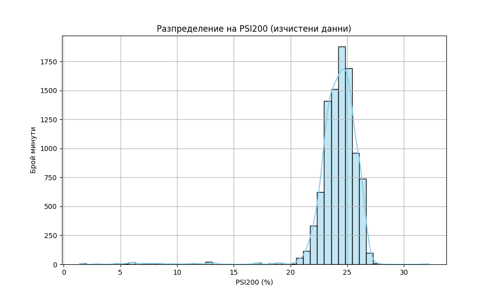
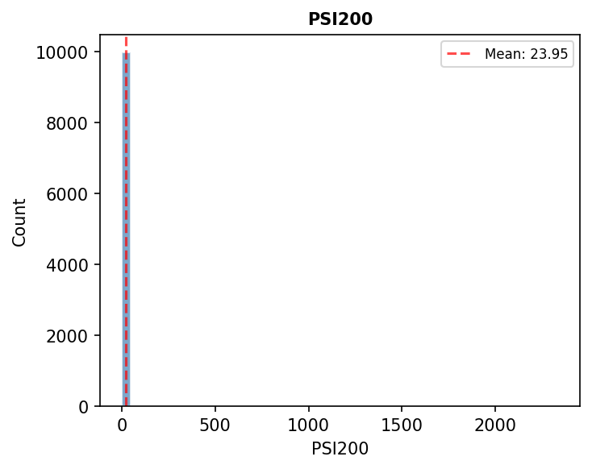

# Доклад: Статистически анализ на качеството на помола (PSI200)

## Резюме (Executive Summary)
Този доклад представя резултатите от детайлния статистически анализ на качеството на продукта (фракция +200 mesh, означена като `PSI200`) за производствените мощности, разглеждани в обединения набор от данни. След внимателно филтриране на аномални стойности, анализът обхвана 9577 минути производствено време. Средната стойност на `PSI200` е 24.13%, при стандартно отклонение от 2.21%. Установено е, че разпределението на фракцията е съсредоточено между 23.4% и 25.2% (интерквартилен обхват). Резултатите показват необходимост от оптимизация на работата на хидроциклоните за поддържане на качеството под оперативната цел от 18% за постигане на оптимален помол.

## Преглед на данните
Анализът се базира на времеви редове с минутна резолюция, обхващащи периода от 14.05.2026 г. до 21.05.2026 г. Общият брой записи в изходния набор от данни е 10 081. След извършване на процедура по почистване на данните и премахване на екстремни аномалии (стойности извън физически възможните граници за технологичния процес), за крайния статистически анализ бяха използвани 9577 валидни записа. Данните включват ключови технологични параметри като `Ore`, `Power`, `PressureHC`, `DensityHC`, `PSI80` и `PSI200`.

## Констатации

### Статистически преглед
След премахване на аномалиите, разпределението на `PSI200` показва следните характеристики:
*   **Брой записи (count):** 9577
*   **Средна стойност (mean):** 24.13%
*   **Стандартно отклонение (std):** 2.21%
*   **Минимална стойност (min):** 1.40%
*   **Медиана (50%):** 24.36%
*   **Максимална стойност (max):** 32.20%

Разпределението показва, че основната маса от данни се намира в диапазона на умерен помол. Стойностите над 30% съответстват на висока концентрация на груби частици, което изисква коригиращи действия при класификацията.

### Анализ на аномалии
По време на обработката бяха идентифицирани и изключени значителни аномалии, достигащи стойности до 2337% (математически невъзможни за този процес). Тези стойности най-вероятно са породени от грешки при предаване на данни от сензорите или моменти на калибрация. След тяхното премахване, горната граница на реалистичните данни е 32.2%, което осигурява надеждна база за анализ на стабилността на мелниците.

## Графики

## Изводи и препоръки
1.  **Целеви показатели:** Настоящото ниво на `PSI200` (средно 24.13%) е над оперативната цел от 18%. Необходимо е да се преразгледа режимът на работа на хидроциклоните (PressureHC и DensityHC), за да се сведе фракцията до целевите стойности.
2.  **Мониторинг:** Наблюдава се висока вариабилност в качеството. Препоръчва се внедряване на по-строг контрол върху `Ore` (подаването на руда), тъй като波动 (флуктуациите) в захранването директно влияят на качеството на помола.
3.  **Диагностика на сензорите:** Наличието на екстремни аномалии в първоначалните данни подсказва за нужда от техническа проверка на измервателната апаратура, отговорна за `PSI200`.
4.  **Стабилизация:** Препоръчва се поддържане на `DensityHC` в по-тесни граници, за да се намали стандартното отклонение на `PSI200` от текущите 2.21% към по-ниски нива, осигуряващи по-предвидим продукт.
5.  **Оперативен контрол:** Всички смени трябва да се стремят към минимизиране на работата при стойности на `PSI200` над 30%, тъй като това води до значително влошаване на качеството (Q клони към 0%).