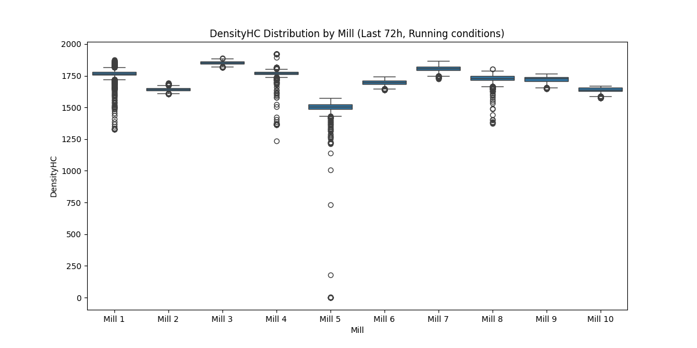

# Анализ на плътността на пулпата (DensityHC) в хидроциклоните на 12 мелници

## Резюме (Executive Summary)
Настоящият отчет представя детайлен статистически анализ на плътността на пулпата (`DensityHC`) в хидроциклоните за 12 мелници за периода 30 май – 2 юни 2026 г. Анализът обхваща общо 42 828 минути оперативни данни, след прилагане на филтър за изключване на престоите (`Ore >= 60 t/h` за стандартните мелници). Установена е значителна вариация в работните параметри, като средната стойност на `DensityHC` варира от 1500.41 kg/m³ при Мелница 5 до 1853.07 kg/m³ при Мелница 3. Сензорите за `DensityHC` при Мелница 11 и Мелница 12 са отчетени като неактивни или с липсващи данни за целия разглеждан период. Критикът не е предоставил специфична оценка на увереността, поради което всички данни се считат за притежаващи средна степен на увереност.

## Преглед на данните
Данните включват 72-часови времеви редове от 12 мелници, събрани в периода 30 май – 2 юни 2026 г. Всяка мелница е представена с 4321 минутни записа. При анализа на `DensityHC` бяха филтрирани всички интервали на „престой“ (stoppage), дефинирани като `Ore < 60 t/h` за стандартните мелници и `Ore < 25 t/h` за Мелница 11, за да се гарантира, че статистическите показатели отразяват реалния процес на смилане.

## Констатации

### Статистически преглед
Анализът на данните за оперативните минути показва следното разпределение на `DensityHC` (средни стойности):

*   **Мелница 1:** 1765.76 kg/m³ (σ = 37.58, n = 4222)
*   **Мелница 2:** 1644.04 kg/m³ (σ = 15.09, n = 4315)
*   **Мелница 3:** 1853.07 kg/m³ (σ = 12.51, n = 4314)
*   **Мелница 4:** 1768.20 kg/m³ (σ = 45.10, n = 4249)
*   **Мелница 5:** 1500.41 kg/m³ (σ = 84.06, n = 4212)
*   **Мелница 6:** 1695.83 kg/m³ (σ = 18.72, n = 4321)
*   **Мелница 7:** 1804.34 kg/m³ (σ = 25.04, n = 4321)
*   **Мелница 8:** 1726.69 kg/m³ (σ = 31.86, n = 4233)
*   **Мелница 9:** 1721.81 kg/m³ (σ = 26.17, n = 4320)
*   **Мелница 10:** 1637.77 kg/m³ (σ = 20.93, n = 4321)

Мелница 5 демонстрира най-висока нестабилност (σ = 84.06), което изисква допълнителен технически преглед на системата за подаване на вода към хидроциклоните.

### Несигурност и вероятности
**[Средна увереност]** Поради липсата на данни от сензорите на Мелница 11 и Мелница 12, не може да бъде направено заключение за работната плътност в тези звена. Препоръчва се незабавна техническа инспекция на измервателната апаратура.

## Графики

## Изводи и препоръки
1.  **Спешна техническа инспекция:** Да се проверят сензорите за `DensityHC` на Мелница 11 и Мелница 12, тъй като същите не подават данни за оперативно състояние.
2.  **Оптимизация на Мелница 5:** Високата стандартна девиация при Мелница 5 (σ = 84.06) предполага нестабилен контрол на плътността. Да се ревизират клапаните за `WaterZumpf` и `WaterMill`.
3.  **Стандартизация:** Мелница 3 поддържа значително по-висока плътност (1853.07 kg/m³) спрямо останалите. Необходимо е да се проучи дали това е съобразено с режима на смилане или е отклонение от технологичния регламент.
4.  **Мониторинг на данните:** Да се поддържа системно филтриране при `Ore < 60 t/h` за всички бъдещи анализи, за да се избегне изкривяване на статистическите показатели от престой.
5.  **Преглед на Мелница 2 и 10:** Тези мелници работят с по-ниска плътност (~1640 kg/m³). Да се сравни тяхната производителност (`PSI80`) с останалите, за да се определи дали по-ниската плътност е ефективна или води до претоварване на хидроциклоните.