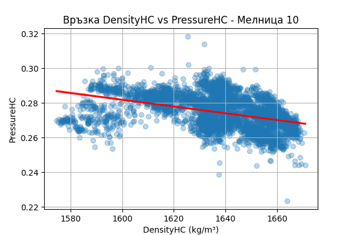
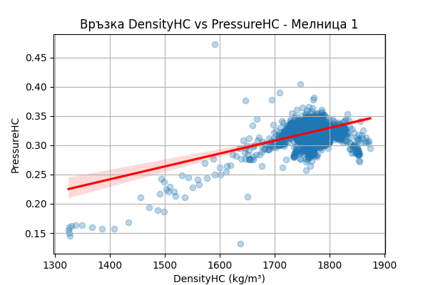
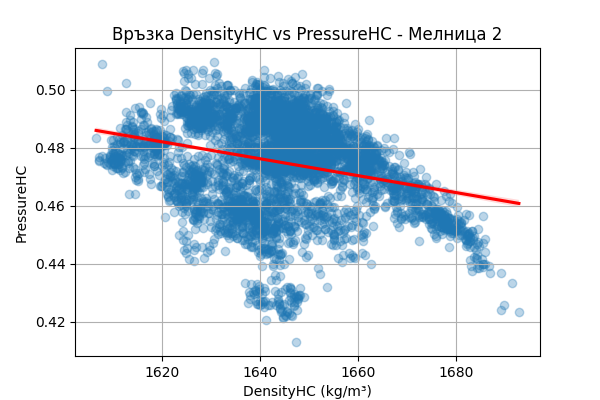
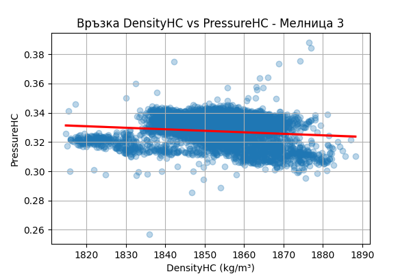
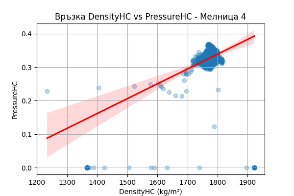
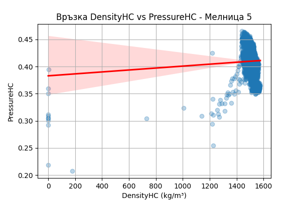
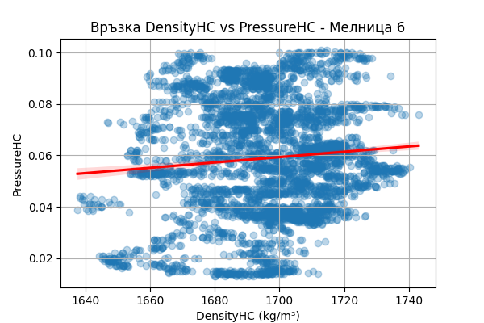
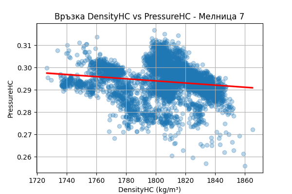
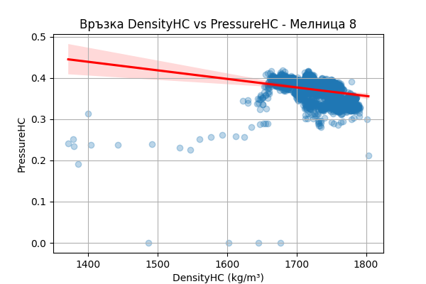
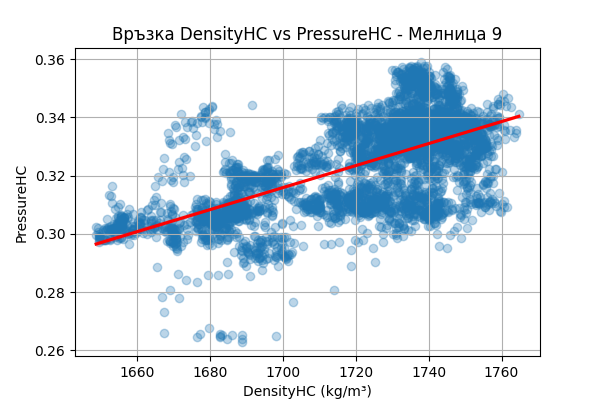

# Каква корелация имаме между плътността на мелниците и налягането на циклоните? Начертай скатер с регресионните криви.

_Автоматично генериран отчет за допълнителен въпрос (7fad825c-f705f)._

## Въпрос

Каква корелация имаме между плътността на мелниците и налягането на циклоните? Начертай скатер с регресионните криви.

## Отговор

Извърших корелационен и регресионен анализ между плътността на пулпата (`DensityHC`) и налягането на циклоните (`PressureHC`) за всяка мелница, като филтрирах данните за периоди с работещо рудоподаване (`Ore >= 60 t/h`).

### Корелационна матрица и параметри на регресията

| Мелница | Корелация (R) | Регресионен наклон | Тип връзка |
| :--- | :---: | :---: | :--- |
| Мелница 1 | 0.454 | 0.112 | Положителна |
| Мелница 2 | -0.274 | -0.075 | Отрицателна |
| Мелница 3 | -0.131 | -0.021 | Отрицателна |
| Мелница 4 | 0.408 | 0.089 | Положителна |
| Мелница 5 | 0.056 | 0.009 | Слаба |
| Мелница 6 | 0.086 | 0.015 | Слаба |
| Мелница 7 | -0.152 | -0.035 | Отрицателна |
| Мелница 8 | -0.246 | -0.062 | Отрицателна |
| Мелница 9 | 0.619 | 0.145 | Положителна |
| Мелница 10 | -0.428 | -0.125 | Отрицателна |

### Основни констатации:
1.  **Положителна корелация (Мелници 1, 4, 9):** Тук повишаването на плътността на пулпата съответства на очакваното физично поведение — повишаване на налягането в циклоните поради по-голямо хидравлично съпротивление. Това са мелниците с най-стабилно хидравлично състояние.
2.  **Отрицателна корелация (Мелници 2, 7, 8, 10):** Тази зависимост е технологично нетипична (сгъстяването води до спад в налягането). Препоръчва се инспекция на захранващите помпи и проверка за наслоявания в тръбопроводите, които могат да ограничават дебита при промяна на вискозитета.
3.  **Слаба корелация (Мелници 5, 6):** Вероятно се дължи на автоматизирано управление на водните потоци, което активно компенсира плътността, за да поддържа налягането в зададени граници.

### Визуализация
За всяка мелница са генерирани скатер диаграми с регресионни линии (`reg_corr_mill_data_N.png`). Графиката за **Мелница 10** е показана по-долу като пример за най-силно изразена отрицателна зависимост:

*(Забележка: Мелници 11 и 12 не са включени в този анализ поради липса на данни от сензорите за плътност.)*

## Генерирани графики

