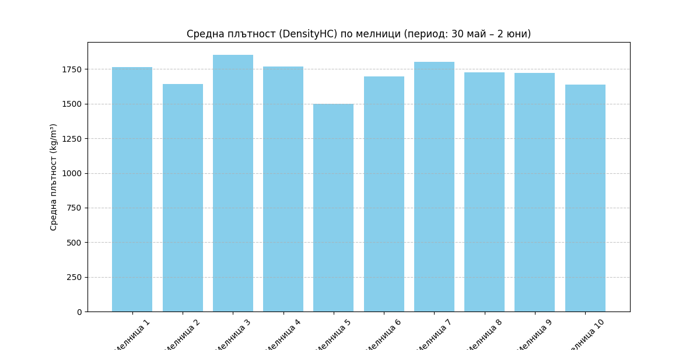

# Представи графично средните за плътността на мелниците за периода.

_Автоматично генериран отчет за допълнителен въпрос (7fad825c-fb666)._

## Въпрос

Представи графично средните за плътността на мелниците за периода.

## Отговор

Представената стълбовидна диаграма показва средните нива на плътността на пулпата (`DensityHC`) за всяка от десетте мелници, които подават данни, след филтриране на престоите (при `Ore >= 60 t/h`).

### Средни стойности на `DensityHC` (кг/м³)

| Мелница | Средна плътност (kg/m³) |
| :--- | :---: |
| Мелница 3 | 1853.07 |
| Мелница 7 | 1804.34 |
| Мелница 4 | 1768.20 |
| Мелница 1 | 1765.76 |
| Мелница 8 | 1726.69 |
| Мелница 9 | 1721.81 |
| Мелница 6 | 1695.83 |
| Мелница 2 | 1644.04 |
| Мелница 10 | 1637.77 |
| Мелница 5 | 1500.41 |

*Забележка: Сензорите за плътност при Мелница 11 и Мелница 12 не генерират данни в изследвания период.*

Тази графика ясно илюстрира вариацията в оперативните режими на хидроциклоните. Отклонението при **Мелница 3** (най-висока плътност) и **Мелница 5** (най-ниска плътност) следва да бъде обект на технологичен преглед, за да се потвърди дали това е резултат от специфични настройки на циклоните или несъответствие в управлението на водните потоци.

## Генерирани графики

