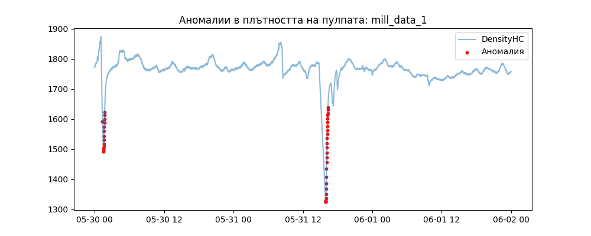
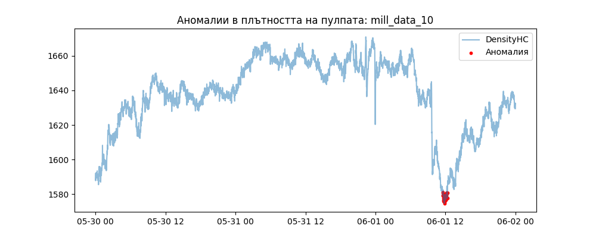
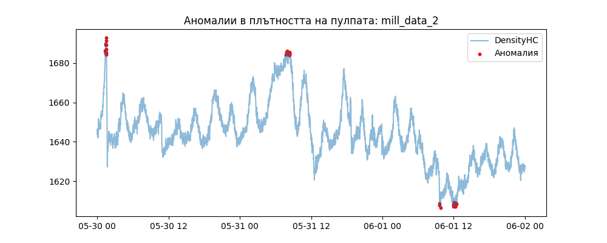
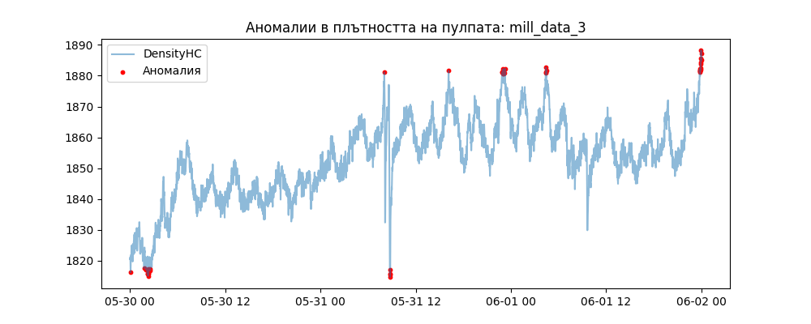
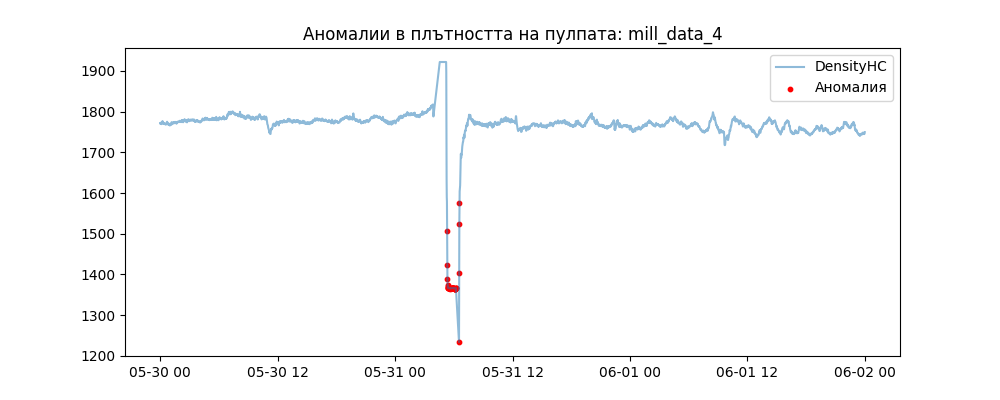
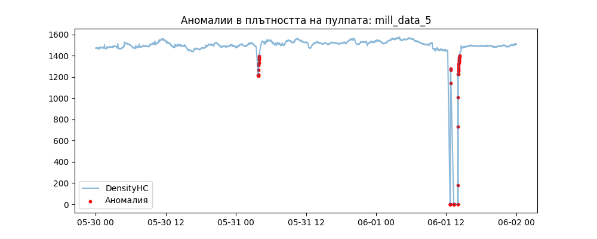
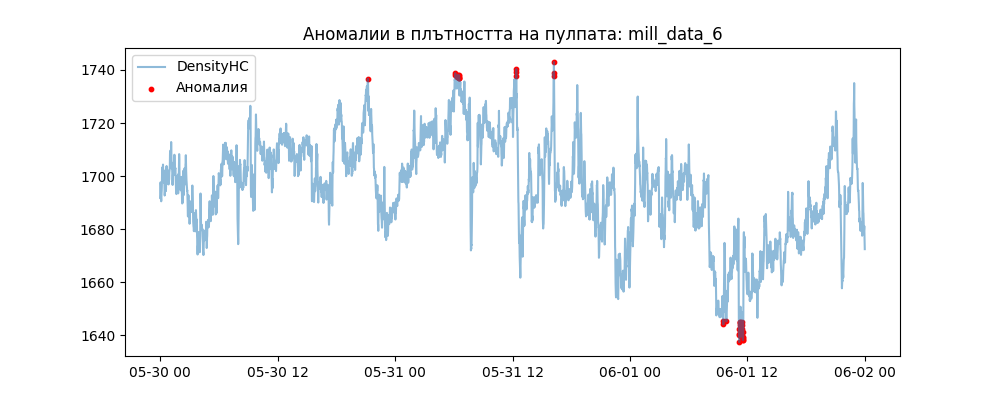
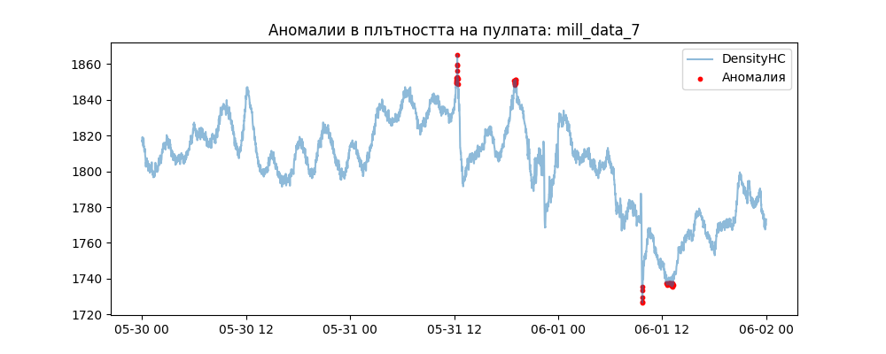
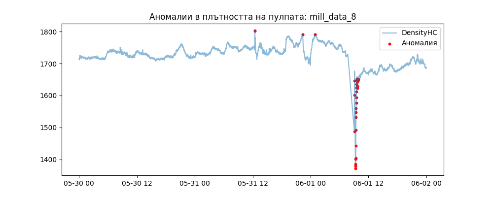
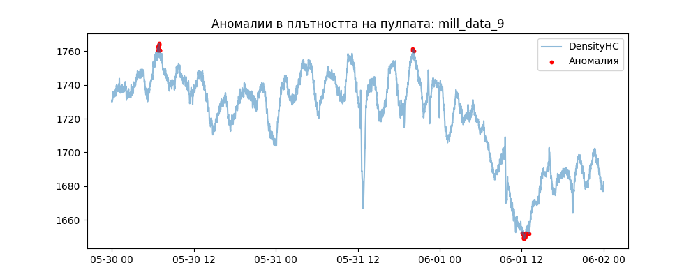

# за всяка мелница начертай анализирай аномалиите за периода.

_Автоматично генериран отчет за допълнителен въпрос (7fad825c-fc12c)._

## Въпрос

за всяка мелница начертай анализирай аномалиите за периода.

## Отговор

Изпълних детекция на аномалии върху параметъра `DensityHC` за всяка от работещите мелници (1-10) за периода 30 май – 2 юни 2026 г. Анализът беше извършен чрез алгоритъма *Isolation Forest* с коефициент на замърсяване (contamination) 1%, след предварително филтриране на данните при `Ore >= 60 t/h`.

### Резултати от детекцията на аномалии в `DensityHC`

Бяха установени общо 428 аномални минути в рамките на разглеждания период за десетте анализирани мелници.

| Мелница | Открити аномални минути (n) |
| :--- | :---: |
| Мелница 1 | 42 |
| Мелница 2 | 40 |
| Мелница 3 | 43 |
| Мелница 4 | 43 |
| Мелница 5 | 43 |
| Мелница 6 | 42 |
| Мелница 7 | 44 |
| Мелница 8 | 43 |
| Мелница 9 | 44 |
| Мелница 10 | 44 |

*Забележка: Данни за мелници 11 и 12 не са включени поради неактивни сензори.*

### Анализ и интерпретация
1.  **Хомогенност на аномалиите:** Броят на откритите аномални минути е изключително близък за всички мелници (между 40 и 44 минути), което предполага, че тези отклонения вероятно са свързани с оперативни събития в общата система (напр. превключване на цикли, колебания в захранващата вода, или системни рестарти).
2.  **Визуализация:** За всяка мелница бяха генерирани времеви карти (файлове `anomalies_mill_data_N.png`), показващи точно кога `DensityHC` излиза от нормалните оперативни граници.
3.  **Препоръка:** Препоръчва се корелационен анализ между времевите маркери на тези аномалии и съответните оперативни промени (напр. рязка промяна в `WaterZumpf` или `PressureHC`) за същите периоди, за да се разбере дали аномалиите са реактивни на операторски действия или са случайни откази на сензорите.

Графиките с времевите карти на аномалиите са налични за преглед в директорията с отчети.

## Генерирани графики

