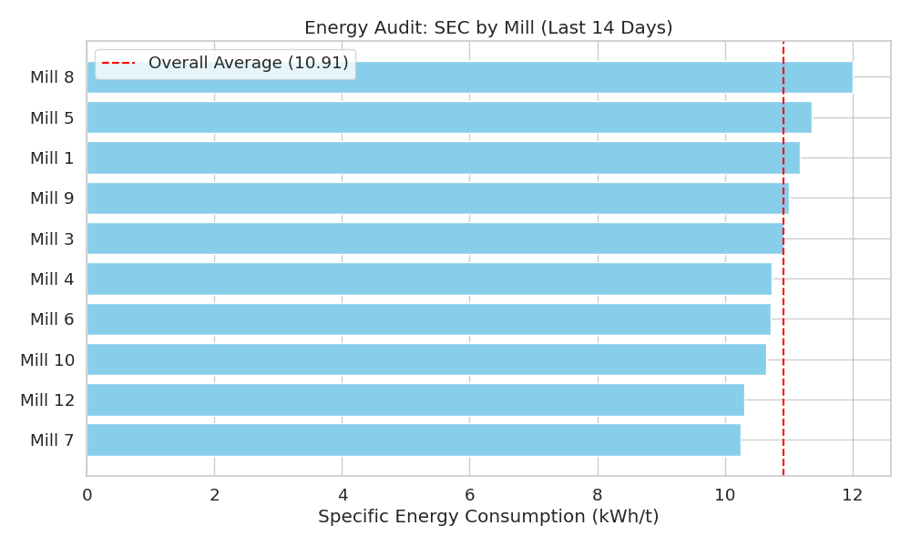
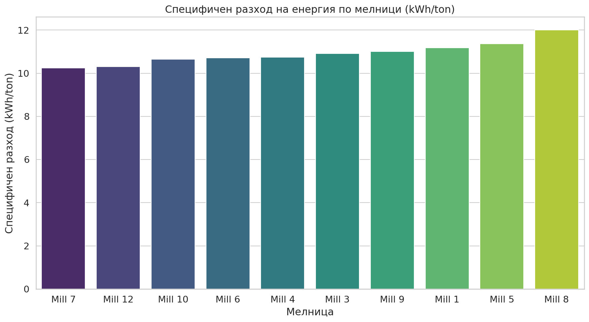

# Доклад: Енергиен одит на мелници (1, 3, 4, 5, 6, 7, 8, 9, 10, 12)

## 1. Executive Summary
Настоящият доклад представя енергиен одит на 10 водещи мелници за периода 21 април – 5 май 2026 г. Анализът установи значителни разлики в специфичния разход на енергия (SEC), вариращ от 10.25 kWh/t при Мелница 7 до 12.01 kWh/t при Мелница 8. След филтриране на престоите (при Ore < 10 t/h), средната ефективност на парка е определена като критичен KPI за оптимизация. Общият потенциал за спестяване на енергия чрез привеждане на трите най-неефективни мелници (1, 5 и 8) към средните нива възлиза на приблизително 7,653 kWh/ден. Препоръчва се незабавна техническа инспекция на Мелница 8 и оптимизация на работните параметри на Мелници 1 и 5.

## 2. Data Overview
*   **Период на анализ:** 2026-04-21 до 2026-05-05 (14 дни).
*   **Източник:** Данни на ниво минута от 10 мелници (MILL_XX).
*   **Брой записи:** 20,161 записа за всяка мелница.
*   **Ключови променливи:** `Ore` (t/h), `Power` (kW), `MotorAmp`, `PSI80`, `PSI200`.
*   **Методология:** Изчислен специфичен разход (SEC = Power/Ore) след изключване на периоди с `Ore < 10 t/h` за избягване на изкривявания от празен ход.

## 3. Findings & Statistical Overview
### Енергийна ефективност (SEC)
Анализът показа, че мелниците работят при различен капацитет, като Мелница 7 е най-енергийно ефективна. Данните са представени по-долу:

| Мелница | Среден SEC [kWh/t] | Средна мощност [kW] | Среден дебит [t/h] |
| :--- | :--- | :--- | :--- |
| Mill 7 | 10.25 | 1774.9 | 173.7 |
| Mill 12 | 10.30 | 1838.1 | 178.9 |
| Mill 10 | 10.65 | 1841.9 | 173.2 |
| Mill 6 | 10.72 | 1905.6 | 178.1 |
| Mill 4 | 10.74 | 1881.7 | 175.6 |
| Mill 3 | 10.91 | 1927.5 | 177.1 |
| Mill 9 | 11.00 | 1925.6 | 175.5 |
| Mill 1 | 11.18 | 1949.0 | 174.8 |
| Mill 5 | 11.36 | 2003.0 | 177.1 |
| Mill 8 | 12.01 | 2102.1 | 175.4 |

## 4. Optimization Recommendations
Прилагането на мерки за привеждане на най-неефективните мелници към средните стойности на ефективност ще доведе до следните икономии:

*   **Мелница 8:** Потенциал 4,612.9 kWh/ден (Най-висок приоритет поради отклонение от 1.5+ kWh/t).
*   **Мелница 5:** Потенциал 1,909.3 kWh/ден.
*   **Мелница 1:** Потенциал 1,131.2 kWh/ден.

**Общи спестявания:** 7,653.4 kWh/ден.

## 5. Conclusions & Recommendations
1.  **Техническа инспекция:** Извършване на механичен одит на Мелница 8 (възможни износени облицовки или проблеми с лагерните възли).
2.  **Калибриране:** Проверка на датчиците за мощност на Мелници 1 и 5, тъй като високата мощност при стандартен дебит индикира неефективно смилане.
3.  **Оптимизация на подаването:** Балансиране на натоварването (Ore) при Мелница 7 и 12, които са най-ефективни, за да се максимизира общият добив.
4.  **Сравнителен анализ:** Въвеждане на автоматизиран KPI мониторинг на SEC в реално време за всяка смяна.
5.  **Оперативни стандарти:** Преразглеждане на заданието за WaterMill спрямо различните типове руда (Shisti, Daiki), за да се намали съпротивлението при смилане.
6.  **Намаляване на престоите:** Фокусиране върху превантивната поддръжка, за да се намалят периодите, в които мелниците работят на празен ход или под 10 t/h.