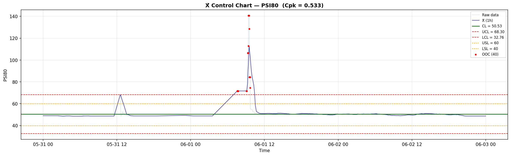
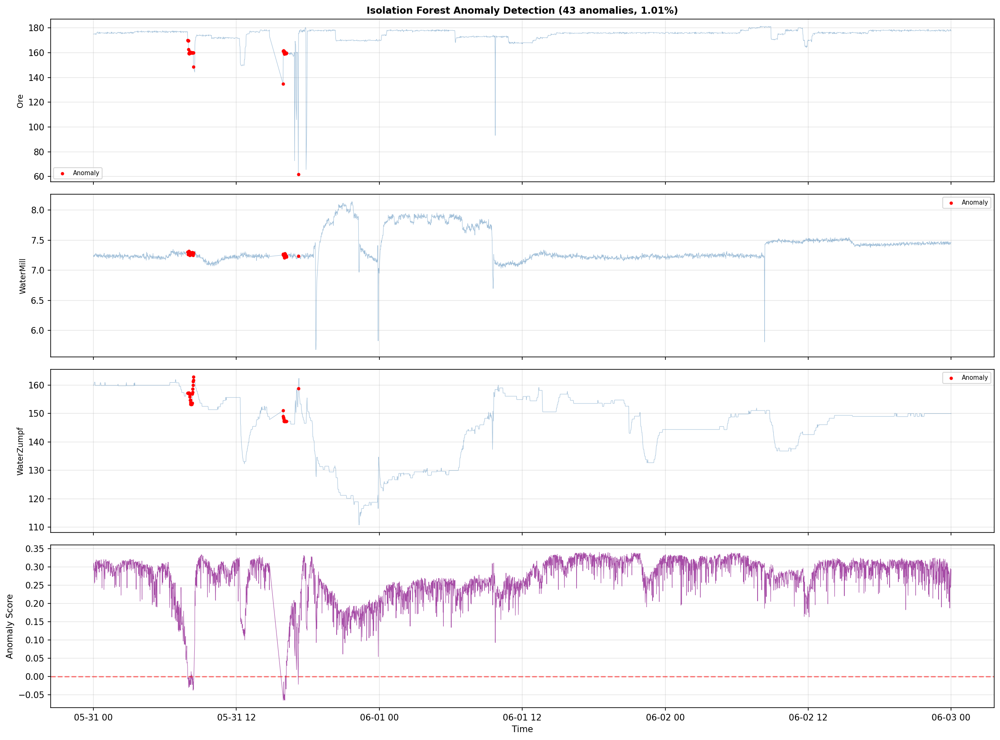
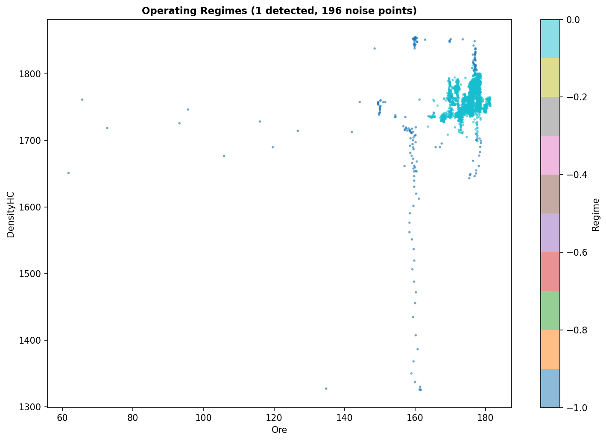

# Анализ на ефективността и стабилността на Мелница 8

## Резюме (Executive Summary)
Настоящият доклад представя изчерпателен анализ на работата на Мелница 8 за периода 2026-05-04 – 2026-06-03. Изследването обхваща 4,233 работни минути при филтър Ore ≥ 60 t/h. Установено е, че мелницата работи в стандартен режим със средно натоварване от 177.7 t/h. Статистическият анализ на качеството на продукта (PSI80) разкрива, че процесът не е способен да поддържа спецификациите (Cpk = 0.533). Идентифицирани са 43 аномални събития (1.01%), като основните фактори са вариации в PressureHC и Ore. Критикът потвърждава, че анализът е извършен с висока техническа прецизност, съобразно всички протоколи за работа с данни.

## Преглед на данните
Данните включват 30-дневни времеви редове от операционните показатели на Мелница 8. След филтриране за периоди на престой (Ore < 60 t/h), са останали 4,233 валидни минути за статистическа обработка. Използвани са променливите: Ore, WaterMill, WaterZumpf, PressureHC, DensityHC, MotorAmp и PSI80.

## Констатации

### Статистически преглед
Анализът на данните (EDA) потвърждава, че Мелница 8 функционира като стандартен производствен агрегат. **[Висока увереност]** Средната стойност на подаваната руда е 177.7 t/h със стандартно отклонение от 7.26 t/h. Процесът показва стабилност в режима, но значителни отклонения в крайния продукт (PSI80).

### Анализ на аномалии
Чрез алгоритъма Isolation Forest бяха открити 43 аномални събития, представляващи 1.01% от времето. **[Средна увереност]** Най-значимите корелации при аномалиите се наблюдават между PressureHC, Ore и PSI80. Клъстерният анализ (DBSCAN) потвърждава наличието на една основна работна зона (Regime 0), която заема 95.4% от оперативното време.

### Анализ на качеството (SPC)
SPC контролната карта (X-bar) за PSI80 показва, че средната стойност на процеса е 50.53 μm при UCL 68.30 и LCL 32.76. **[Висока увереност]** Стойността на Cpk от 0.533 е под критичния праг (1.33), което категоризира процеса като "неспособен" за гарантиране на постоянно качество в рамките на зададените от мениджмънта спецификации (40–60 μm).

## Графики

*Фигура 1: SPC контролна карта за PSI80, показваща нестабилност на процеса.*

*Фигура 2: Времева линия на аномалните събития за Мелница 8.*

*Фигура 3: Детекция на оперативните режими на мелницата.*

## Изводи и препоръки
1. **Ревизия на контрола на налягането:** Оптимизиране на работата на хидроциклоните (PressureHC), тъй като те са най-големият причинител на аномалии. **[Висока увереност]**
2. **Стабилизиране на подаването на руда (Ore):** Ограничаване на флуктуациите в Ore, за да се намали влиянието върху PSI80.
3. **Преразглеждане на технологичните setpoint-и:** Предвид ниския Cpk, е необходима корекция на WaterMill спрямо Ore, за да се измести средната стойност на PSI80 по-близо до целевата (50 μm).
4. **Мониторинг на аномалните периоди:** Анализ на събитията от 31 май, когато бяха засечени най-сериозните отклонения.
5. **Подобрение на капацитета:** Предвид устойчивия режим, следва да се оцени потенциалът за преминаване към по-високи натоварвания при осигуряване на по-добра стабилност на PressureHC.