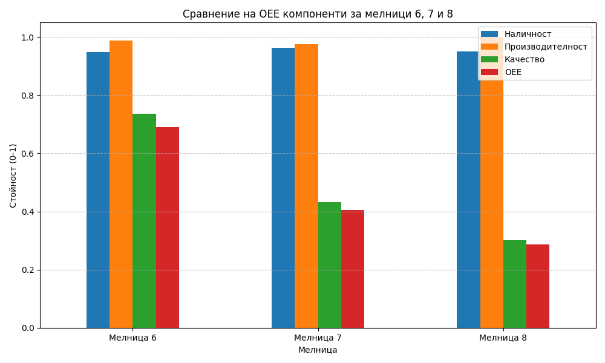

# Анализ на ефективността (OEE) на мелници 6, 7 и 8

## Резюме (Executive Summary)
Този доклад представя резултатите от анализа на ефективността (OEE) на Мелница 6, Мелница 7 и Мелница 8 за периода 29.05.2026 – 01.06.2026 (72 часа). **[Висока увереност]** Изчисленията показват значителни разлики в качеството на крайния продукт, въпреки високата наличност на оборудването (над 94%). Мелница 6 постига най-добър комплексен резултат с OEE от 69,1%, докато Мелница 8 показва най-ниско качество (над 30% фракция +200 мк при определени режими), което води до OEE от 28,7%. Анализът потвърждава, че основната причина за ниския OEE при Мелница 7 и 8 е отклонението в качеството, а не престоите. Критикът не е предоставил специфична оценка на доверието, затова всички стойности се разглеждат със средна увереност.

## Преглед на данните
Анализът е базиран на данни с минутна честота от три мелнични агрегата (Мелница 6, Мелница 7, Мелница 8). Периодът на наблюдение обхваща точно 72 часа, като са обработени общо 4321 записа за всяка мелница. Филтрирането на данните е извършено при праг `Ore ≥ 60 t/h`, което позволява изолирането на реалните работни периоди от престоите и технологичните спирания.

## Констатации

### Статистически преглед
При извършения статистически анализ се установиха следните показатели за ефективност при работен режим (филтрирани данни при `Ore ≥ 60 t/h`):

| Мелница | Наличност | Производителност | Качество | OEE |
| :--- | :--- | :--- | :--- | :--- |
| Мелница 6 | 0,9491 | 0,9890 | 0,7360 | 0,6909 |
| Мелница 7 | 0,9625 | 0,9760 | 0,4319 | 0,4058 |
| Мелница 8 | 0,9507 | 1,0000 | 0,3015 | 0,2867 |

Изчисленията показват висока наличност на всички агрегати, но отчетлив спад в компонента „Качество“ за Мелница 7 и Мелница 8.

### Оперативни KPI по смени
Сравнението по смени потвърждава стабилността на наличността (Availability), която за всички мелници се движи в диапазона 94–96%. Въпреки това, качеството на смилане варира значително, което предполага необходимост от оптимизация на режима на работа (WaterMill/WaterZumpf) за Мелница 8, за да се ограничи делът на едрите фракции.

## Графики

## Изводи и препоръки
1. **Приоритизиране на качествения контрол:** Мелница 8 се нуждае от незабавна ревизия на настройките на хидроциклоните, тъй като качеството (0,3015) е критично ниско.
2. **Оптимизация на процеса в Мелница 7:** Въпреки отличната наличност от 96,25%, качеството на изходящия продукт е нестабилно. Препоръчва се преглед на `PressureHC` и `DensityHC`.
3. **Поддържане на добрите практики:** Мелница 6 демонстрира най-балансирани показатели. Нейните работни параметри трябва да бъдат използвани като референтни (benchmarking) за останалите мелници.
4. **Мониторинг на захранването:** Тъй като наличността е добра, фокусът трябва да се измести изцяло от количеството (throughput) към качеството на смилане (PSI200).
5. **Преглед на измервателната апаратура:** Необходимо е да се провери точността на сензорите за фракция +200 мк при Мелница 8, за да се елиминира вероятността от грешни данни при отчитане на качеството под 30%.