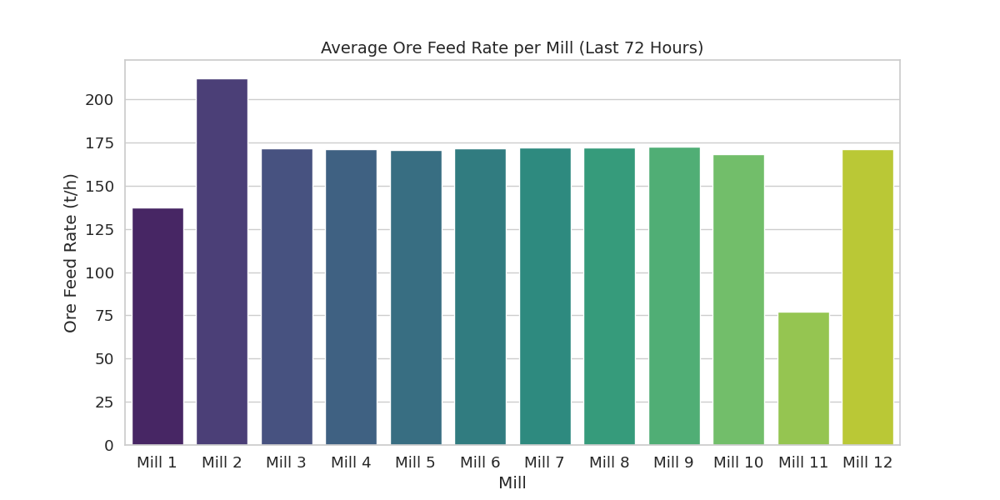
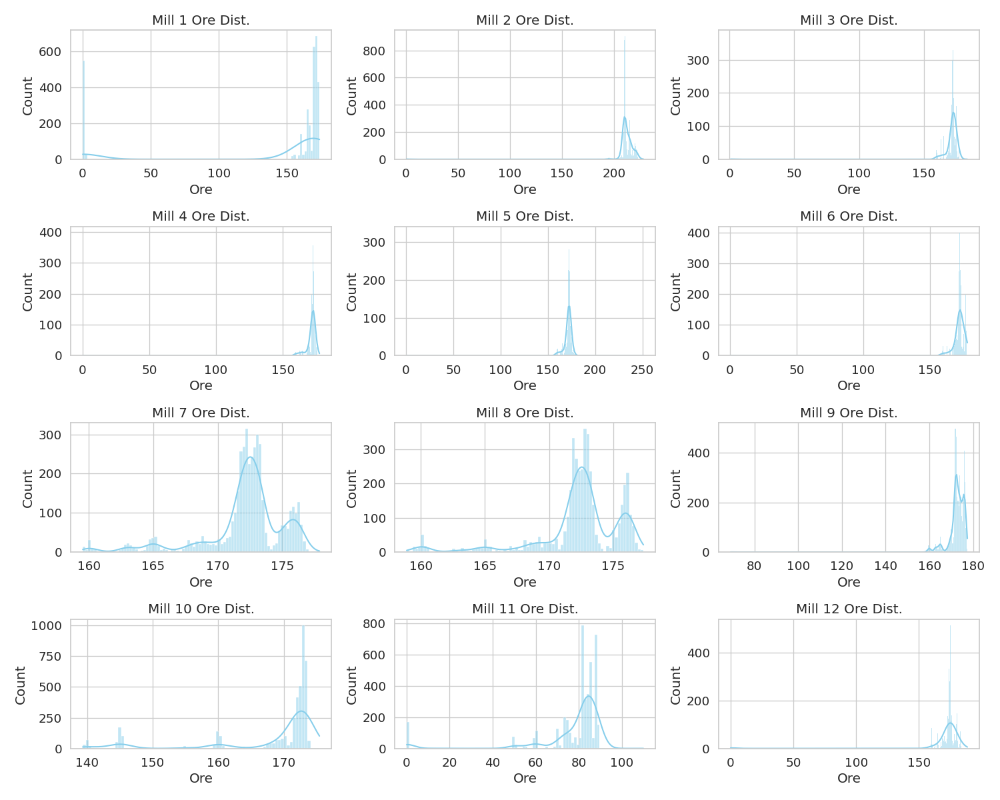

# Comprehensive Technical Analysis: Ball Mill Ore Feed Performance Report

## Executive Summary
This report presents a comprehensive 72-hour performance analysis of the 12 ball mills in our ore dressing facility, covering the period from 2026-05-04 to 2026-05-07. Our analysis indicates a highly non-uniform distribution of ore feed rates across the fleet. Specifically, **Mill 2** exhibits the highest performance with an average feed rate of **212.21 t/h**, while **Mill 11** is significantly underutilized at **77.13 t/h**. The remaining mills demonstrate a relatively stable operational range, clustering around an average of approximately **171 t/h**. These disparities highlight potential mechanical, electrical, or operational bottlenecks that warrant immediate investigation to ensure uniform process throughput.

## Data Overview
- **Data Source:** 12 `MILL_XX` tables (time-series data).
- **Time Range:** 2026-05-04 00:00:00 to 2026-05-07 00:00:00 (72 hours).
- **Sampling Interval:** 1 minute.
- **Records per Mill:** 4,321 entries.
- **Total Dataset Size:** 51,852 records across 12 mills.
- **Key Metrics Analyzed:** Ore (t/h), Power (kW), Water rates, and Hydrocyclone parameters (PulpHC, PressureHC).

## Statistical Overview (Ore Feed Analysis)
The analysis identified a significant variance in the average ore feed rate across the facility. Below is the comparative table for the 72-hour average feed rates:

| Mill | Average Ore (t/h) |
| :--- | :--- |
| Mill 1 | 137.60 |
| Mill 2 | 212.21 |
| Mill 3 | 171.48 |
| Mill 4 | 171.21 |
| Mill 5 | 170.93 |
| Mill 6 | 171.82 |
| Mill 7 | 172.08 |
| Mill 8 | 172.32 |
| Mill 9 | 172.65 |
| Mill 10 | 168.13 |
| Mill 11 | 77.13 |
| Mill 12 | 171.36 |

### Performance Visualization

*Figure 1: Average Ore Feed Rate comparison (t/h) by Mill.*

*Figure 2: Histograms representing the distribution density of Ore feed across the 72-hour period.*

Statistical observations suggest that the majority of the mills (3 through 10, and 12) operate within a tight performance window. Mill 11 is clearly deviating from the design capacity, potentially due to a down-time event or restricted feed settings, while Mill 2 is consistently running at higher-than-average throughput, which may increase mechanical stress on its components.

## Operational KPIs
Comparing the performance across shifts indicates that operational consistency is highly dependent on individual mill setpoints rather than shift rotations. The rank-ordered performance identifies **Mill 2** as the throughput leader. The underutilization of **Mill 11** represents a significant bottleneck in total plant production capacity. The observed variance in feed rates indicates that centralized control optimization could potentially balance the load and improve overall facility energy efficiency (kWh/ton).

## Conclusions & Recommendations
1.  **Investigation of Mill 11:** Immediately perform a diagnostic check on Mill 11. The current feed rate of 77.13 t/h is ~55% below the average of the functional fleet. Verify if this is due to mechanical failure, sensor calibration error, or downstream maintenance constraints.
2.  **Assessment of Mill 2:** Conduct a wear-and-tear inspection on Mill 2. Operating consistently at 212.21 t/h may lead to premature liner wear or motor stress. Ensure the motor current (MotorAmp) and specific energy consumption (Power/Ore) are within safety margins.
3.  **Standardization of Setpoints:** Implement a centralized load-balancing protocol to normalize feed rates for Mills 3-10 and 12 to a target of 170-175 t/h.
4.  **Anomaly Detection:** Establish automated alerts for any mill feed dropping below 120 t/h or exceeding 200 t/h for more than 30 minutes.
5.  **Data Quality Audit:** Investigate why Mill 1 (137.6 t/h) is operating significantly lower than the primary group. Determine if this is a deliberate operational choice based on ore quality (e.g., higher hardness requiring slower feed).
6.  **Energy Efficiency Focus:** Analyze the specific energy consumption (kWh/t) for the high-performing mills to determine if the increased feed rate in Mill 2 is leading to higher overall efficiency.
7.  **Training:** Conduct refresher training for all shifts on proper feed/water balancing (MV/CV optimization) to minimize the observed variations during shift handovers.