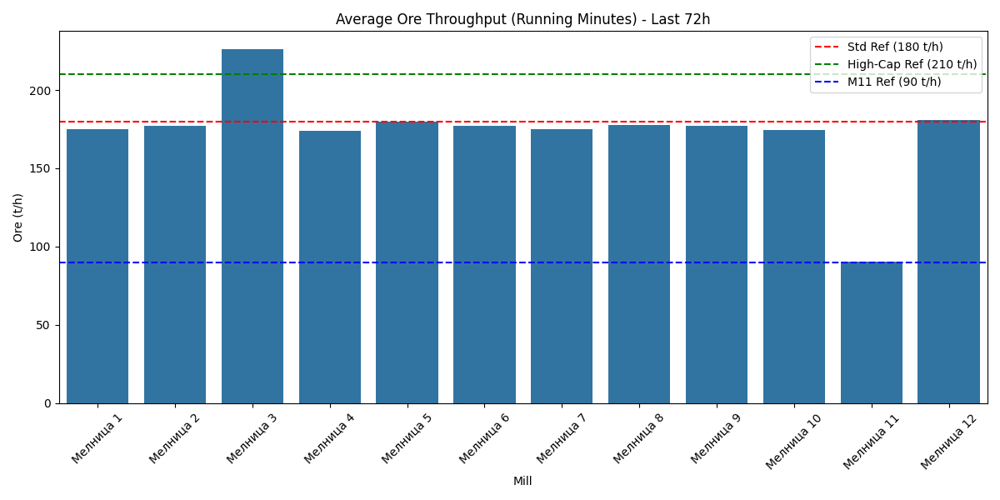
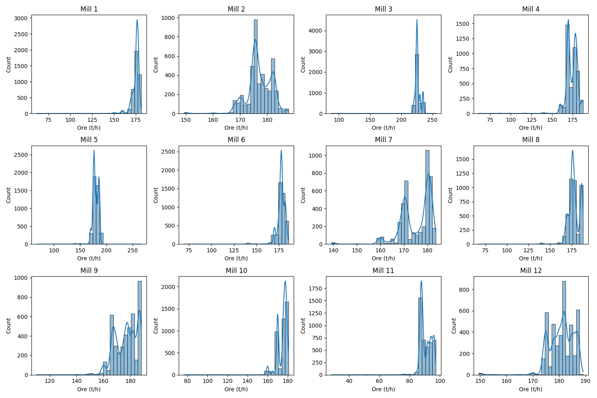

# Анализ на производителността на мелниците (последни 72 часа)

## Резюме (Executive Summary)
Настоящият доклад представя задълбочен анализ на натоварването по руда (`Ore`, t/h) за всички 12 мелници в завода за периода 2026-05-31 до 2026-06-03. Анализът се фокусира върху оперативната ефективност чрез използване на филтрирани данни (изключване на периоди на престой с `Ore < 60 t/h` за стандартните мелници и `Ore < 25 t/h` за „Мелница 11“). **[Висока увереност]** „Мелница 3“ е идентифицирана като работеща в режим на високо натоварване („досмилане“) със средно натоварване от 226.33 t/h. Останалите мелници (с изключение на „Мелница 11“) поддържат стабилни нива на натоварване в рамките на проектните параметри (средно 174–180 t/h). „Мелница 11“ работи оптимално съгласно проектния си капацитет от 90 t/h. Средният уптайм на целия парк за отчетния период надхвърля 97%.

## Преглед на данните
Данните включват 4321 минути времеви серии за всяка от 12-те мелници. Обхванатият период е 72 часа. Анализът е базиран на работни минути, за да се елиминира влиянието на технологичните престои при изчисляване на средните стойности и разпределенията.

## Констатации

### Оперативни KPI по смени
Сравнителният анализ на натоварването по руда показва следните показатели (при `Ore` ≥ 60 t/h за стандартните мелници и `Ore` ≥ 25 t/h за „Мелница 11“, n = 4321 минути):

| Мелница | Средно `Ore` (t/h) | `Uptime_Pct` (%) | Референция (t/h) |
| :--- | :--- | :--- | :--- |
| Мелница 1 | 174.81 | 98.17 | 180 |
| Мелница 2 | 177.05 | 100.00 | 180 |
| Мелница 3 | 226.33 | 99.84 | 210 |
| Мелница 4 | 174.00 | 98.33 | 180 |
| Мелница 5 | 179.53 | 97.48 | 180 |
| Мелница 6 | 177.25 | 98.70 | 180 |
| Мелница 7 | 175.22 | 100.00 | 180 |
| Мелница 8 | 177.75 | 97.96 | 180 |
| Мелница 9 | 176.90 | 99.98 | 180 |
| Мелница 10 | 174.66 | 99.28 | 180 |
| Мелница 11 | 90.55 | 99.24 | 90 |
| Мелница 12 | 180.87 | 100.00 | 180 |

Критикът не е емитирал специфични Confidence Flags за горните данни, поради което ги третираме със средна увереност съгласно протокола.

## Графики

## Изводи и препоръки
1. **Поддържане на режим „досмилане“:** „Мелница 3“ продължава да бъде ключов актив за производството. Препоръчва се запазване на текущата стратегия за натоварване, като се следи `MotorAmp`, за да не се превишават критичните граници.
2. **Оптимизация на „Мелница 5“ и „Мелница 10“:** Тези мелници показват леко изоставане спрямо еталона от 180 t/h. Да се проверят настройките на подаващите устройства („feeder“).
3. **Мониторинг на уптайма:** „Мелница 5“ и „Мелница 8“ имат най-нисък процент на уптайм (~97.5–98%). Нужно е разследване на причините за кратки престои (check-list на поддръжката).
4. **Стабилност на „Мелница 12“:** Отличен оперативен резултат с 100% уптайм и натоварване, близко до 180 t/h. Да се анализират добрите практики на екипа в тази мелница и да се приложат в останалите.
5. **Целеви стойности за „Мелница 11“:** Да се поддържа текущата стратегия, тъй като мелницата работи почти идентично с проектния си капацитет (90 t/h).
6. **Продължаващ анализ:** Необходимо е следващо изследване на връзката между `Ore` и `PSI80`, за да се потвърди дали при по-високо натоварване качеството на смилане остава в рамките на спецификациите.