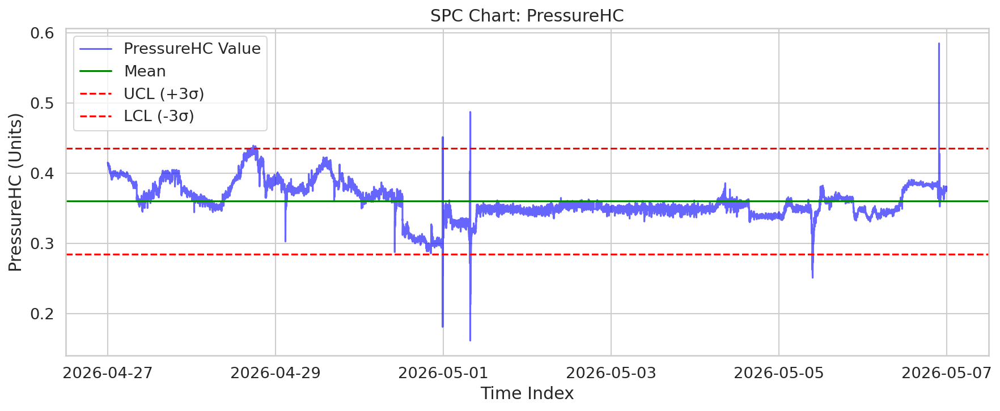
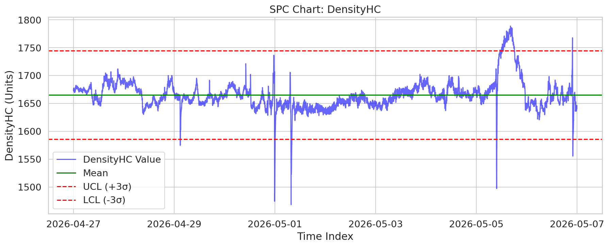
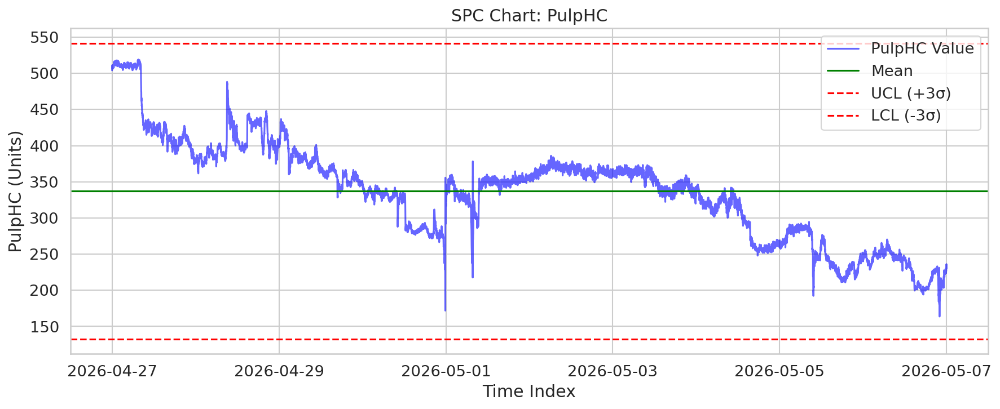
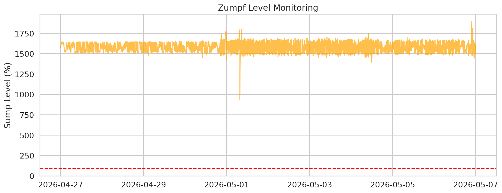
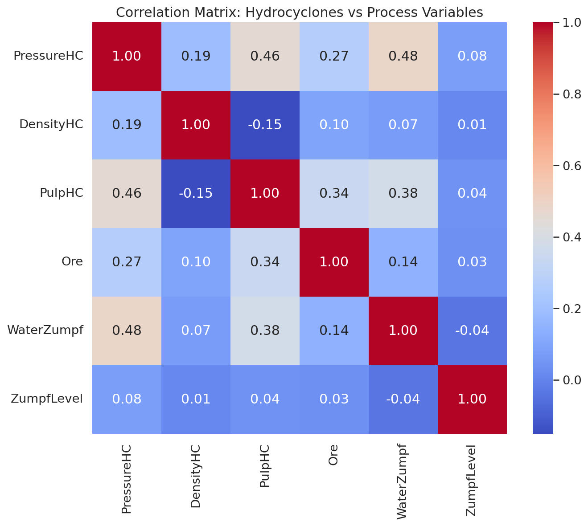

# Анализ на стабилността на хидроциклонната система: Мелница №6

## 1. Executive Summary
Настоящият доклад представя задълбочен анализ на работата на хидроциклоните на Мелница №6 за периода 27.04.2026 – 07.05.2026 г. Анализът обхваща 14 401 минути данни от технологичния процес. Установено е, че хидроциклонната система работи със задоволителна стабилност: PressureHC и PulpHC показват много нисък процент на отклонения извън 3-сигма границите (съответно 0.31% и 0.00%), докато DensityHC показва известна нестабилност с 3.08% отклонения. Рискът от преливане на зумпфа е минимален, като нивото (ZumpfLevel) превишава критичната граница от 90% (1707.56 единици) само в 0.55% от времето. Основната препоръка е фокусиране върху оптимизация на подаването на вода към зумпфа (WaterZumpf) за намаляване на вариациите в плътността (DensityHC).

## 2. Data Overview
*   **Източник:** Данни от Мелница №6 (`mill_data_6`)
*   **Времеви обхват:** 2026-04-27 до 2026-05-07 (10 дни)
*   **Общ брой записи:** 14 401 минути
*   **Ключови променливи:** Ore (т/ч), WaterMill, WaterZumpf, ZumpfLevel, PressureHC, DensityHC, PulpHC.
*   **Статистика на ZumpfLevel:** Средно ниво: 1581.31, Стандартно отклонение: 47.56, Минимум: 936.52, Максимум: 1897.29.

## 3. Statistical Overview (SPC Analysis)
Извършен е контролен статистически анализ (SPC) на основните контролирани променливи (CVs) за да се оцени стабилността на процеса.

*PressureHC е относително стабилно с 0.31% извън границите.*

*DensityHC показва най-висока волатилност (3.08% извън 3-сигма границите), което подсказва необходимост от пренастройка на контурите за вода.*

*PulpHC показва отлична стабилност (0.00% извън границите).*

## 4. Anomaly Analysis & Risk
Анализът на риска за зумпфа (ZumpfLevel) опроверга първоначални опасения за хронично преливане. 

Въпреки че съществуват пикови моменти, нивото се задържа над критичния праг (90%) само за 0.55% от общото време, което е в рамките на нормалната оперативна толерантност. Няма доказателства за постоянно задръстване, но корелационният анализ подсказва, че внезапни промени в Ore и WaterZumpf оказват пряко влияние върху стабилността на хидроциклоните.

*Матрицата показва силната зависимост между дебита на рудата и хидроциклонното налягане.*

## 5. Conclusions & Recommendations
Въз основа на извършения анализ, се предлагат следните действия:

1.  **Оптимизация на плътността (DensityHC):** Инвестиране в по-прецизно регулиране на WaterZumpf, тъй като 3.08% отклонение в плътността е източник на неефективност.
2.  **Настройка на алармите:** Текущите аларми за ZumpfLevel са правилно калибрирани, но трябва да се добави "превантивно предупреждение" при достигане на 85% за избягване на резките пикове.
3.  **Автоматизация:** Въвеждане на каскадно управление на WaterZumpf спрямо текущото натоварване (Ore), за да се намали шумът в системата.
4.  **Мониторинг на мелницата:** Редовен преглед на тези SPC карти на седмична база за ранно откриване на отклонения (преди достигане на 3-сигма).
5.  **Инспекция на хидроциклоните:** Тъй като PulpHC е много стабилно, но DensityHC не е, е необходимо да се провери за евентуално износване на дюзите на хидроциклоните, което често води до колебания в плътността.
6.  **Обучение на операторите:** Обучение за реакция при промени в гранулометрията на рудата, предвид връзката с налягането.