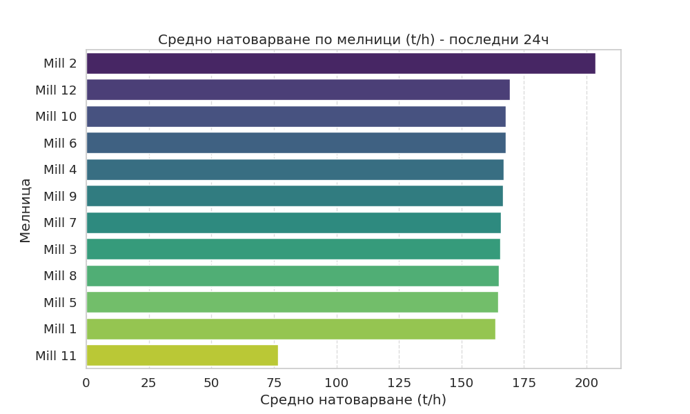
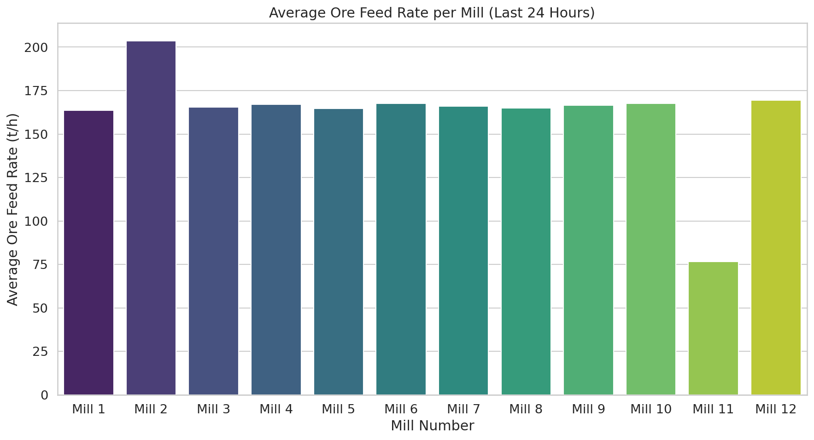
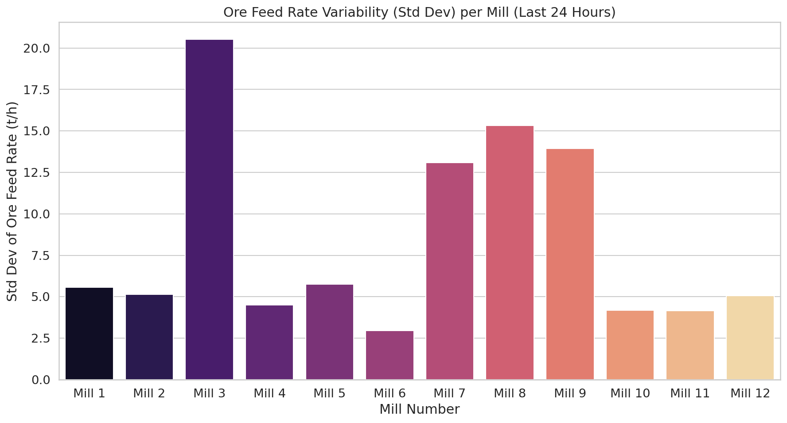

# Доклад за експлоатационен анализ на мелниците (Последни 24 часа)

## 1. Executive Summary
Настоящият доклад представя изчерпателен анализ на работата на 12-те мелници за периода 2026-05-07 до 2026-05-08. Анализът разкрива значителни разлики в натоварването и енергийната ефективност между отделните агрегати. **Мелница 2** се отличава като най-производителна със средно натоварване от **203.60 t/h** и отлична енергийна ефективност от **9.69 kWh/t**. В рязък контраст, **Мелница 11** работи с ограничено натоварване от **76.55 t/h**, което предполага технически ограничения или специфични оперативни цели. Отбелязани са сериозни отклонения в специфичната енергийна консумация при мелници 7, 3 и 8, достигащи нива над **60 kWh/t**, което изисква незабавна проверка на механичното състояние на задвижванията или ефективността на мелене. Общата наличност на активите (Uptime) е отлична, като повечето мелници поддържат близо 100% оперативна готовност.

## 2. Data Overview
Данните са извлечени от системата за управление на процесите в обогатителната фабрика. За всяка от 12-те мелници бяха заредени по **1441 записа** (минутни данни), обхващащи период от 24 часа. Наличните параметри включват:
- **Технологични данни:** Ore (t/h), WaterMill, WaterZumpf, Power (kW), ZumpfLevel, PressureHC, DensityHC, PulpHC, PumpRPM, MotorAmp, PSI80, PSI200.
- **Обхват:** 2026-05-07 00:00 до 2026-05-08 00:00.

## 3. Statistical Overview (Analyst Findings)
Статистическият анализ разкрива широка вариативност в работните режими:
- **Средни стойности:** Повечето мелници работят в диапазона 163-169 t/h, изключвайки мелници 2 (203.6 t/h) и 11 (76.5 t/h).
- **Вариативност:** Мелници като **Мелница 3** (std=20.52 t/h) и **Мелница 8** (std=15.33 t/h) демонстрират висока нестабилност в подаването на руда, което влияе директно върху качеството на продукта (PSI80).
- **Корелация:** Наблюдава се силна зависимост между специфичната енергийна консумация и стабилността на подаване на руда.

## 4. Operational KPIs (Shift Reporter)
Сравнението на ключовите показатели за ефективност (KPIs) за последните 24 часа:

| Мелница | Средно натоварване (t/h) | Uptime (%) | Енергийна ефективност (kWh/t) |
| :--- | :---: | :---: | :---: |
| **Mill 2** | 203.60 | 100.00 | 9.69 |
| **Mill 12** | 169.44 | 100.00 | 10.93 |
| **Mill 10** | 167.73 | 100.00 | 10.88 |
| **Mill 6** | 167.63 | 100.00 | 11.46 |
| **Mill 4** | 166.99 | 100.00 | 11.27 |
| **Mill 9** | 166.52 | 99.51 | 28.30 |
| **Mill 7** | 165.91 | 99.51 | 62.47 |
| **Mill 3** | 165.58 | 98.61 | 63.32 |
| **Mill 8** | 165.07 | 99.31 | 31.35 |
| **Mill 5** | 164.72 | 100.00 | 12.19 |
| **Mill 1** | 163.65 | 100.00 | 11.91 |
| **Mill 11** | 76.55 | 100.00 | 13.20 |

## 5. Conclusions & Recommendations
Въз основа на анализа, препоръчваме следните стъпки за оптимизация:

1.  **Одит на Мелници 3, 7 и 8:** Спешна техническа проверка на тези агрегати поради изключително високата специфична енергийна консумация (над 30-60 kWh/t).
2.  **Стабилизиране на потока:** Въвеждане на автоматизирано управление на захранващите ленти за мелници с висока вариативност (Мелница 3 и 8), за да се намалят колебанията в PSI80.
3.  **Изследване на Мелница 11:** Да се установи причината за ниското натоварване – дали е ограничение от захранващия капацитет, състояние на мелницата или специфични изисквания за качество.
4.  **Трансфер на добри практики:** Анализ на режимите на **Мелница 2**, която демонстрира най-добра ефективност, и прилагане на нейните оперативни настройки (WaterMill/Ore ratio) към останалите мелници.
5.  **Мониторинг на енергийната ефективност:** Интегриране на алармена система, която да сигнализира при превишаване на праг от 15 kWh/t специфична консумация.
6.  **Преглед на хидроциклоните:** Проверка на налягането (PressureHC) при мелници, които показват отклонения в фиността (PSI80), за гарантиране на съответствие със спецификациите.