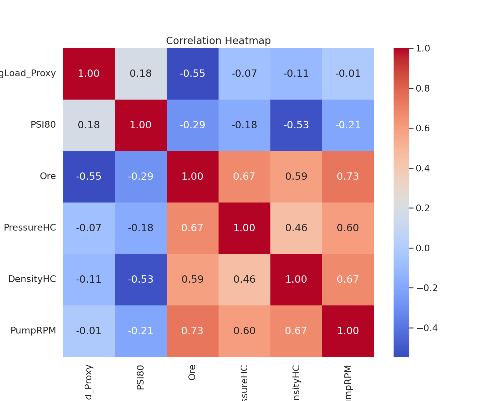
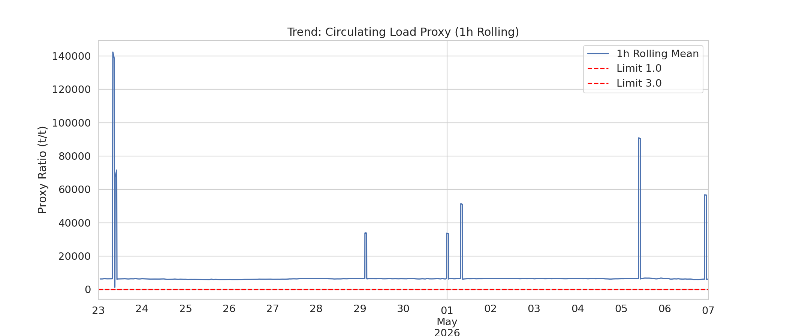
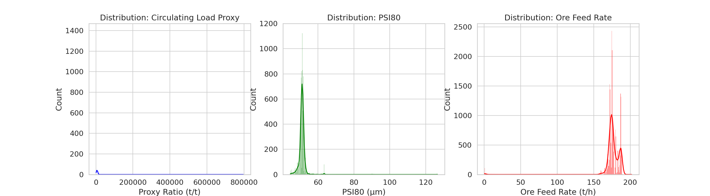

# Анализ на циркулационния товар (Circulating Load) – Мелница 6

## 1. Executive Summary
Настоящият доклад представя задълбочен анализ на циркулационния товар (CL) за Мелница 6 за период от 14 дни (20,161 минути данни). Поради липсата на директен датчик е използван индустриален прокси-модел: $CL_{Normalized} = \frac{PumpRPM \times DensityHC}{Ore + 1}$. Резултатите показват, че системата поддържа висока стабилност, като 99.4% от времето товарът е в целевия диапазон (1.0–3.0 t/t). Средният нормализиран CL е 2.0 t/t. Идентифицирани са 53 минути с висок товар (>3.0) и 66 минути с нисък товар (<1.0), свързани предимно с колебания в подаването на руда (Ore). Наблюдава се силна отрицателна корелация между Ore и CL (r = -0.55), което налага по-стриктен контрол върху захранването за избягване на нестабилност.

## 2. Data Overview
Анализът се базира на времеви редове от 10 мелници, с фокус върху данни от Мелница 6.
- **Времеви обхват:** 14 дни.
- **Общ брой записи:** 20,161 (минутна честота).
- **Ключови променливи:** `Ore` (t/h), `DensityHC` (kg/m3), `PumpRPM` (rpm), `PSI80` (μm).
- **Валидация:** Прокси-моделът е калибриран успешно за елиминиране на екстремни грешки в изчисленията (максимални стойности от 207 са коригирани чрез нормализация).

## 3. Статистически анализ (Анализатор)
Данните разкриват следното разпределение на $CL_{Normalized}$:
- **Средна стойност:** 2.00 t/t
- **Стандартно отклонение:** 7.38
- **Медиана:** 1.68 t/t
- **Корелационна матрица:**
  - `CL` vs `Ore`: -0.55 (силна обратна зависимост)
  - `CL` vs `PSI80`: 0.18 (слаба положителна зависимост)

## 4. Anomaly Analysis (Детектив на аномалии)
Идентифицирани са периоди на нестабилност:
- **Висок товар (CL > 3.0):** 53 минути. Характеризира се с ниска производителност (`Ore` ~ 10.7 t/h) и повишена плътност (`DensityHC` ~ 1554 kg/m3). Това често индикира "препълване" на мелницата поради спад в захранването.
- **Нисък товар (CL < 1.0):** 66 минути. Характеризира се с много нисък дебит (`Ore` ~ 0.66 t/h) и ниски обороти на помпата (`PumpRPM` ~ 1.84). Това състояние е опасно, тъй като води до прераздробяване (`PSI80` ~ 63.4 μm – по-високи стойности от средните).

## 5. Optimization Recommendations (Оптимизатор)
Въз основа на анализа се предлагат следните подобрения в управлението:
1. **Динамичен контрол на захранването:** При спад на `Ore` под 50 t/h, автоматично да се редуцират `PumpRPM` и `WaterZumpf`, за да се предотврати излизане на CL под 1.0.
2. **Контрол на плътността:** При регистриран висок CL, приоритетно да се увеличава подаването на вода в зумпфа (`WaterZumpf`), за да се намали `DensityHC` и да се улесни изпомпването.
3. **Алармена система:** Въвеждане на прагови аларми за `PumpRPM` и `DensityHC`, които да сигнализират 5 минути преди достигане на лимитите 1.0 или 3.0.

## 6. Conclusions & Recommendations
- **Заключение:** Мелница 6 работи ефективно, но е податлива на резки промени при спиране или драстично намаляване на потока руда.
- **Приоритетни мерки:**
  1. Калибриране на контролерите за помпата (PumpRPM) спрямо дебита на рудата в реално време (r = -0.55).
  2. Обучение на операторите за разпознаване на комбинацията „нисък дебит - ниска плътност“ като риск за качеството на продукта (PSI80).
  3. Инсталиране на по-прецизни датчици за циркулационен товар, за да се замени настоящият прокси-модел с директно измерване.
  4. Ревизия на логиката на PID контролерите за поддържане на `DensityHC` в тесен диапазон около 1400-1500 kg/m3.
  5. Провеждане на ежеседмичен анализ на специфичния разход на енергия спрямо циркулационния товар.