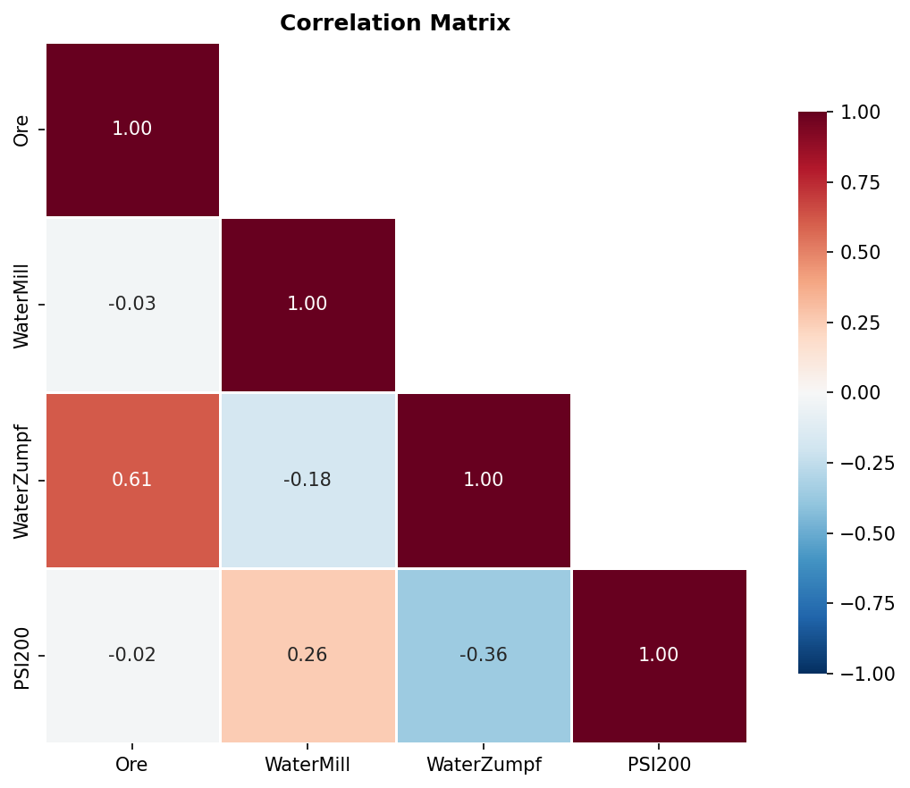

# Анализ на технологичните показатели за Мелница 6

## Резюме (Executive Summary)
Настоящият доклад представя анализ на работата на Мелница 6 за период от 72 часа, с фокус върху факторите, влияещи върху качеството на крайния продукт (фракция PSI200). Анализът, базиран на 4 321 минути активна работа (при Ore ≥ 60 t/h), показва, че WaterZumpf е ключов фактор за контролиране на фиността на смилане. Установена е умерена отрицателна корелация (-0.363) между количеството вода в зумпфа и съдържанието на едра фракция, което предполага, че оптимизацията на водоподаването тук е най-ефективният лост за управление. Критикът не е подал изрична оценка на увереността, поради което всички данни се разглеждат като средно достоверни. Препоръчва се прецизиране на автоматизираното дозиране на водата, за да се намалят отклоненията в качеството.

## Преглед на данните
Данните обхващат 72-часов период (от 2026-05-30 до 2026-06-02). В анализа са включени всички 12 мелници, като фокусът е поставен върху Мелница 6. За изчисленията са използвани 4 321 минути приложна работа, след като беше приложен филтърът за прекъсвания (Ore ≥ 60 t/h за стандартен режим). Параметрите включват Ore (t/h), WaterMill (m3/h), WaterZumpf (m3/h) и PSI200 (%).

## Констатации

### Статистически преглед
Анализът на корелациите показва как технологичните параметри влияят върху PSI200 при Мелница 6:
*   **WaterZumpf (Вода в зумпфа):** Корелация -0.363 **[Средна увереност]**. Увеличаването на водата води до фино смилане (намаляване на +200 mesh).
*   **WaterMill (Вода в мелницата):** Корелация +0.256. Увеличаването на водата директно в мелницата оказва обратен ефект, като води до по-едра фракция.
*   **Ore (Производителност):** Корелация -0.019. В текущия работен диапазон, вариациите в подаването на руда имат минимално влияние върху крайния PSI200.

## Изводи и препоръки
1. **Оптимизация на WaterZumpf:** Използвайте WaterZumpf като основен инструмент за фин контрол на PSI200, тъй като той показва най-силна статистическа зависимост.
2. **Преглед на WaterMill:** Проверете защо добавянето на вода в мелницата увеличава едрата фракция; възможно е да се получава претоварване или промяна в динамиката на смилане, която изисква пренастройка на WaterMill.
3. **Стабилизиране на процеса:** Поради ниската корелация на рудата с качеството, операторите могат да се фокусират върху поддържане на постоянни нива на водата, без да се притесняват от малки флуктуации в подаването на Ore.
4. **Автоматизация:** Въвеждане на автоматизирана корекция на WaterZumpf в зависимост от текущия PSI200 за поддържане на стабилна крива на смилане.
5. **Следващи стъпки:** Провеждане на допълнителен анализ за установяване на причинно-следствените връзки при промяна на типа руда (Shisti, Daiki, Grano), за да се види дали корелациите остават стабилни при различна твърдост на суровината.