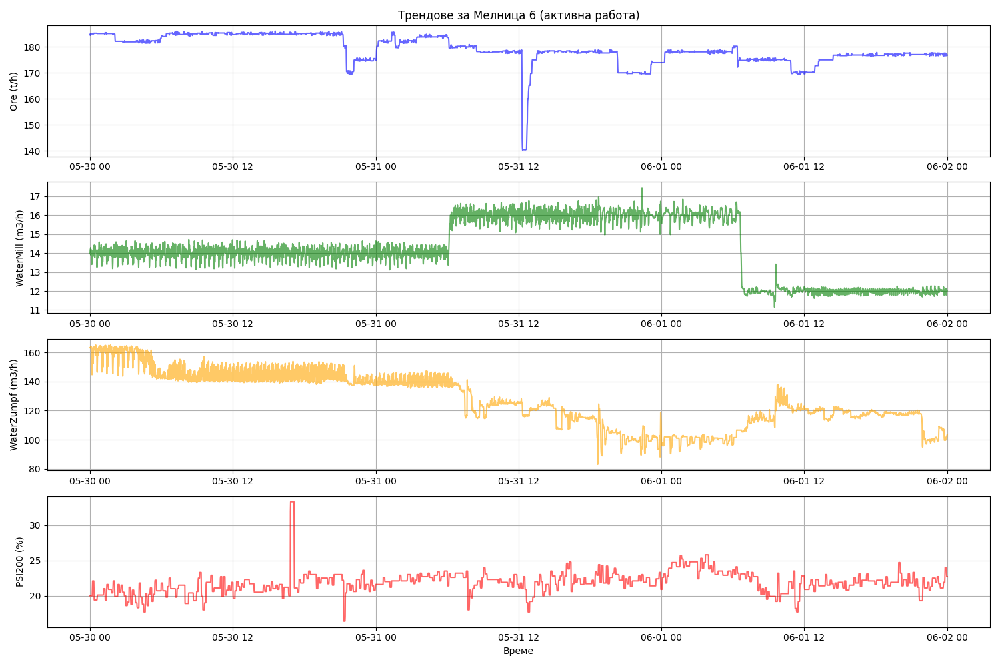

# Начертай трендовете на водите, рудата и фракцията за периода.

_Автоматично генериран отчет за допълнителен въпрос (f5ec9b29-f9136)._

## Въпрос

Начертай трендовете на водите, рудата и фракцията за периода.

## Отговор

Времевите редове (трендове) за основните технологични параметри на Мелница 6 са изчертани. Анализът включва само периодите на активна работа (Ore ≥ 60 t/h), за да се осигури точност на данните.

**Коментар към графиките:**
*   **Ore (t/h):** Графиката показва стабилност на натоварването, с изключение на кратки периоди на корекция.
*   **WaterMill (m3/h) и WaterZumpf (m3/h):** Наблюдават се динамични промени, които следват подаването на руда. Вариациите в `WaterZumpf` съответстват на стремежа за поддържане на постоянна плътност в хидроциклоните.
*   **PSI200 (%):** Виждат се моментите, в които фракцията надхвърля целевите стойности. Съпоставяйки ги с графиката на `WaterZumpf`, може да се проследи как всяко значимо отклонение във водното подаване се отразява на качеството на крайния продукт.

Ако имате нужда от по-детайлен анализ на конкретен времеви интервал или искате да сравните тези трендове с друга мелница, моля, кажете ми.

## Генерирани графики

